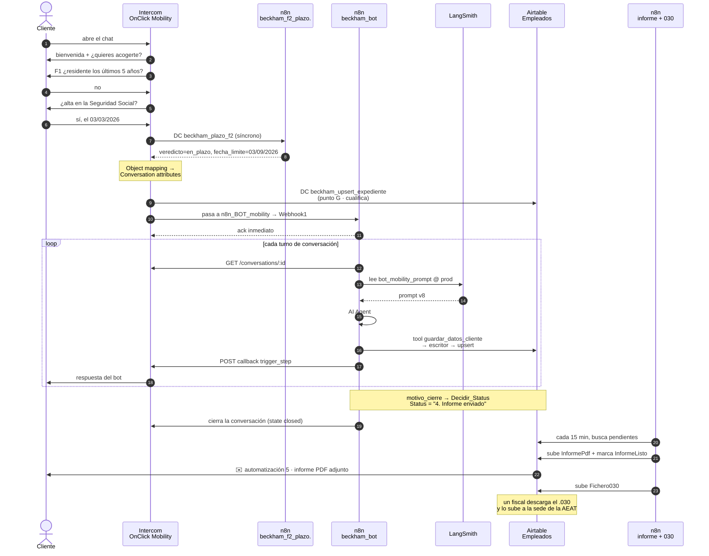
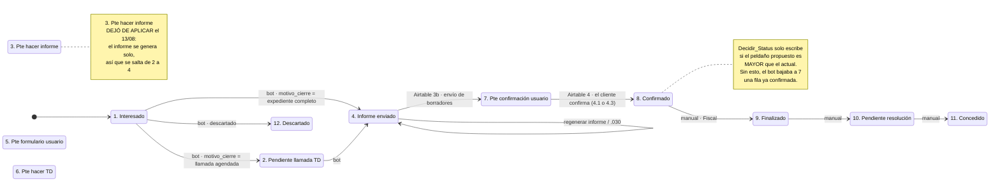
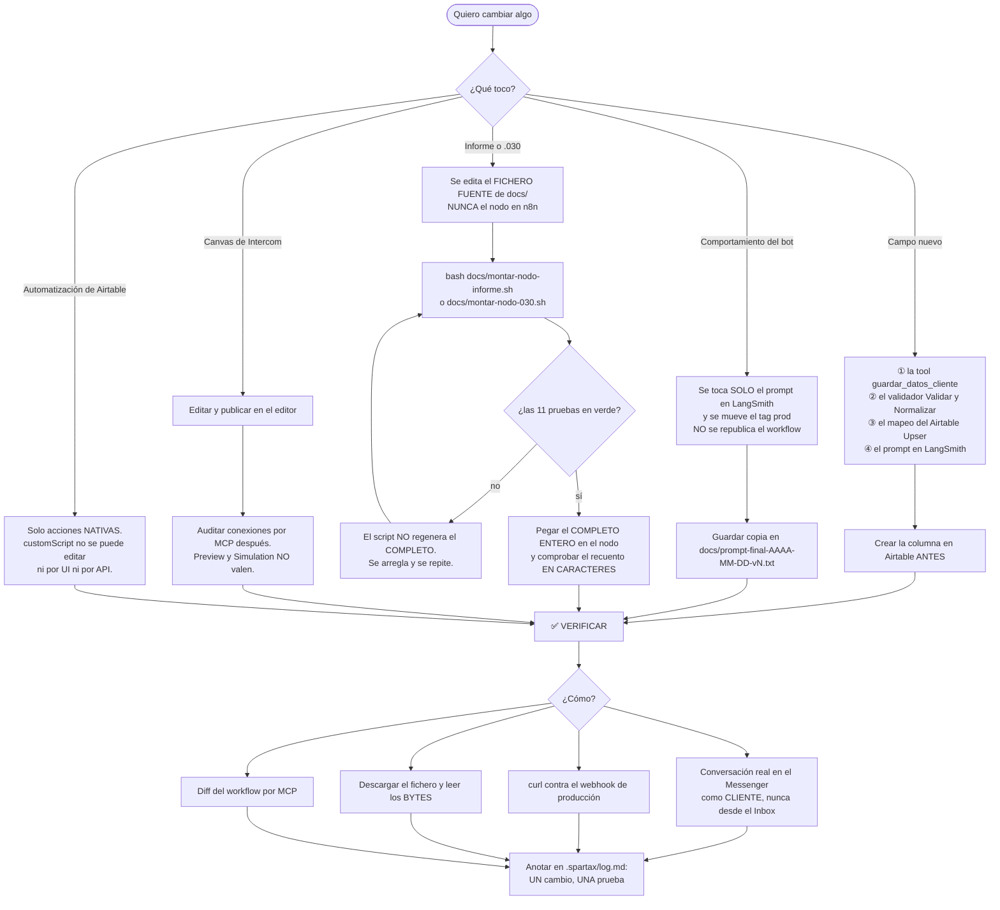

# Arquitectura del sistema Beckham · Mobility TaxDown

> Estado del documento: **arquitectura objetivo = arquitectura vigente el 16/08/2026.**
> Todo lo que hay aquí está leído por MCP de los sistemas vivos ese mismo día (n8n `es.synapse.rentax.es`
> y Airtable `app5K8OnSObqwWweS`), no de memoria. Lo que todavía no existe va marcado
> explícitamente como **pendiente**.

---

## 0. Qué es esto en una frase

Un bot conversacional que cualifica candidatos a la **Ley Beckham** (régimen fiscal especial para
trabajadores desplazados a España), recoge su documentación, construye su expediente y produce dos
entregables: un **informe de memoria fiscal en PDF** para el cliente y un **fichero `.030`
posicional** para que un fiscal lo suba a la sede de la AEAT.

Tres sistemas, en este orden: **Intercom** (la conversación), **n8n** (toda la lógica),
**Airtable** (el expediente y el bus de eventos).

---

## 1. Las decisiones de arquitectura, y por qué

Esto es lo que hay que leer antes del diagrama. Cada punto es una decisión tomada con una razón
concreta, casi siempre por un límite real del que nos hemos chocado.

### 1.1 El sistema **es** su configuración. No hay código fuente versionado.

La lógica vive dentro de nodos de n8n, de expresiones de n8n, de automatizaciones nativas de
Airtable y de un prompt de ~47.000 caracteres alojado en LangSmith. Los `.json` del repo son
**exportaciones, no fuente**: se generan *después* de publicar.

Consecuencias asumidas:

- No hay CI ni entorno de staging. Se publica sobre la instancia y se audita después, por MCP, con diff.
- **Sí hay batería automática donde puede haberla**: los dos generadores son JavaScript puro y se
  prueban con Node antes de pegarlos — **14 ficheros, 3.609 líneas** —, y `montar-nodo-informe.sh`
  la usa **como puerta**: no regenera el `COMPLETO` si una prueba está roja y revierte al anterior
  si falla la de integración.
- Lo que **solo existe dentro** de n8n, Intercom o Airtable no se puede ejecutar en local: ahí la
  verificación es **por evidencia** — conversación real, `curl`, los bytes del fichero descargado y
  el diff por MCP. Un `status: 200` no prueba nada.
- Un cambio mal hecho **falla en silencio**. De ahí la regla de casa: *campo nuevo = cuatro sitios*
  (la tool del agente, el validador, el mapeo de Airtable y el prompt), y olvidar uno **no da error**.

### 1.2 Los filtros eliminatorios F1/F2/F3 viven en el canvas de Intercom, no en n8n

Decisión de negocio, tomada en reunión con manager. El embudo de descarte es determinista, barato y
lo tiene que poder tocar Ops sin abrir n8n. **n8n empieza a existir cuando el candidato ya ha pasado
el filtro.** El antiguo bloque ① de filtros dentro de n8n quedó obsoleto y se retiró.

### 1.3 …pero **F2 se delega a n8n**, y es el único punto síncrono de todo el sistema

El canvas de Intercom no sabe hacer aritmética de fechas (¿han pasado 6 meses desde el alta en la
Seguridad Social?) ni parsear una fecha escrita en lenguaje libre. Por eso existe
**`beckham_f2_plazo.`**: tres nodos, sin estado, sin credenciales, respuesta en línea. Es el
workflow "de en medio" del diagrama.

Trampa aprendida y viva en producción: **los outputs de un Data Connector son atributos locales del
path donde vive el conector** y no se ven fuera de él. El arreglo es el `Object mapping` de la
pestaña `2 Data`, que los sube a **Conversation attributes** (`veredicto_f2`, `fecha_limite_f2`,
`dias_pasados_f2`). Sin eso, el branch cae siempre al `else`. **No deshacerlo.**

### 1.4 El bot conversacional es **asíncrono con callback**, no petición-respuesta

El agente de IA tarda más que el timeout de un Data Connector. Así que `Webhook1` responde `ack`
inmediato, n8n hace su trabajo y **devuelve el texto con un POST** a
`api.intercom.io/hooks/workflows/trigger_step/…/<conversation_id>`, que reanuda el paso
`Wait for webhook` del workflow reutilizable de Intercom.

### 1.5 Un solo escritor hacia Airtable, y el agente **no** escribe directamente

Todo lo que entra en la base pasa por
`POST /webhook/beckham-upsert-expediente` → `Validar y Normalizar` (≈950 líneas) →
`Airtable Upser Expediente`. Whitelist de **57 columnas** exactas; la tool del agente expone
**41 parámetros**.

Las tools del agente (`guardar_datos_cliente`, `leer_expediente`) son **llamadas HTTP a los propios
webhooks de n8n**, no nodos de Airtable. Así la validación no se puede saltar aunque el modelo
alucine un campo.

Contrapartida dicha en voz alta: **lo que no está en la whitelist se descarta devolviendo
`ok:true`**. No se pierde por un bug — *no existe el camino*. Es exactamente lo que hace peligroso
el punto 1.1.

`typecast: true` **no se apaga** (se intentó y se revirtió dos veces): `ponerFecha` produce un
datetime y las columnas son de solo fecha. Lo que protege la base son las whitelists, no el typecast.

### 1.6 Tres guardas delante del upsert, porque **hay más de un escritor**

| Guarda | Qué evita |
|---|---|
| `¿UserId duplicado?` | `count>1` en `UserId` ⇒ **no escribe**, avisa a Slack. Un match ambiguo escribiría en el expediente de otro. |
| `¿Ya escrito?` (`last_idem_key`) | Huella sobre el **contenido** del payload. El bot guarda de forma incremental, así que la huella *no* puede ser `user_id\|punto\|conversation_id`. |
| `Decidir_Status` | **La escalera solo sube.** Solo escribe si el peldaño propuesto es mayor que el actual. Las automatizaciones de Airtable escriben sobre las mismas columnas; sin esto, una fila en `8. Confirmado` volvía a `7`. |

### 1.7 El prompt vive fuera del workflow, con respaldo dentro

Fuente de verdad: **LangSmith**, `promptName: bot_mobility_prompt`, `promptTag: prod`.
**Manda el tag, no el último commit.** Publicar el prompt y publicar el workflow son dos actos
distintos, y eso es deliberado: el prompt cambia mucho más a menudo que la topología.

Si LangSmith no responde o devuelve vacío, el nodo `¿Prompt vacio?` desvía a
`Prompt_De_Respaldo`, una **Data Table de n8n** (`beckham_prompt_respaldo`) que se refresca con la
última versión buena cada vez que LangSmith sí responde.

### 1.8 Lo pesado va **por lotes en workflows aparte**, nunca como tool del agente

El informe y el `.030` son nodos de código de **238.809** y **197.924** caracteres. Dos razones para
sacarlos de `beckham_bot`:

1. Metidos dentro, revientan la lectura por MCP y con ella **el diff de cada sesión**, que es la
   única red de seguridad de la parte que no se puede probar fuera de n8n.
2. Como tool, el agente **podría olvidar dispararlos, o dispararlos antes de tiempo**.

Se disparan por el **estado de la fila** (`Status = "4. Informe enviado"` + banderas
`RegenerarInforme` / `Regenerar030`), cada 15 minutos, y son idempotentes.

### 1.9 Airtable no es solo la base de datos: es **el bus de eventos**

`InformeListo` no es un adorno de informe: es lo que **dispara el correo**. n8n marca la casilla;
Airtable manda el correo. El acoplamiento entre las dos mitades del sistema es una columna.

### 1.10 El correo **lo manda Airtable, no n8n** — y el PDF va adjunto, no por enlace

La acción nativa `sendEmail` adjunta ficheros desde un campo de adjunto (`spread`), y eso ya
funcionaba en producción con los borradores del 030 y del 149. Por tanto: **cero credenciales
nuevas**, que es el muro que bloquea este proyecto en tres sitios distintos.

Adjunto y no enlace porque **las URLs de adjunto de Airtable caducan el mismo día** (medido: una URL
de las 10:26 caducaba a las 14:00). Un enlace le dejaría al cliente un documento muerto por la tarde.

### 1.11 Todo lo que se genera se genera **a mano, byte a byte**

En n8n no se pueden instalar librerías. Así que:

- **El PDF** se monta a mano: objetos, `xref`, `WinAnsiEncoding`, métricas de Times y Helvetica
  tabuladas. No se rellena el `.docx` porque **15 de los 17 marcadores están partidos entre varios
  `<w:r>`** del XML de Word: un buscar-y-reemplazar sustituiría 2 de 19 apariciones y dejaría 17
  `{{…}}` literales en el documento del cliente, **sin fallar**.
- **El `.030`** es texto **posicional de ancho fijo**, 2700 bytes, **ISO-8859-1** (no UTF-8: en
  UTF-8 serían 2708 y la AEAT lo rechaza).

Los dos se construyen a partir de ficheros fuente en `docs/`, se concatenan con un script que
**no regenera si una prueba está roja**, y se pegan enteros en el nodo. **No se editan en n8n.**

### 1.12 Vaciar antes de subir

`uploadAttachment` de Airtable **añade** adjunto, no lo reemplaza. Por eso hay un `Vaciar …` antes
de cada subida en los dos workflows de lotes. Sin él, regenerar deja dos ficheros en la celda.

### 1.13 Toda la observabilidad entra por un solo sitio

`beckham_alertas` tiene **dos puertas**: un `Error Trigger` (se cayó un workflow) y un
`Execute Workflow Trigger` (aviso de negocio desde `beckham_bot`). Las dos salen a Slack.

Y como los peores fallos **no producen error**, hay un centinela por lotes:
`beckham_adjuntos_huerfanos` busca cada hora adjuntos que Airtable aceptó y nunca llegó a descargar
(sin `size`, con la URL de Intercom ya caducada) — un fallo que la ejecución del escritor cerró en
`success` hace horas.

### 1.14 El auth de los webhooks está **apagado a propósito**

Header Auth `beckham_webhook_auth` está probado (403 sin cabecera, 200 con ella) y **desactivado**.
Con la credencial puesta, **la API de n8n no puede leer el workflow**, y sin lectura no hay diff —
y el diff es lo que ha cazado los fallos silenciosos. Se activa **una vez, en producción**, con
token nuevo. Decisión cerrada el 14/08.

---

## 2. El diagrama completo, de punta a punta

```mermaid
flowchart LR

%% ══════════════════════════════ INTERCOM ══════════════════════════════
subgraph INTERCOM["🟦 INTERCOM · workspace TEST q3bhdtoi"]
  direction TB

  CLI(["👤 Cliente<br/>Messenger web / iOS / Android"])

  subgraph OCM["Custom Bot · OnClick Mobility · 66243731 · Live"]
    direction TB
    A["A · Bienvenida<br/>explica la Ley + ¿quieres acogerte?<br/>Tag jarry_ignore"]
    ANO["Welcome-No<br/>→ cierre a soporte"]
    B{"B · F1<br/>¿residente fiscal en España<br/>los últimos 5 años?"}
    D["🔴 D · Descarte duro<br/>Fue residente → Close"]
    E{"E · ¿Alta en la<br/>Seguridad Social?"}
    H["🟡 H · Lead potencial<br/>no descartar aún · F4 → Close"]
    F["F · Collect data<br/>fecha de alta en la SS"]
    I{"I · Path<br/>branch sobre veredicto_f2"}
    K["K · Path · reintento<br/>vuelve a preguntar la fecha"]
    G["🟢 G · CUALIFICA<br/>Assign Ops_BOT_Mobility"]
    M{"M · Path<br/>re-llama al conector"}
    N["🔴 N · Descarte por plazo"]
    O["🟠 O · Escalar a humano<br/>fallo de conexión"]
  end

  subgraph REUSE["Turnos 2..n"]
    direction TB
    RM["reuse_mobility · 66250478<br/>trigger: el cliente envía cualquier mensaje<br/>'esto puede tardar unos segundos…'"]
    NBM["n8n_BOT_mobility · 66246057 · Reusable<br/>Path A: DC → Wait for webhook<br/>Path B: error n8n"]
  end

  subgraph DCS["Data Connectors"]
    direction TB
    DC1["🔌 beckham_plazo_f2<br/>Object mapping → Conversation attrs"]
    DC2["🔌 beckham_upsert_expediente<br/>conectado en los 4 puntos D · H · G · N"]
    DC3["🔌 n8n_bot_mobility · 461046"]
  end
end

CLI --> A
A -->|no| ANO
A -->|sí| B
B -->|sí| D
B -->|no| E
E -->|no| H
E -->|sí| F
F --> DC1
DC1 --> I
I -->|en_plazo| G
I -->|fuera_plazo| M
I -->|else| K
K --> F
M -->|200| N
M -->|error| O
G --> NBM
CLI -. turnos 2 y siguientes .-> RM
RM --> NBM
NBM --> DC3

D --> DC2
H --> DC2
G --> DC2
N --> DC2

%% ══════════════════════════════ N8N ══════════════════════════════
subgraph N8N["🟧 N8N · self-hosted · es.synapse.rentax.es"]
  direction TB

  subgraph F2["⏱️ beckham_f2_plazo. · wdOOF0ecCkgFOUjt · activo<br/>EL QUE CALCULA LA FECHA · síncrono, sin credenciales"]
    direction LR
    F2A["Webhook POST<br/>/webhook/b3c76655-…"] --> F2B["Code<br/>parsea 4 formatos de fecha<br/>+6 meses = fecha límite"] --> F2C["Respond to Webhook<br/>veredicto · fecha_alta_norm<br/>fecha_limite · dias_pasados"]
  end

  subgraph BOT["🤖 beckham_bot · nhOwpiGxikeU5DLR · activo · 54 nodos · v d15a8da8"]
    direction TB

    subgraph CONV["① Bloque conversacional"]
      direction TB
      W1["Webhook1 · POST<br/>ack inmediato"] --> IF2{"If2<br/>¿hace falta esperar?"}
      IF2 -->|sí| WAIT["Wait2"] --> TRAER
      IF2 -->|no| TRAER["Traer_Conversacion_intercom1<br/>GET api.intercom.io/conversations/:id"]
      TRAER --> FMT{"Formatear_conversacion1"}
      FMT -->|ok| PREP["Preparar_Prompt<br/>arma el contexto"]
      FMT -->|error| FB["Mensaje_fallback"]
      PREP --> LS["Langsmith Prompt · nodo CUSTOM<br/>bot_mobility_prompt @ prod"]
      LS --> PV{"¿Prompt vacio?"}
      PV -->|vacío| DT["Prompt_De_Respaldo<br/>Data Table beckham_prompt_respaldo"] --> ARM["Armar_Prompt_Respaldo"] --> AG
      PV -->|ok| AG["🧠 AI Agent"]
      PV -->|ok| RFR["Refrescar_Respaldo<br/>guarda la última versión buena"]
      LLM["David Beckham<br/>gpt-5.6-terra"] -.ai_languageModel.-> AG
      AG --> CB["Callback_Intercom<br/>POST trigger_step/…/:conversation_id"]
      FB --> CB
      CB --> LMC["Leer_MotivoCierre"] --> CC{"¿Cerrar conversacion?"}
      CC -->|sí| CERR["Cerrar_Conversacion<br/>POST /conversations/:id/parts · state closed"]
    end

    subgraph TOOLS["② Tools del agente · son HTTP a los webhooks de n8n"]
      direction TB
      T1["🛠️ guardar_datos_cliente<br/>httpRequestTool · 41 parámetros"]
      T2["🛠️ leer_expediente<br/>httpRequestTool · 1 vez al empezar"]
      T3["🛠️ analizar_documento<br/>toolWorkflow"]
    end
    T1 -.ai_tool.-> AG
    T2 -.ai_tool.-> AG
    T3 -.ai_tool.-> AG

    subgraph ESCR["③ ESCRITOR · el único camino de escritura"]
      direction TB
      WU["Webhook_Upsert_Expediente<br/>POST /webhook/beckham-upsert-expediente"] --> VAL["Validar y Normalizar<br/>~950 líneas · whitelist de 57 columnas"]
      VAL --> DV{"¿Datos Válidos?"}
      DV -->|no| RE["Respond Error 400"] --> AV1["Avisar_Upsert_Rechazado"]
      DV -->|sí| LST["Leer_Status_Actual"] --> DS["Decidir_Status<br/>LA ESCALERA SOLO SUBE"]
      DS --> UD{"¿UserId duplicado?"}
      UD -->|mas de un match| AV2["Avisar_Multi_Match"] --> RMM["Respond Multi Match<br/>NO ESCRIBE"]
      UD -->|único| YE{"¿Ya escrito?<br/>last_idem_key"}
      YE -->|sí| RD["Respond Dedup"]
      YE -->|no| UPS["Airtable Upser Expediente<br/>upsert · typecast true"]
      UPS -->|ok| ROK["Respond OK"] --> FD{"¿Fechas descartadas?"}
      FD -->|sí| AV3["Avisar_Fecha_Invalida"]
      UPS -->|error| AV4["Avisar_Persistencia_Fallida"] --> RPF["Respond Persistencia Fallida"]
    end

    subgraph LECT["④ LECTOR"]
      direction TB
      WG["Webhook_Get_Expediente<br/>POST /webhook/beckham-get-expediente"] --> VUI["Validar user_id"] --> UV{"user_id válido?"}
      UV -->|no| R400["Responder 400"]
      UV -->|sí| BUS["Buscar Expediente en Airtable"] --> FRE["Formatear Respuesta<br/>21 claves"] --> RES["Responder Expediente"]
    end
  end

  subgraph SUB["🧩 Subflujos y flujos independientes"]
    direction TB

    AD["📄 beckham_analizar_documento · ONhveViBeiI6GXWd · activo<br/>lee el adjunto, IDENTIFICA qué documento es<br/>y devuelve TEXTO · no transcribe números de identidad"]

    subgraph ALE["🔔 beckham_alertas · BJfExmwu1fI1aPpY · activo · errorWorkflow global"]
      direction LR
      AL1["Fallo_De_Workflow<br/>Error Trigger"] --> SL1["Slack_Fallo"]
      AL2["Aviso_Desde_Beckham<br/>Execute Workflow Trigger<br/>6 campos"] --> SL2["Slack_Aviso"]
    end

    subgraph HUE["🕵️ beckham_adjuntos_huerfanos · 9Dh7U9DIxvXvzPxG · activo · cada hora"]
      direction LR
      HU1["Cada hora"] --> HU2["Leer Empleados"] --> HU3["Buscar adjuntos sin materializar<br/>señal = falta size"] --> HU4{"¿hay?"} --> HU5["Avisar_Adjunto_No_Materializado"]
    end

    subgraph INF["📘 beckham_informe_mobility · Us5sFgXD9qVxJvxO · activo · cada 15 min"]
      direction TB
      IN1["Cada 15 minutos"] --> IN2["Buscar filas pendientes<br/>Status='4. Informe enviado' AND<br/>(RegenerarInforme=1 OR InformePdf vacío)"]
      IN2 --> IN3["Montar el informe · 238.809 car.<br/>PDF a mano: objetos, xref, WinAnsiEncoding<br/>ES / EN · Times · logo TaxDown"]
      IN3 --> IN4{"¿Se ha podido montar?"}
      IN4 -->|no| IN9["Escribir el motivo<br/>en ErrorInforme"]
      IN4 -->|sí| IN5["Vaciar InformePdf<br/>PATCH · uploadAttachment AÑADE"]
      IN5 --> IN6["Subir el PDF<br/>POST uploadAttachment"] --> IN7["Marcar InformeListo ✅"]
    end

    subgraph M030["🏛️ beckham_generar_030 · OoJ2l7PmxSHLxXA4 · activo · cada 15 min · v b9653e09"]
      direction TB
      G1["Cada 15 minutos"] --> G2["Buscar filas pendientes<br/>Status='4. Informe enviado' AND<br/>(Regenerar030=1 OR Fichero030 vacío)"]
      G2 --> G3["Montar el .030 · 197.924 car.<br/>posicional 2700 bytes · ISO-8859-1<br/>8.132 municipios INE · 245 países · 52 provincias"]
      G3 --> G4{"¿Se ha podido generar?"}
      G4 -->|no| G8["Escribir el motivo<br/>en Error030"]
      G4 -->|sí| G5["Vaciar Fichero030<br/>PATCH"]
      G5 --> G6["Subir el fichero<br/>POST uploadAttachment"] --> G7["Limpiar Regenerar030<br/>y Error030"]
    end
  end
end

%% ══════════════ Intercom ⇄ n8n ══════════════
DC1 -->|POST síncrono| F2A
F2C -->|veredicto| DC1
DC2 -->|POST| WU
DC3 -->|POST| W1
CB -->|POST callback| NBM
CERR -->|state closed| CLI
T1 --> WU
T2 --> WG
T3 --> AD

%% ══════════════ alertas ══════════════
AV1 --> AL2
AV2 --> AL2
AV3 --> AL2
AV4 --> AL2
HU5 --> AL2
BOT -.errorWorkflow.-> AL1

%% ══════════════════════════════ AIRTABLE ══════════════════════════════
subgraph AT["🟩 AIRTABLE · base Mobility_2026 · app5K8OnSObqwWweS"]
  direction TB

  EMP[("🗂️ Tabla Empleados · tblTWCWu5nQXNOMR1<br/>93 columnas · el escritor acepta 57<br/>clave de negocio: UserId")]

  subgraph FLAGS["Columnas que actúan como bus de eventos"]
    direction LR
    FL1["Status<br/>escalera 1 → 12"]
    FL2["InformePdf · InformeListo<br/>RegenerarInforme · ErrorInforme"]
    FL3["Fichero030 · Regenerar030<br/>Error030"]
    FL4["Estado030149<br/>EnviarBorradores"]
  end

  subgraph AUT["⚙️ Automatizaciones nativas · SIN script"]
    direction TB
    AU2["2b · wflvsvULr5SUHcgPN<br/>formSubmitted → fusiona 3 campos<br/>en el expediente real por recordId"]
    AU3["3b · wflbayW4R4IvjHLTQ · ON<br/>→ sendEmail borradores 030 y 149<br/>EN explícito / ES por defecto<br/>Status a 7 solo si venía de 1–6"]
    AU4["4 · wflYrTfhxYtRaLZkU · ON<br/>Status 7 + confirma 4.1 o 4.3<br/>→ Status 8. Confirmado"]
    AU5["5 · wflZuMqIE5YYdnU8l · ON<br/>InformeListo ✅ AND InformePdf lleno<br/>→ sendEmail con el PDF ADJUNTO"]
  end

  FORM["📝 Formulario de confirmación<br/>vista clásica · viwjxT8e1uLg7K4OC<br/>siempre crea fila nueva"]
end

UPS -->|upsert por UserId| EMP
BUS -->|search| EMP
LST -->|search| EMP
LMC -->|search| EMP
HU2 -->|search| EMP
IN2 -->|search| EMP
G2 -->|search| EMP
IN6 -->|uploadAttachment| FL2
IN7 --> FL2
IN9 --> FL2
G6 -->|uploadAttachment| FL3
G7 --> FL3
G8 --> FL3

EMP --- FLAGS
FL2 -->|dispara| AU5
FL4 -->|dispara| AU3
FL1 -->|dispara| AU4
FORM -->|dispara| AU2
AU2 --> EMP
AU3 --> EMP
AU4 --> EMP

%% ══════════════════════════════ SALIDAS ══════════════════════════════
subgraph OUT["📤 Salidas del sistema"]
  direction TB
  MAIL1(["✉️ Cliente · borradores 030 y 149"])
  MAIL2(["✉️ Cliente · informe de memoria fiscal en PDF"])
  AEAT(["🏛️ AEAT · un fiscal sube el .030<br/>a mano a la sede electrónica"])
  SLK(["💬 Slack · canal de Ops"])
end

AU3 --> MAIL1
AU5 --> MAIL2
MAIL1 -.el cliente confirma.-> FORM
FL3 --> AEAT
SL1 --> SLK
SL2 --> SLK

%% ══════════════════════════════ EXTERNOS ══════════════════════════════
subgraph EXT["☁️ Servicios externos"]
  direction TB
  LSMITH["LangSmith<br/>fuente de verdad del prompt<br/>bot_mobility_prompt @ prod · v8 · 46.878 car."]
  OAI["Proveedor LLM<br/>gpt-5.6-terra"]
  CALY["Calendly<br/>movilidad-internacional<br/>origen real de la fecha de reunión"]
end

LS <-->|lee el tag prod| LSMITH
AG <--> OAI
CALY -. PENDIENTE · webhook invitee_created .-> EMP

%% ══════════════════════════════ ESTILOS ══════════════════════════════
classDef intercom fill:#1f3a5f,stroke:#4a90d9,color:#e8f0fa
classDef n8n fill:#4a2410,stroke:#ea4b71,color:#ffe8ec
classDef airtable fill:#123524,stroke:#2ecc71,color:#e6fff0
classDef externo fill:#2d2d3a,stroke:#8b8ba7,color:#eaeaf2
classDef salida fill:#3d3416,stroke:#d4af37,color:#fff8e1
classDef alerta fill:#4a1520,stroke:#e74c3c,color:#ffe8ea
classDef pendiente stroke-dasharray: 5 5

class CLI,A,ANO,B,D,E,H,F,I,K,G,M,N,O,RM,NBM,DC1,DC2,DC3 intercom
class F2A,F2B,F2C,W1,IF2,WAIT,TRAER,FMT,PREP,LS,PV,DT,ARM,AG,LLM,RFR,CB,FB,LMC,CC,CERR,T1,T2,T3,WU,VAL,DV,RE,LST,DS,UD,YE,UPS,ROK,FD,RD,RMM,RPF,WG,VUI,UV,BUS,FRE,RES,R400,AD,IN1,IN2,IN3,IN4,IN5,IN6,IN7,IN9,G1,G2,G3,G4,G5,G6,G7,G8,HU1,HU2,HU3,HU4,HU5 n8n
class EMP,FL1,FL2,FL3,FL4,AU2,AU3,AU4,AU5,FORM airtable
class LSMITH,OAI,CALY externo
class MAIL1,MAIL2,AEAT,SLK salida
class AL1,AL2,SL1,SL2,AV1,AV2,AV3,AV4 alerta
class CALY pendiente
```

---

## 3. El recorrido de una conversación, en el tiempo

---

## 4. La escalera de `Status` — quién la mueve

Es el punto donde más escritores concurren, y por eso `Decidir_Status` solo permite **subir**.

---

## 5. Inventario: dónde vive cada trozo de lógica

| Sistema | Artefacto | ID | Estado | Qué hace |
|---|---|---|---|---|
| Intercom | Custom Bot `OnClick Mobility` | 66243731 | Live | Canvas de filtros F1/F2/F3 y los 4 puntos de disparo D·H·G·N |
| Intercom | Workflow `reuse_mobility` | 66250478 | Live | Relanza el turno 2..n cuando el cliente escribe |
| Intercom | Workflow `n8n_BOT_mobility` | 66246057 | Reusable | Llama a n8n y espera el callback |
| Intercom | DC `beckham_plazo_f2` | — | — | F2, síncrono. `Object mapping` → Conversation attributes |
| Intercom | DC `beckham_upsert_expediente` | — | — | Persiste desde los 4 puntos del canvas |
| Intercom | DC `n8n_bot_mobility` | 461046 | — | Entrada al agente |
| n8n | `beckham_bot` | `nhOwpiGxikeU5DLR` | activo · 54 nodos · `d15a8da8` | Agente, escritor, lector y cierre |
| n8n | `beckham_f2_plazo.` | `wdOOF0ecCkgFOUjt` | activo · 3 nodos | Cálculo del plazo de 6 meses |
| n8n | `beckham_analizar_documento` | `ONhveViBeiI6GXWd` | activo | Tool: lee adjuntos y devuelve texto |
| n8n | `beckham_alertas` | `BJfExmwu1fI1aPpY` | activo | Slack. Es el `errorWorkflow` global |
| n8n | `beckham_adjuntos_huerfanos` | `9Dh7U9DIxvXvzPxG` | activo · cada hora | Centinela de adjuntos no materializados |
| n8n | `beckham_informe_mobility` | `Us5sFgXD9qVxJvxO` | activo · cada 15 min · 9 nodos | Monta y sube el informe PDF |
| n8n | `beckham_generar_030` | `OoJ2l7PmxSHLxXA4` | activo · cada 15 min · 8 nodos · `b9653e09` | Monta y sube el fichero `.030` |
| LangSmith | `bot_mobility_prompt` @ `prod` | — | v8 · 46.878 car. | El comportamiento del agente |
| n8n | Data Table `beckham_prompt_respaldo` | — | — | Copia de seguridad del prompt |
| Airtable | Tabla `Empleados` | `tblTWCWu5nQXNOMR1` | 93 columnas | El expediente |
| Airtable | Automatización `2b` | `wflvsvULr5SUHcgPN` | desplegada | Fusiona la respuesta del formulario |
| Airtable | Automatización `3b` | `wflbayW4R4IvjHLTQ` | ON | Correo con los borradores 030 y 149 |
| Airtable | Automatización `4` | `wflYrTfhxYtRaLZkU` | ON | Status 7 → 8 al confirmar |
| Airtable | Automatización `5` | `wflZuMqIE5YYdnU8l` | ON | Correo con el informe PDF adjunto |

**Automatizaciones viejas apagadas** (`2`, `3`, `Crear Check out`): llevan acciones `customScript`
que **Airtable no deja editar ni por UI ni por API** (`readOnlyNodeType`). Por eso se rehicieron
desde cero con acciones nativas. No resucitarlas.

---

## 6. Los ficheros fuente de los dos generadores

No están en n8n: n8n solo tiene el resultado de concatenarlos.

| Fichero | Qué es |
|---|---|
| `docs/metrica-times-2026-08-14.js` · `metrica-helvetica-2026-08-14.js` | Anchos de las fuentes, 256 códigos WinAnsi |
| `docs/pdf-motor-2026-08-14.js` | El PDF byte a byte: objetos, `xref`, `WinAnsiEncoding` |
| `docs/informe-datos-2026-08-14.js` | Los 17 marcadores y la elección de bloque |
| `docs/informe-cuerpo-2026-08-14.js` | La plantilla convertida al IR |
| `docs/logo-taxdown-2026-08-14.js` | El logo embebido |
| `docs/nodo-informe-glue-2026-08-14.js` | De la fila de Airtable al PDF |
| `docs/montar-nodo-informe.sh` | Concatena. **No regenera si una de las 11 pruebas está roja** |
| `docs/generador-030-2026-08-14.js` | El constructor posicional: 2700 bytes, ISO-8859-1 |
| `docs/tabla-municipios-ine-2026-08-14.js` | 8.132 municipios del INE, 9.620 claves |
| `docs/tabla-paises-iso2-2026-08-13.js` · `tabla-provincias-030-2026-08-13.js` | Conversiones del `.030` |
| `docs/nodo-030-glue-2026-08-14.js` | De las columnas de Airtable al generador |
| `docs/montar-nodo-030.sh` | Concatena los cinco |

**La unidad del recuento importa.** `wc -c` da **bytes**; el editor de n8n cuenta **caracteres**. El
`COMPLETO` del informe lleva ~1.500 acentos y en UTF-8 cada uno son dos bytes: los dos números se
separan casi 3.000 y parece que el pegado se quedó corto. **Siempre en caracteres.**

---

## 7. Lo que está abierto, dicho y no tapado

| Qué | Estado |
|---|---|
| `FechaLlamada` | Columna creada y los 4 sitios del bot puestos. **Sin probar en conversación real.** El origen bueno sería un webhook `invitee.created` de Calendly, no el bot. |
| Corpus fiscal en el prompt (WP-220) | Extraído en `docs/corpus-fiscal-beckham-2026-08-13.md`, pendiente de entrar. Desbloquea las 14 fichas del FAQ. Falta añadir que **la prestación por paternidad de la SS sí tributa**. |
| Auth de los webhooks (T053) | Probada y **apagada a propósito**. Se activa una vez en producción, con token nuevo. Ver §1.14. |
| Casillas 772-790 del `.030` | Bloque/escalera/planta/puerta: no se sabe cuál es cuál. No se resuelve sin una muestra con planta **y** escalera a la vez, y no hay más muestras. |
| Fecha de efectos (1390-1397) del `.030` | La regla es deducción nuestra, **no la ha firmado Fiscal**. Encaja con las cuatro muestras. |
| Traducción inglesa del informe | Revisada y dada por buena por el dueño técnico; **pendiente de revisión de Fiscal**, y así va marcada en el código. |
| Credenciales ajenas | El auth de los webhooks, la credencial de Airtable en n8n y los secretos de las automatizaciones de Airtable no son del constructor. Bloquea en tres sitios. **Es conversación con Ops, no problema técnico.** |
| Pegado manual de los nodos de código | Propuesta en `docs/propuesta-quitar-el-pegado-manual-2026-08-14.md`. **Fuera del alcance del 31/08.** |

---

## 8. Trampas que hay que conocer antes de tocar nada

1. **`.item` vs `.first()` son reglas OPUESTAS** según dónde estés.
   En un **nodo de código**: nunca `$('X').item` — cuelga el task runner hasta el timeout; siempre
   `.first()`.
   En una **expresión** de un nodo normal: `.item` es el item **emparejado** y `.first()` devuelve
   siempre el primero. Con dos filas pendientes a la vez, `.first()` le sube el fichero de la
   primera fila a las dos. Probado el 14/08 con dos filas simultáneas.
2. **`uploadAttachment` añade, no reemplaza.** Vaciar antes de subir, siempre.
3. **Las URLs de adjunto de Airtable caducan el mismo día.** Nunca enlaces: adjuntos.
4. **Airtable no descarga el fichero al escribirlo**: acepta la URL y lo descarga después, en
   segundo plano. Si la URL de Intercom caduca antes, el adjunto se queda vacío **y nadie se entera**.
   Eso es lo que vigila `beckham_adjuntos_huerfanos`.
5. **Airtable no tiene acción nativa de borrar registro.** Las filas que crea el formulario se
   quedan; se limpian a mano con la vista de huérfanas.
6. **Un grupo condicional de Airtable debe ser el último nodo**: no se puede poner nada detrás. Por
   eso las guardas del Status van duplicadas dentro de cada rama de idioma.
7. **`isAnyOf` no vale** en las condiciones de un grupo condicional (sí en el filtro del disparador).
8. **El MCP de n8n devuelve `credentials={}` en TODOS los nodos**, también en los que funcionan. No
   se puede comprobar una credencial por MCP: **la única forma es ejecutar**.
9. **Preview y Simulation de Intercom no valen** para validar: usan mocks de los Data Connectors.
   Lo único que valida un Custom Bot es publicar y usar el Messenger **como cliente**. Y contestar
   desde el Inbox es un mensaje de *admin*: no dispara «when customer sends any message».
10. **`elegirBloque` del informe acepta CUATRO valores, no tres.** `No residente NO UE` va al
    Bloque B igual que `No residente UE` — y ahí cae la mayoría del embudo (UK, EEUU, México,
    Argentina, Colombia, Marruecos).

---

## 9. El contrato de escritura, que es el corazón del sistema

El nodo `Airtable Upser Expediente` acepta **exactamente 57 columnas** y hace `upsert` con
`matchingColumns: ["UserId"]`. Todo lo que no esté en esta lista **se descarta devolviendo
`ok:true`**.

```mermaid
flowchart TB
    subgraph C1["🆔 Identidad y enrutado · 9"]
        direction LR
        X1["UserId · clave de negocio<br/>intercom_conversation_id<br/>email · Status · Descarte<br/>lead_potencial · AplicaBeckham<br/>MotivoCierre · last_idem_key"]
    end
    subgraph C2["👤 Datos personales · 16"]
        direction LR
        X2["Nombre empleado · Apellidos empleado<br/>ApellidoPrimero · ApellidoSegundo · NIF<br/>PasaporteNumero · FechaNacimiento<br/>NumeroTelefono · Sexo · estadoCivil<br/>hijos · Nacionalidad · PaisNacimiento<br/>Municipio de Nacimiento · Provincia de Nacimiento<br/>UltimoPaisResidencia"]
    end
    subgraph C3["🏠 Domicilio en España · 8"]
        direction LR
        X3["Tipo de vía · Nombre de la calle<br/>Número de tu domicilio · Codigo Postal<br/>Planta · Puerta · MunicipioResidencia<br/>Idioma"]
    end
    subgraph C4["📅 Fechas y régimen · 8"]
        direction LR
        X4["fecha_alta_ss · alta_ss<br/>fecha_prevista_alta · fecha_limite_plazo<br/>fechaDesplazamiento · FechaLlamada<br/>TipoBeckham · Empresa"]
    end
    subgraph C5["💰 Patrimonio y complejidad · 6"]
        direction LR
        X5["Salario · Propiedades · Inversiones<br/>ConyugeQuiereAcogerse<br/>SenalesComplejidad · DiscrepanciaFechaAlta"]
    end
    subgraph C6["📎 Adjuntos · 9"]
        direction LR
        X6["DNI · Pasaporte · Contratotrabajo<br/>AltaSeguridadSocial · AutorizacionEmpleado<br/>AutorizacionEmpresa · CertificadoEnisa<br/>Apostilla · Visado"]
    end
    subgraph C7["🗒️ Salida del agente · 1"]
        direction LR
        X7["ResumenBot · ficha + prosa"]
    end
    C1 --> C2 --> C3 --> C4 --> C5 --> C6 --> C7
```

`nie` **comparte columna con `dni`** en `COLUMNA_POR_TIPO`. Antes de añadirlo se perdía el fichero
devolviendo `ok:true`.

Los adjuntos del bot son los 9 de arriba. `Borrador030` y `Borrador149` **no** están en la lista:
los sube un fiscal a mano desde la UI, que manda bytes y no una URL, y por eso el centinela de
huérfanos tampoco los mira.

---

## 10. Cómo se hace un cambio · runbook

**La regla que más cara ha salido:** *campo nuevo = tres sitios*. Olvidar el tercero **no da error**
— el escritor ignora la clave y responde `ok:true`. Desde el 14/08 son cuatro sitios contando el
prompt.

---

## 11. Entornos y credenciales

| Qué | Dónde | Notas |
|---|---|---|
| Workspace de Intercom | TEST · `q3bhdtoi` | **Nunca escribir desde el Inbox.** Preview y Simulation no validan nada. |
| n8n | `https://es.synapse.rentax.es` | Acceso por el **servidor MCP integrado de n8n**, no por API key personal |
| Base de Airtable | `app5K8OnSObqwWweS` · Mobility_2026 | |
| Canal de Slack | `C0BMJ370HTQ` | Avisos de error y de negocio |

**El problema de las credenciales ajenas, y son tres sistemas:**

1. El **auth de los webhooks** de n8n (`beckham_webhook_auth` · `chTgEmF0KkSvcivT`): la identidad
   del servidor MCP integrado **no ve esa credencial**, así que con el auth puesto la API no puede
   leer el workflow.
2. La **credencial de Airtable** dentro de n8n.
3. Los **secretos de las automatizaciones de Airtable** (`n8nApi` · `eacbfZbyDYjL9UWCW`;
   `crear checkout BPM` · `eacfUyKjpY6C9pTqT`). Airtable **no devuelve el valor de un secreto por
   API**, solo su referencia: un backup por API nunca incluye los tokens.

**Es conversación con Ops, no problema técnico.** Y es la razón de fondo de la decisión §1.10: que
el correo lo mande Airtable con acciones nativas evita abrir un cuarto frente de credenciales.

---

## 12. Glosario

| Término | Qué es |
|---|---|
| **Escritor** | `POST /webhook/beckham-upsert-expediente` → `Validar y Normalizar` → `Airtable Upser Expediente`. El único camino de escritura. |
| **Lector** | `POST /webhook/beckham-get-expediente`. Devuelve 21 claves. |
| **DC** | Data Connector de Intercom. |
| **F1 / F2 / F3** | Los filtros eliminatorios: residencia fiscal previa, plazo de 6 meses desde el alta en la SS, y fecha límite. **F4** es la rama de lead potencial. |
| **D · H · G · N** | Los cuatro puntos del canvas donde se persiste: descarte duro, lead potencial, cualifica y descarte por plazo. |
| **Descartados** | `_fechas_descartadas`: el bucle por el que el agente vuelve a pedir un dato inválido. |
| **WP-2NN** | Work package de Fase 2, en `docs/prds/fase2/`. |
| **COMPLETO** | El fichero resultante de concatenar los fuentes de un generador; es lo que se pega en el nodo. |
| **La escalera** | La secuencia de `Status` 1 → 12. Solo sube. |
| **Ley Beckham** | Régimen fiscal especial para trabajadores desplazados a territorio español. |

---

## 13. Convenciones del repositorio

- Todo en **español**, incluidos los comentarios de código.
- Horas siempre en **hora de Madrid**, nunca UTC.
- Valores para pegar en n8n: **sin el `=` inicial y sin salto de línea final**.
- Bitácora en `.spartax/log.md`: cada cambio con su prueba. **Un cambio, una prueba**: dos cambios
  y una sola prueba ⇒ la prueba no cuenta.
- **«Diagnosticado» no es «resuelto».** Nada se cierra sin verificarlo.
- Tras cualquier sesión de canvas, **auditar conexiones por MCP**.
