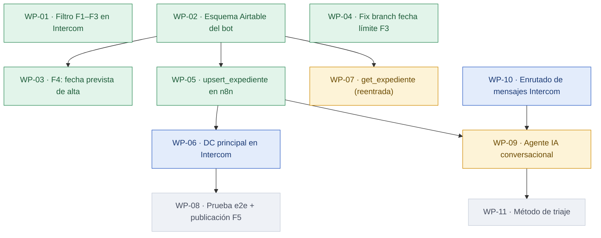

# Bot Beckham (Intercom + n8n + Airtable) — PRD roadmap

> Regenerado por `/prd:map` el **2026-07-28**. No editar a mano — la fuente de verdad es el
> frontmatter de cada `WP-NN-*.md` de esta carpeta. Versión interactiva: [`map.html`](./map.html).

## Dependency map



## Estado por Work Package

| WP | Título | Tam. | Estado | Depende de | Owner | Externo |
|---|---|---|---|---|---|---|
| [WP-01](WP-01-filtro-f1-f3-intercom.md) | Filtro F1–F3: cualificación conversacional en Intercom | M | ✅ done | — | Hammad | — |
| [WP-02](WP-02-esquema-airtable-bot.md) | Esquema Airtable: campos escribibles del bot | S | ✅ done | — | Hammad | — |
| [WP-03](WP-03-f4-fecha-prevista-alta.md) | F4: captura de la fecha prevista de alta | S | ✅ done | WP-02 | Hammad | — |
| [WP-04](WP-04-bug-fecha-limite-f3.md) | Fix: el branch no detecta el veredicto del connector | S | ✅ **done (hoy)** | — | Hammad | — |
| [WP-05](WP-05-upsert-expediente-n8n.md) | F5: `upsert_expediente` dentro de `beckham_bot` | M | ✅ done | WP-02 | Hammad | — |
| [WP-06](WP-06-dc-principal-intercom.md) | F5: DC principal + conexión en los 4 puntos | M | 📘 specified | WP-05 | Hammad | — |
| [WP-07](WP-07-get-expediente-reentrada.md) | F5: `get_expediente` — reentrada por `UserId` | S | 🔨 building | WP-02 | Hammad | — |
| [WP-08](WP-08-e2e-publicacion-f5.md) | F5: prueba end-to-end y publicación | S | ⬜ skeleton | WP-06 | Hammad | — |
| [WP-09](WP-09-agente-ia.md) | F6: agente IA conversacional | L | 🔨 **building (hoy)** | WP-05, WP-10 | Paula, Hammad | — |
| [WP-10](WP-10-enrutado-mensajes-intercom.md) | Enrutado de mensajes: tickets y distribuidor | M | 📘 **specified (nuevo)** | — | Hammad | Adri / Fer |
| [WP-11](WP-11-metodo-triaje.md) | Método de triaje de casos | M | ⬜ **skeleton (nuevo)** | WP-09 | Hammad, Alina | Alina |

**Leyenda:** ⬜ skeleton (sin especificar) · 📘 specified (listo para construir) · 🔨 building (en construcción) · ✅ done

## Camino crítico

Cadena más pesada (S=1 · M=2 · L=3):

```
WP-02 (2) → WP-05 (2) → WP-09 (3) → WP-11 (2)   = peso 9
```

**Primer WP no terminado de esa cadena: WP-09**, en construcción y **bloqueado por WP-10**. O sea que lo que hoy retrasa todo lo demás es el **enrutado de mensajes de Intercom**, no el agente en sí.

Cadena de persistencia:

```
WP-02 (2) → WP-05 (2) → WP-06 (2) → WP-08 (1)   = peso 7
```

**Primer WP no terminado: WP-06.** Está `specified` y sin bloqueos: se puede construir cuando se quiera.

## Listos para empezar

| WP | Estado | Nota |
|---|---|---|
| **WP-10** | 📘 specified | Sin dependencias. **Es el desbloqueo real** — hasta que se resuelva, el agente solo puede dar un turno |
| **WP-06** | 📘 specified | Dependencia (WP-05) cerrada. Diseño acordado por el Council del 28/07 |

## Bloqueadores externos abiertos

- **WP-10** — exige tocar configuración del workspace de Intercom que no es de este proyecto (el workflow `distribuidor - usuario envia mensaje` y el ticket type `Prueba Fer`). Interlocutores: **Adri / Fer**.
- **WP-11** — las reglas del triaje son de negocio y las tiene **Alina**. No se puede especificar sin ella.

## Validación del mapa

Sin problemas: no hay ids duplicados, ni dependencias a WPs inexistentes, ni ciclos, ni ningún WP `done` que dependa de algo no terminado.

## Cómo leer el mapa

- Las **flechas van de la dependencia al dependiente**: si `A → B`, B no se puede terminar sin A.
- El **camino crítico** es la cadena más pesada; retrasar cualquier WP de esa cadena retrasa el proyecto entero.
- Un WP `skeleton` **no se implementa**: primero hay que especificarlo con `/prd:fill`.
- Los estados y dependencias viven en el frontmatter de cada `WP-*.md`. Este fichero y `map.html` se **derivan** de ahí — si algo no cuadra, se corrige el PRD y se vuelve a ejecutar `/prd:map`.
