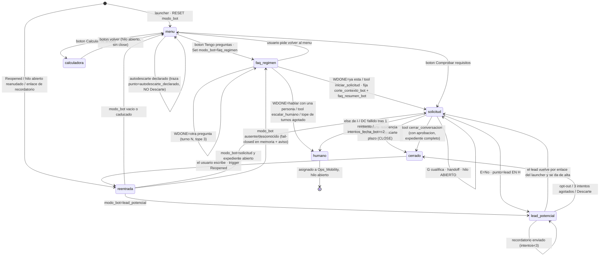
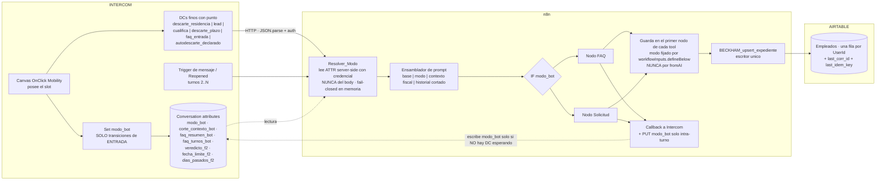
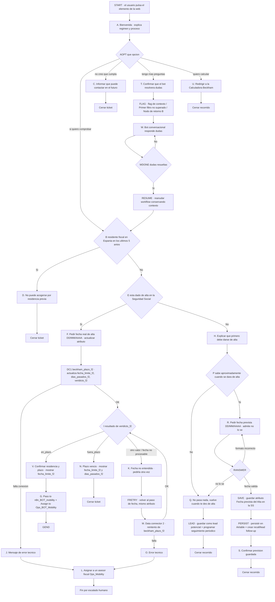
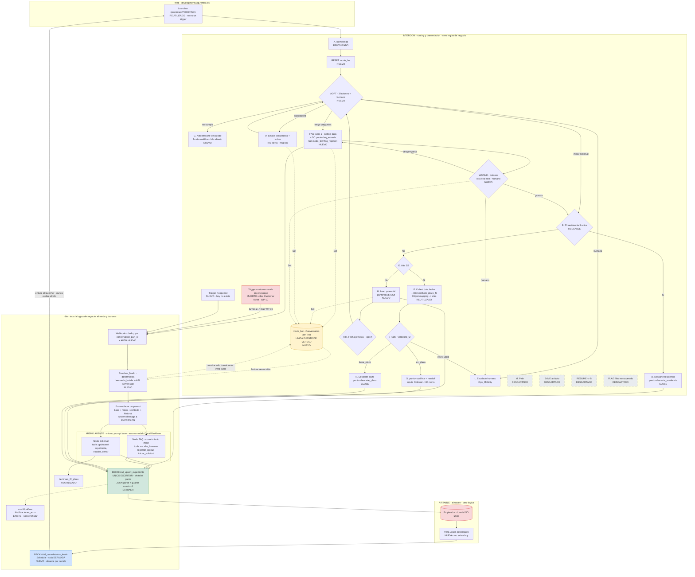

# PRD maestro · Fase 2 conversacional del Bot Beckham

> **Specified (2026-07-29).** Derivado de `COUNCIL-SINTESIS.md` (arbitraje del Chairman sobre cinco
> entregas y dos rondas) y del briefing común del Council. Este documento **no modifica ningún
> sistema** y no sustituye a ningún PRD existente: es un paquete de planificación **independiente**.
>
> **Etiquetas usadas en todo el documento:** **HECHO VERIFICADO** (comprobado por MCP de solo lectura
> o lectura de fichero el 28–29/07) · **DECISIÓN APROBADA** (cerrada por el Council/Chairman) ·
> **PROPUESTA** (no aprobada) · **INFERENCIA** · **DESCONOCIDO** · **BLOQUEO**.
>
> **Reglas de honestidad de este PRD:** ninguna métrica nueva se presenta como aprobada; ningún límite
> numérico de API o de plan se cita sin fuente real (si no está verificado, DESCONOCIDO); no se inventan
> campos, atributos ni capacidades. El atributo del veredicto es **`veredicto_f2`** (con "e"). **No hay
> imágenes adjuntas en esta sesión: la tabla de notas amarillas queda declarada como dato faltante y su
> contenido no se infiere.**

---

## 1. Resumen ejecutivo

La Fase 2 añade al inicio del flujo de Intercom un **menú de entrada con cuatro salidas** (comprobar
requisitos · calculadora · preguntas sobre el régimen · hablar con una persona), un **modo FAQ servido
por el mismo agente de IA** con las tools de tramitación técnicamente inaccesibles, y el **registro de
los leads potenciales** que hoy se pierden sin traza.

**El flujo propuesto por el usuario es viable en intención y no construible tal como está dibujado**
(DECISIÓN APROBADA). Tres piezas centrales — `RESUME → nodo B`, el bucle `W → WDONE → W` y
"Cerrar ticket" — no existen o significan otra cosa en Intercom (HECHO VERIFICADO).

**La Fase 2 no se empieza hoy** (DECISIÓN APROBADA). La cadena de escritura está **rota en producción**:
`Validar y Normalizar` lee `$input.first().json.body`, el Data Connector manda
`application/x-www-form-urlencoded` con el JSON **como clave**, y no hay ni un `JSON.parse` en el
workflow (HECHO VERIFICADO, confirmado por tres agentes de forma independiente). Todas las ramas de
persistencia de la Fase 2 nacerían devolviendo 400. Y el `systemMessage` del agente **no es expresión**
y **nombra tres tools que no existen** (HECHO VERIFICADO): el agente puede *fingir* acciones, lo que
hace un fallo de allowlist indistinguible de una alucinación.

**Arquitectura aprobada:** un mismo agente con **aislamiento por topología** — dos nodos `AI Agent` con
`prompt_base` y modelo compartidos, elegidos por un IF sobre `modo_bot`. El nodo `agent` v3.1 **no
expone ningún parámetro de selección de tools** (HECHO VERIFICADO): las tools son aristas `ai_tool` del
grafo, así que el requisito duro del manager se cumple **técnicamente**, no por prompt, y se verifica
**contando aristas**.

**Fuente de verdad del modo (reescrito 27/08/2026 — WP-210 §2.2):** el modo viaja como **input
obligatorio de cada llamada al Data Connector**, con valores
`menu · solicitud · faq_regimen · calculadora · lead_potencial · humano`; `modo_bot` desaparece del
contrato salvo la variante B híbrida (T081 abierta, B pura recomendada). El fail-closed **nunca se
persiste**.

> **REESCRITO 27/08/2026 — transporte B (WP-210 §2.2, 26/08).** El texto original de este párrafo
> decía: fuente de verdad `modo_bot`, Conversation attribute de tipo Text, con un dueño único por
> transición — el canvas escribe mientras posee el slot, n8n las transiciones intra-conversación,
> nunca los dos a la vez. Eso era el **transporte A**. Vigente: el modo es input de cada llamada al
> DC, `menu` es un valor explícito y **no hay reset**; los cinco atributos que sobreviven son los de
> WP-210 §2.3. T081 (abierta): con **B pura** (recomendada) no queda atributo de modo; con **B
> híbrida**, `modo_bot` cubriría solo la reentrada, nunca la fuente de verdad del turno. Quedan
> superados donde contradigan esto: la §9 (máquina de estados con `Set modo_bot`), la §10, la §11, el
> criterio de aceptación 8 y el diagrama 2 («ÚNICA FUENTE DE VERDAD»).

**Orden no negociable:** parseo del body → red de errores y auth → prompt a expresión y purga de tools
fantasma → guarda de unicidad de `UserId` → conversación sonda (superada 27/08/2026: WP-209 muerta el
14/08, no se ejecuta) → Fase 2.

**33 Work Packages**, de los cuales 9 son prerrequisitos que forman parte del MVP (no "trabajo previo":
sin ellos nada de lo demás es verificable), y 6 quedan bloqueados por decisiones del manager o por WP-10.

---

## 2. Problema

1. **El menú no existe.** Hoy el flujo tiene un solo camino: `A → B → E → F → I`, con el modo implícito
   en "por dónde vas" (HECHO VERIFICADO). Quien entra con dudas o quiere calcular su ahorro no tiene
   dónde ir, y quien no cumple se descarta sin dejar traza aprovechable.
2. **El agente no tiene modos.** El `AI Agent` vivo tiene **cero aristas `ai_tool`** (HECHO VERIFICADO):
   existe un "modo FAQ" *de facto* porque no hay tools que restringir. El trabajo real no es restringir,
   es **construir el lado solicitud sin contaminar el FAQ**.
3. **La persistencia devuelve 400.** Las 4 ramas de WP-06 y todas las ramas nuevas de la Fase 2 fallan
   por el content-type (HECHO VERIFICADO).
4. **Los leads se pierden.** `H` no persiste nada: quien abandona en `P`/`R` desaparece. Ya existe un
   lead con `lead_potencial=true` **sin `UserId`**, irrecuperable por la clave de upsert (HECHO
   VERIFICADO). La vista "Leads potenciales" aceptada el 28/07 **nunca se construyó** (HECHO VERIFICADO).
5. **El turno 2 está muerto.** Sobre un `Customer ticket` **no se disparan los triggers "customer sends
   any message"** (HECHO VERIFICADO), y pasar el ticket a `Submitted` **manda un correo al cliente**
   (HECHO VERIFICADO). Es el bloqueo WP-10.
6. **No se puede depurar.** Ningún artefacto lleva identificador de correlación; cruzar Intercom con n8n
   se hace a ojo por timestamps (HECHO VERIFICADO). INFERENCIA declarada: con las ramas que añade la
   Fase 2, la arquitectura nueva sería *más* difícil de depurar que la actual.
7. **Las ramas se pisan entre sí.** Ninguna rama limpia las marcas de otra: existe una fila con
   `alta_ss=true` + `Descarte` + `fecha_prevista_alta` **simultáneos** (HECHO VERIFICADO).
8. **Seguridad.** Los dos webhooks son **públicos sin autenticación** sobre datos reales de empleados, y
   `typecast:true` permite que una errata cree opciones nuevas en un single-select (HECHO VERIFICADO).

---

## 3. Objetivos SMART

Los ocho objetivos vienen de la síntesis del Council (DECISIÓN APROBADA en su formulación; los plazos
por sesión son PROPUESTA hasta que el usuario apruebe la secuencia — decisión abierta U1).

| # | Objetivo | Medible por | Condición previa |
|---|---|---|---|
| O1 | **Restaurar la persistencia**: toda llamada del DC al escritor único devuelve `ok:true` con `record_id`, y ninguna devuelve `user_id_or_conversation_id_missing` | `contract-test.sh` verde con los 6 curls, incluido el caso urlencoded | Ninguna |
| O2 | **Cero fallos silenciosos**: todo fallo de escritura produce un evento en `Notificaciones_error` y un `resultado` del enum cerrado; ningún `ok:true` significa "no hice nada" | Recuento de ejecuciones fallidas sin notificación = 0 | O1 |
| O3 | **Aislamiento de tools verificable**: 10 prompts adversarios en modo FAQ producen **cero** peticiones al webhook de upsert, y el conteo de aristas `ai_tool` del nodo FAQ coincide con la matriz de tools | Script de evaluación por curl + inspección del grafo por MCP | WP-204 |
| O4 | **Un solo dueño del modo**: en 20 conversaciones no-Preview, cero discrepancias entre el `modo_bot` leído por n8n y la rama del canvas que lo escribió | `Log_Evento` cruzado con el timeline de Intercom | WP-209 |
| O5 | **El menú enruta**: las cuatro opciones de `AOPT` llevan al destino correcto en conversación no-Preview, y **ninguna toca `ticket.state`** | Matriz de 4 recorridos con par (conversación, ejecución) | O1, O4 |
| O6 | **FAQ de un turno publicable**: el agente responde con cita del corpus aprobado o dice `no_cubierto` y ofrece humano; cero afirmaciones normativas sin fuente en una muestra de 30 preguntas doradas | Set de 30 preguntas etiquetadas *responde / no cubierto / escala* | O3 + **corpus aprobado existente** |
| O7 | **Ningún lead se pierde**: todo usuario que llega a `H` tiene fila con `lead_potencial=true` y `precision_fecha_prevista` no vacía | Recuento de recorridos por `H` vs filas creadas, cruzado por `corr_id` | O1, WP-205 |
| O8 | **Multi-turno vivo**: dos turnos consecutivos producen dos ejecuciones de `beckham_bot` sin intervención manual, y el contacto **no recibe correo** | Par de ejecuciones + bandeja del contacto de e2e | **WP-10** |

---

## 4. Alcance MVP

**Dentro** (DECISIÓN APROBADA):

1. Los **prerrequisitos** (WP-201 a WP-209). **No son "trabajo previo": son parte del MVP**, porque sin
   ellos nada de lo demás es verificable.
2. Menú `AOPT` con 3 botones + "hablar con una persona", y **reset de `modo_bot` al inicio**.
3. Rama **calculadora**: mensaje con enlace + botones de vuelta, **sin cerrar**.
4. Rama **autodescarte declarado**: traza `punto=autodescarte_declarado`, hilo abierto, oferta de FAQ o
   calculadora.
5. **FAQ de un turno** (`Collect data` + DC `punto=faq_entrada` + callback + botones `WDONE`), con
   `modo_bot`, corpus aprobado, `escalar_humano` y `registrar_optout`.
6. Contrato completo del modo con **dueño único por transición**, y `corr_id` en todo.
7. **Aislamiento topológico de tools**, con guarda en el borde de cada tool de escritura.
8. **Registro del lead en `H`** con precisión de fecha, ventana, texto literal y opt-in, más la **vista
   `Leads potenciales`** acordada el 28/07 y nunca construida.
9. Correcciones del canvas heredado: borrar `M. Path`, borrar `SAVE`, `Close` solo en `D` y `N`, inputs
   del handoff a `Optional`, typo `veredicto_f2`.

---

## 5. Fuera de alcance

Declarado, no olvidado. **Cada elemento lleva su condición de entrada escrita: nada se pospone "para más
adelante" sin condición.**

| Elemento | Condición de entrada | WP |
|---|---|---|
| Multi-turno del FAQ por trigger de mensaje | **WP-10 cerrado con su gate** (causante nombrado) | WP-228 |
| `iniciar_solicitud` con relanzamiento del reusable | Confirmar que `Pass to` salta hacia delante | WP-229 |
| Reincorporación automática de leads | **WP-07** activo (hoy `active:false`, `triggerCount 0`) | — |
| Envío de recordatorios (scheduler) | **Decisión M1** del manager + WP-10 cerrado | WP-230 |
| `generar_informe` / `enviar_reporte` | Contrato cerrado (WP-09 §4) | — |
| Tabla `Recordatorios` y locks con lease | Multicanal o auditoría formal de envíos | — |
| Cualquier reintento automático de escritura | Guarda `count==1` existente | WP-205 |
| Deduplicación histórica de Airtable y dueño de `wflo1oMmSWlcYsO3V` | Dueño asignado (fuera del bot) | — |
| Nodo de Memory en el agente | Si se añade, `corte_contexto_bot` se sustituye por reset de sesión | — |

**Criterios anti-scope-creep:** (1) nada entra si depende de una incógnita DESCONOCIDA bloqueante;
(2) ninguna tool sin contrato escrito y probado por curl; (3) ningún atributo, campo o valor de
single-select nuevo sin whitelist en n8n; (4) ninguna rama nueva antes de que la anterior tenga su par
(conversación no-Preview, ejecución); (5) **un solo cambio entre pruebas** — dos cambios sin prueba
intermedia y la prueba **no cuenta como evidencia**; (6) si una decisión requiere al manager, la rama se
marca BLOQUEADA y **no se construye "por si acaso"**; (7) toda idea que no entra se escribe con su
condición y no se discute dos veces.

---

## 6. Personas y recorridos

| Persona | Qué quiere | Recorrido | Estado terminal declarado |
|---|---|---|---|
| **Candidato que cree cumplir** | Saber si puede acogerse | `AOPT → B → E → F → I → G` | Cualifica, hilo **abierto**, asignado al team del bot |
| **Candidato que ya fue residente** | Lo mismo | `AOPT → B → D` | Descarte duro, **`Close`** |
| **Candidato fuera de plazo** | Lo mismo | `AOPT → B → E → F → I → N` | Descarte por plazo, **`Close`** |
| **Candidato sin alta en la SS** | Saber cuándo podrá | `AOPT → B → E → H → P/R` | **Lead registrado** en `H`, hilo abierto |
| **Curioso con dudas** | Entender el régimen | `AOPT → FAQ (1 turno) → WDONE` | Respuesta con cita, o `no_cubierto` + humano |
| **Interesado en el ahorro** | Ver cuánto ganaría | `AOPT → calculadora` | Enlace + vuelta al menú, **sin cerrar** |
| **Quien se autodescarta** | Irse sin fricción | `FAQ → autodescarte declarado` | Traza `punto=autodescarte_declarado`, **no** `Descarte` |
| **Quien quiere una persona** | Hablar con alguien | Botón en cualquier modo → `L` | Asignado a `Ops_Mobility`, hilo abierto |
| **Quien vuelve días después** | Continuar | Reapertura / enlace del launcher | Según `modo_bot`; **el menú no está garantizado** |

**INVARIANTE de producto declarada (HECHO VERIFICADO):** si el contacto tiene una conversación abierta, el
Messenger **la reanuda** y el usuario **no vuelve a ver `A`/`AOPT`**. El menú **no es un punto de entrada
garantizado**, y ningún recorrido puede asumir que empieza en él.

---

## 7. Requisitos funcionales

| # | Requisito | Origen | WP |
|---|---|---|---|
| RF1 | El menú `AOPT` ofrece 3 opciones + "hablar con una persona" y escribe la transición de entrada del modo | DECISIÓN APROBADA | WP-213 |
| RF2 | `modo_bot` se resetea al inicio de cada sesión del canvas | DECISIÓN APROBADA | WP-212 |
| RF3 | La calculadora se ofrece como **enlace** (Intercom no redirige el navegador) y no cierra el hilo | HECHO VERIFICADO | WP-214 |
| RF4 | El autodescarte deja traza `punto=autodescarte_declarado` y **nunca** escribe `Descarte` | DECISIÓN APROBADA | WP-215 |
| RF5 | El modo FAQ responde una pregunta por turno vía `Collect data` + DC + callback | DECISIÓN APROBADA | WP-221 |
| RF6 | El fin del FAQ lo decide un **botón** (`WDONE`), nunca la intención inferida por el LLM ni una tool | DECISIÓN APROBADA | WP-221 |
| RF7 | El agente puede **proponer** un cambio de modo (`sugerencia_modo`), no decidirlo | DECISIÓN APROBADA | WP-221 |
| RF8 | En modo FAQ el agente no puede escribir en el expediente; la única escritura permitida es `registrar_optout` | Requisito duro del manager | WP-219, WP-223 |
| RF9 | Toda respuesta fiscal lleva cita del corpus aprobado o devuelve `no_cubierto` y ofrece humano | DECISIÓN APROBADA | WP-220 |
| RF10 | Al salir del FAQ se fija un corte de contexto y un resumen ≤400 caracteres | DECISIÓN APROBADA | WP-222 |
| RF11 | El escalado humano **asigna de verdad** a `Ops_Mobility` y existe como botón y como tool | HECHO VERIFICADO (hoy no asigna) | WP-223 |
| RF12 | El lead se persiste **en `H`**, antes de preguntar la fecha | DECISIÓN APROBADA | WP-224 |
| RF13 | La fecha prevista se modela como ancla + precisión (5 valores) + ventana + texto literal | DECISIÓN APROBADA | WP-224 |
| RF14 | Los recordatorios requieren **opt-in explícito** trazable al `corr_id`; la rama `Q` guarda y no programa | DECISIÓN APROBADA | WP-225 |
| RF15 | Cada `punto` declara qué campos pone y qué campos **borra a propósito** | DECISIÓN APROBADA | WP-226 |
| RF16 | Existe un workflow con trigger `Reopened` que lee `modo_bot` y reencamina | HECHO VERIFICADO (hoy no existe) | WP-227 |
| RF17 | `Close conversation` solo en `D` y `N`; **ninguna rama toca `ticket.state`** | DECISIÓN APROBADA | WP-216 |
| RF18 | El escritor único es el único que escribe en `Empleados`, con whitelist de `punto` y `modo` | DECISIÓN APROBADA (28/07) | WP-207, WP-219 |

---

## 8. Requisitos no funcionales

| # | Requisito | Cómo se mide | Nota de honestidad |
|---|---|---|---|
| RNF1 | El modo se **deriva server-side** de la API de Intercom, nunca del body del webhook | Body falsificado no cambia el modo resuelto | El webhook es público y falsificable (HECHO VERIFICADO) |
| RNF2 | Autenticación en ambos webhooks | `curl` anónimo → 401 | Hoy ambos son públicos (HECHO VERIFICADO) |
| RNF3 | Latencia: el callback llega antes del **timeout de 15 s del DC** | p95 entre `wait_for_callback_started` y `..._received` | El 15 s está verificado; hay un `Wait2 3s` ya dentro |
| RNF4 | Ningún log contiene PII ni objetos completos | Inspección de una ejecución | `returnIntermediateSteps` queda desactivado por eso |
| RNF5 | Idempotencia: un doble clic no produce dos escrituras | Repetir payload → `dedup:true` | Hoy `If2` es un *debounce*, no un dedupe (HECHO VERIFICADO) |
| RNF6 | Trazabilidad: de una fila de Airtable a la ejecución y a la conversación **sin buscar por hora** | Prueba con un `last_corr_id` real | Hoy se hace a ojo por timestamps |
| RNF7 | Rollback definido antes de tocar nada | `versionId` anotado en n8n; backup del canvas en Intercom | **Intercom no ofrece rollback por API** |
| RNF8 | Coste por turno acotado | `tokens_in/out` por turno con `corr_id` | El coste en euros es **DESCONOCIDO** sin modelo y plan |
| RNF9 | Escalabilidad | — | **DESCONOCIDO**: hay 6 filas en Airtable; está sin medir |
| RNF10 | Límites de plan de Intercom, n8n y Airtable | — | **DESCONOCIDO. No se citan cifras sin fuente** |

---

## 9. Máquina de estados

**Estados:** `menu` · `calculadora` · `faq_regimen` · `solicitud` · `lead_potencial` · `humano` ·
`cerrado`. `menu` es un **valor explícito** del input `modo`, igual que los demás: no existe el estado
vacío ni el reset (WP-210 §2.1 y §2.4 invariante 4). (Corregido 27/08/2026; antes decía que `menu` era
el estado implícito — atributo vacío o ausente, nunca persistido — para que un reset fallido no
atrapara a nadie: transporte A. El transporte B elimina el reset de raíz, y con él ese riesgo.)



**Reglas de la máquina:**

- **Entrada a FAQ:** botón en `AOPT` → `Set modo_bot=faq_regimen` (canvas, mientras posee el slot) →
  `Collect data` → DC `punto=faq_entrada` con `wait_for_callback` → respuesta del agente → botones
  `WDONE`. Mecanismo **idéntico al ya verificado** en `F`.
- **Persistencia multi-turno:** el modo vive en el Conversation attribute, no en la topología ni en la
  memoria del agente (HECHO VERIFICADO: **no hay nodo de Memory**). Cada turno, `Resolver_Modo` lo relee
  de la API.
- **Cómo sabe el agente sus tools:** no lo sabe ni lo decide. El IF sobre `modo_bot` lo lleva a un nodo
  que **no tiene la arista**.
- **Fin de preguntas:** botón. Si el LLM decide, elige su propio nivel de privilegio.
- **Vuelta al menú:** reply button en FAQ y calculadora; escribe `modo_bot` vacío (o centinela).
- **FAQ→solicitud:** **no hay `RESUME`**. Dos variantes (WP-229) y la sonda decide.
- **Limpieza de contexto:** `corte_contexto_bot` + `faq_resumen_bot`; `Formatear_conversacion1` descarta
  las parts anteriores. Sin esto: prompt sin techo, hipotéticos releídos como hechos y `cold_start` roto.
- **`cold_start`** deja de calcularse como `!last_message_content` y se deriva de `modo_bot` + `punto`.
- **Datos personales en FAQ:** no se persisten, pero **sí quedan en el hilo y en el prompt** →
  enmascarado de PII, y "DATOS QUE YA CONOCEMOS" **nunca** se alimenta de texto libre.
- **Si pide humano:** botón en todos los modos **y** tool; debe asignar de verdad.
- **Si vuelve días después:** tres caminos y **ninguno es el menú por defecto** (hilo reanudado ·
  reapertura con trigger `Reopened`, que **no es** "any message" · cooldown de 2 minutos que hace que un
  reintento inmediato no dispare nada). Todos HECHO VERIFICADO.
- **Eventos duplicados y fuera de orden:** dedupe por `conversation_part_id`; descartar parts con id ≤ el
  último procesado; `idem_key` en el escritor. Hoy un doble clic produce **dos** upserts.

---

## 10. Arquitectura

**Patrón elegido: aislamiento topológico del modo, con guarda en el borde de cada tool de escritura**
(DECISIÓN APROBADA). Descartados: modo por prompt (viola el requisito duro), nodo único con gateway
central como patrón principal (el LLM ve las descripciones de todas las tools → **fuga de intención**, y
un bug del gateway es fuga real de capacidad), y dos webhooks (su fuente de verdad, "qué webhook entró",
**desaparece en el turno 2**).

**Tres límites, escritos como contrato:**

- **Intercom** = routing, presentación y **escritura de las transiciones de entrada** del modo con pasos
  `Set`. Cero cálculo, cero constantes de negocio, cero decisión de allowlist. **Nunca toca
  `ticket.state`.**
- **n8n** = toda la lógica de negocio, el resolver de modo, las tools, el escritor único y las
  **transiciones intra-conversación** del modo.
- **Airtable** = almacén y única verdad del expediente. Cero lógica, cero estado conversacional. **El
  modo no va a Airtable**: llegaría tarde y desincronizado (unanimidad del Council).

**Mismo agente, definido para que el requisito sea verificable:** misma identidad (`prompt_base` único y
versionado), mismo sub-nodo de modelo (`David Beckham`, `lmChatOpenAi`), mismo conocimiento, mismo hilo.
Lo único que cambia entre modos es el **conjunto de aristas `ai_tool`** y un bloque corto `prompt_modo`.
Los dos nodos son *ejecutores*, no dos agentes. **Verificación: contar aristas del grafo, no leer el
prompt.**



**Invariantes de la arquitectura — van como criterios de aceptación, no como buenas intenciones:**

1. El modo se **deriva server-side** de la API de Intercom, nunca del body del webhook.
2. El fail-closed **no se persiste**: es allowlist en memoria más aviso estructurado.
3. Nunca hay dos escritores del modo activos a la vez.
4. **`G`/`GEND` no cierra.** El cierre del expediente es una tool con aprobación.
5. **Ninguna rama toca `ticket.state`.**
6. El prompt de un modo **nunca** nombra una tool que no esté conectada a su nodo.
7. **Ningún reintento de escritura antes de la guarda `count==1`.**
8. Toda conclusión lleva par (`conversation_id` no-Preview, `execution_id`).

**Prerrequisitos técnicos del diseño** (sin ellos no se construye nada; los costes son estimaciones
PROPUESTA del Council, no compromisos):

| WP | Prerrequisito | Por qué |
|---|---|---|
| WP-201 | `JSON.parse` de la clave única del body urlencoded | Hoy toda la persistencia devuelve 400 |
| WP-202 | `errorWorkflow` + `retryOnFail`/`onError` | La red de errores **existe y está activa**: solo hay que enchufarla |
| WP-203 | Auth en ambos webhooks + path a UUID | Ambos públicos sobre datos reales de empleados |
| WP-204 | `systemMessage` a expresión + purga de tools fantasma | Hoy las variables llegan literales y el agente puede fingir acciones |
| WP-205 | Guarda de unicidad de `UserId` | `UserId` no es único y se usa como `matchingColumns` con `typecast:true` |
| WP-206 | Whitelist de `punto` y `Descarte`; luego `typecast:false` | Una errata crea una opción nueva en el single-select |
| WP-207 | Extraer `BECKHAM_upsert_expediente` | Editable por MCP, tools sin HTTP urlencoded, sin reentrada |
| WP-208 | `corr_id` en todo + `Log_Evento` | Hoy cruzar Intercom↔n8n se hace a ojo por timestamps |
| WP-209 | Conversación sonda | Cierra nueve incógnitas con una conversación |

---

## 11. Modelo de datos

**Intercom — Conversation attributes (todos tipo Text):**

| Atributo | Contenido | Quién escribe | Quién consume |
|---|---|---|---|
| `modo_bot` | `faq_regimen \| solicitud \| lead_potencial \| calculadora \| humano \| cerrado` · *(vacío = menu)* | Canvas (`Set`) para entradas y reset · n8n (PUT) para transiciones intra-turno | `Resolver_Modo`, IF de routing, guardas, escritor, branches del canvas (solo lectura) |
| `corte_contexto_bot` | id de `conversation_part` | n8n al salir de FAQ | `Formatear_conversacion1` |
| `faq_resumen_bot` | texto ≤400 caracteres | n8n al salir de FAQ | `Preparar_Prompt` |
| `faq_turnos_bot` | entero como Text | n8n, un incremento por turno FAQ | `Resolver_Modo` (tope 3) |
| `intentos_fecha_bot` | entero como Text | Canvas (`Set`) en la rama de fecha | Branch de la rama de fecha (`<2` repregunta · `==2` escala) |
| `corr_id_bot` | `{conversation_id}:{conversation_part_id}`(+`:{intento}`) | n8n | Logs, input del DC, cabecera, `last_corr_id`, nota interna |
| `veredicto_f2` · `fecha_limite_f2` · `dias_pasados_f2` | HECHO VERIFICADO: Text, escritos por `Object mapping` de la pestaña `2 Data` del DC `beckham_plazo_f2` | **Solo** ese DC | Branch `I. Path` + `Preparar_Prompt` |

**INVARIANTE:** ninguna transición de modo escribe `Descarte` ni ningún `*_f2`. Convención: sufijo `_bot`
para estado conversacional, `_f2` para el cálculo, `BECKHAM_` para workflows de n8n, `beckham_*` para DCs.

**Airtable — tabla `Empleados` (`tblTWCWu5nQXNOMR1`, base `app5K8OnSObqwWweS`). Ninguna tabla nueva.**

Campos existentes usados: `UserId`, `email`, `Descarte`, `alta_ss`, `fecha_alta_ss`, `lead_potencial`,
`fecha_limite_plazo`, `fecha_prevista_alta`, `intercom_conversation_id`.

Campos nuevos (12):

| Campo | Valores / tipo | WP |
|---|---|---|
| `precision_fecha_prevista` | `exacta \| mes \| trimestre \| rango \| desconocida` | WP-224 |
| `fecha_prevista_desde` · `fecha_prevista_hasta` | date (**date-only**: HECHO VERIFICADO, ningún campo tiene hora) | WP-224 |
| `fecha_prevista_texto` | lo que dijo el usuario, literal | WP-224 |
| `recordatorio_optin` · `recordatorio_optin_fecha` · `recordatorio_optin_corr_id` | consentimiento trazable | WP-225 |
| `recordatorio_optout` | excluye de la vista; irreversible sin nuevo opt-in | WP-225 |
| `recordatorio_intentos` · `recordatorio_ultimo_envio` | reservados al scheduler o al tercero | WP-225 |
| `last_corr_id` · `last_idem_key` | trazabilidad e idempotencia | WP-205, WP-208 |

Vistas nuevas: `Leads potenciales` (`lead_potencial=true AND Descarte vacío AND recordatorio_optout=false`
— **acordada el 28/07 y nunca construida**), `leads sin fecha`, `leads agotados`.

**Qué NO va en Airtable** (DECISIÓN APROBADA): el modo y todo el estado conversacional · transcripciones
y contexto del agente · prompts y salidas del LLM · **`dias_pasados`**, que es un derivado que **caduca
cada día** (persistirlo garantiza un dato falso; el mensaje de `N` lo recalcula) · claves de dedupe de
alta frecuencia · secretos · PII que el consumidor no necesite.

`fecha_prevista_alta` se mantiene como **ancla representativa** para no romper WP-03/WP-05.

---

## 12. Contratos entre sistemas

**Contrato del escritor único** — `docs/contratos/upsert_expediente.v1.json` (JSON Schema), versión en el
path (`/v1`):

- **Entrada:** `user_id` (obligatorio), `intercom_conversation_id` (obligatorio), `punto` (whitelist de 6
  valores), `modo`, `corr_id`, `idem_key`, más los campos de expediente.
- **Salida:** `{ok, resultado, record_id, dedup, dropped[]}`.
- **Enum cerrado:** `resultado ∈ {ok, dedup, schema_error, no_match, multi_match, airtable_error}`.
- **Regla:** **nunca un `ok:true` que signifique "no hice nada"** — una fecha inválida devuelve
  `{ok:true, dropped:[...]}` y el DC branchea sobre `dropped`.
- **Transporte:** el DC llega por HTTP (con `JSON.parse` defensivo del body urlencoded y auth por
  header); las tools del agente entran por `Call n8n Workflow Tool`, que **no pasa por HTTP
  urlencoded**.

**Contrato del Data Connector → n8n:** un solo DC por punto, con `punto` en whitelist y **400 ante valor
desconocido**. Los inputs de "último mensaje" van a `Optional` (HECHO VERIFICADO: `Required` es condición
de ejecución y un input no textual no puede ser opcional → puede requerir paso previo Number→Text o un DC
dedicado de arranque en frío).

**Contrato n8n → Intercom:** callback para publicar el mensaje; PUT de `custom_attributes` **solo** en
turnos que llegan por trigger de mensaje o `Reopened`, **nunca mientras un DC espera callback**.

**Contrato de outputs de DC:** HECHO VERIFICADO — los outputs de un DC son **atributos locales del path**
y **no** son legibles desde otro path. La única vía verificada de exportarlos es `Object mapping` de la
pestaña `2 Data`, que escribe Conversation attributes.

**Contrato de datos de leads** (`docs/contratos/leads_seguimiento.md`, WP-225): definición de cada campo,
semántica de `precision_fecha_prevista`, qué significa opt-in, **"no enviar sin
`recordatorio_optin=true`"**, campos reservados al tercero, y aviso de que la automatización ajena
`wflo1oMmSWlcYsO3V` **reacciona a escrituras creando filas hijas** (HECHO VERIFICADO).

---

## 13. Modos del agente

| Modo | Cuándo | Identidad | Tools | Salidas |
|---|---|---|---|---|
| `faq_regimen` | Botón "Tengo preguntas"; también **fail-closed en memoria** ante modo ausente | `prompt_base` + `prompt_modo` FAQ | `buscar_contexto_fiscal`, `escalar_humano`, `registrar_optout`, (`iniciar_solicitud` solo si V1 es viable) | `WDONE` botones · `no_cubierto` → humano · tope 3 turnos |
| `solicitud` | Botón "Comprobar si cumplo", o `WDONE=ya está` | Mismo `prompt_base` + `prompt_modo` solicitud | `get_expediente`, `upsert_expediente`, `escalar_humano`, `registrar_optout`, `cerrar_conversacion` (con aprobación) | Cualifica · descarte · lead · humano |
| `lead_potencial` | `E=No`, registrado en `H` | Mismo `prompt_base` | Como solicitud, con `upsert_expediente` limitado a `punto=lead` | Enriquecimiento de fecha · opt-in · fin de recorrido |
| `calculadora` | Botón "Calcular mi ahorro" | No interviene el agente | — | Enlace + vuelta al menú |
| `humano` | Botón o tool `escalar_humano` | No interviene el agente | — | Asignado a `Ops_Mobility`, hilo abierto |
| `cerrado` | `D`, `N`, o `cerrar_conversacion` | — | — | Reentrada por `Reopened` |

**El fail-closed usa `faq_regimen` como mínimo privilegio en memoria y emite `modo_ausente`; nunca lo
escribe.** Sujeto a la decisión abierta **M5**: si el manager exige la lectura literal de "un solo nodo",
se degrada a un nodo con gateway central **documentando por escrito la fuga de intención**, y se añade el
criterio "el agente nunca menciona una acción que no puede ejecutar".

---

## 14. Matriz de tools

Capa 1 = el nodo del modo **no tiene la arista `ai_tool`**. Capa 2 = guarda en el primer nodo del
subworkflow-tool, con `modo` y `conversation_id` fijados por `workflowInputs.defineBelow` (**jamás
`$fromAI`**). Capa 3 = whitelist de `punto` + `modo` en el escritor único, 400 ante desconocido.

| Tool | FAQ | Solicitud | Lead | Aprobación | Observaciones |
|---|---|---|---|---|---|
| ~~`buscar_contexto_fiscal(consulta)`~~ **DESCARTADA (WP-220)** | — | — | — | — | **No se implementa.** El conocimiento va inline en el `systemMessage`. **Sin corpus, el modo FAQ no es publicable** — bloqueo de contenido, no de ingeniería |
| `escalar_humano(motivo)` | ✔ | ✔ | ✔ | No | Debe **asignar de verdad**. Coexiste con el botón. Es el freno legal |
| `registrar_optout()` | ✔ | ✔ | ✔ | No (pasa por guarda) | **Única escritura permitida en FAQ.** Toca solo `recordatorio_optout` |
| `iniciar_solicitud()` | ✔ | ✖ | ✔ | No (pasa por guarda) | Sustituye al inexistente `RESUME→B`. **Solo si V1 es viable** (WP-229) |
| `get_expediente(user_id)` | ✖ | ✔ | ✔ | No | **BLOQUEADA:** WP-07 está `active:false`, `triggerCount 0` (HECHO VERIFICADO). Sin ella no hay reincorporación de leads |
| `upsert_expediente(punto, campos…)` | ✖ | ✔ | ✔ (solo `punto=lead`) | No (guarda + whitelist) | Escritor único, vía `Call n8n Workflow Tool`, **nunca HTTP al propio webhook**. **Sin reintento** hasta la guarda `count==1` |
| `cerrar_conversacion()` | ✖ | ✔ | ✔ | **Sí** | Solo al completar el expediente. **Prohibido** tocar `ticket.state` |
| `generar_informe` / `enviar_reporte` | ✖ | ✖ | ✖ | **Sí** | Contrato sin cerrar (WP-09 §4). **No se monta en Fase 2** |
| `pedir_datos_personales` | — | — | — | — | **No es una tool**: preguntar es escribir un mensaje. Modelarla convertiría el prompt en la allowlist |
| `guardar_lead(fecha, precision)` | ✖ | ✖ | ✔ | No | **No es una tool nueva**: es `upsert_expediente` con `punto=lead`. Se documenta para que nadie la construya aparte |

**Criterio de aceptación del aislamiento (medible, no opinable):** 10 prompts adversarios en modo FAQ →
**cero** peticiones al webhook de upsert; y verificación por **conteo de aristas `ai_tool` del grafo**.
Más dos gates: `systemMessage` es expresión en ambos nodos y el prompt final aparece en el log; el prompt
**no nombra ninguna tool no conectada**.

**Declaración honesta:** las capas 2 y 3 **comparten origen** con la capa 1 (la salida del resolver).
Protegen contra **errores de cableado**, no contra un resolver equivocado. La defensa realmente
independiente es la topológica.

---

## 15. Leads potenciales

**El lead se persiste en `H`**, antes de preguntar la fecha (DECISIÓN APROBADA), con
`lead_potencial=true`, `alta_ss=false`, `precision_fecha_prevista=desconocida`, y se enriquece después.
Hoy quien abandona en `P`/`R` **desaparece sin traza**, y ya existe un lead sin `UserId` irrecuperable
(HECHO VERIFICADO).

**Modelo de la fecha: ancla + precisión + ventana + texto literal.** Una sola fecha no basta, y los campos
`date` de Airtable son **date-only** (HECHO VERIFICADO): "en marzo" se convertiría en "1 de marzo" y el
mensaje mentiría. Normalización: `exacta` → desde=hasta=ancla · `mes` → día 1 a fin de mes ·
`trimestre`/`rango` → explícitos · `desconocida` → las tres fechas vacías. **Se rechaza el valor
"aproximada"**: es ambiguo y se solapa con `mes`/`rango`.

**`SAVE` se borra** (DECISIÓN APROBADA): escribir un atributo de Intercom en un paso para leerlo en otro
es el patrón que costó 5 días en WP-04. La fecha viaja como input del DC en el mismo path, con `punto=lead`.

**La vista `Leads potenciales` no existe** (HECHO VERIFICADO): era la entrega acordada el 28/07. Se
construye en WP-225, junto con `leads sin fecha` y `leads agotados` para revisión humana.

**Límite duro declarado:** sin `user_id` el webhook devuelve 400 y **no hay lead**. La identidad de
reserva es decisión de producto pendiente (**U3**).

---

## 16. Recordatorios

**BLOQUEO de alcance, no de arquitectura.** WP-03 declara la gestión de recordatorios al lead **fuera de
alcance de todo el proyecto y hecha por otra persona** (HECHO VERIFICADO); la Fase 2 pide construirlos. El
Council **no puede resolver esa contradicción**: es la decisión **M1** del manager. Se diseñaron las dos
variantes para que la decisión sea de una línea.

**Hechos que condicionan cualquier variante:** la vista no existe · **ningún campo de la tabla tiene
hora** (los tres `date` son date-only) · ya hay leads sin `UserId` · la acción principal de un recordatorio
es un **mensaje proactivo**, y una conversación nueva es justo lo que se convirtió en `Customer ticket`,
cuyo paso a `Submitted` **manda correo al cliente** → **los recordatorios están aguas abajo de WP-10 en
cualquier variante** · un recordatorio diferido **no es interés legítimo automático**: requiere opt-in
explícito trazable. Todos HECHO VERIFICADO salvo el último, que es criterio legal.

| | **Variante A — dentro de alcance** | **Variante B — fuera de alcance (recomendada para el MVP)** |
|---|---|---|
| Qué construye el equipo | Registro + workflow `BECKHAM_recordatorios_leads` con Schedule diario, cola **derivada**, revalidación en el envío, tope 3, purga | **Solo** registro + vista + opt-in + `registrar_optout` + contrato escrito |
| Programación | Con ventana: `desde-14d`, `desde`, `hasta+30d`. Sin ventana: `D+30`, `D+90`, `D+180`. Granularidad **diaria** (el esquema no permite más) | No la construye |
| Idempotencia | Cola derivada + `recordatorio_ultimo_envio` + ventana anti-ráfaga de 24 h. **Sin locks**: un lock sin lease dejaría el lead bloqueado para siempre y en silencio | No aplica |
| Riesgos propios | Añade a la Fase 2 una dependencia de WP-10, una decisión legal y ~14 objetos de esquema, sin dueño nombrado | Nadie valida el opt-in salvo por contrato · segundo escritor de facto sobre `recordatorio_*` (la propiedad por columnas **no es enforceable** en Airtable) · sin dueño, los leads acumulan sin que nadie los mire |
| Ventaja | Control del envío | Saca del camino crítico la única funcionalidad que depende **a la vez** de WP-10 y de una decisión legal. **No enviar nada nunca es el estado seguro** |

**Recomendación del Chairman al manager:** **Variante B para el MVP**, Variante A como fase posterior si
el tercero no aparece. El registro es barato y es prerrequisito de las dos.

**Parada del seguimiento:** cualquier rama que avance, descarte, escale o reciba opt-out cancela el
seguimiento (semántica de reset por `punto`). Retención **PROPUESTA**: 12 meses desde el último contacto.

---

## 17. Observabilidad

**Alertas accionables (no ruido):** fallo de escritura · `multi_match` · **`modo_ausente`** (el detector
del fail-closed silencioso, que es lo único que evita que la pérdida de negocio sea invisible) ·
`wait_for_callback` expirado · fallo del scheduler si llega a existir.

**Nodo `Log_Evento` con exactamente 6 campos:** `{corr_id, modo, punto, resultado, ms, dropped[]}`.
**Prohibido** loguear el registro completo de Airtable o el body entero.

**`corr_id = {conversation_id}:{conversation_part_id}`** (+`:{intento}`), presente en el input del DC, la
cabecera `X-Beckham-Corr-Id`, el nodo `Set_Corr` de cada rama, todo `console.log`, `last_corr_id` de la
fila y una nota interna de Intercom. Criterio: **de una fila de Airtable a la ejecución y a la
conversación sin buscar por hora**.

**Métricas — todas PROPUESTA, ninguna instrumentada hoy, sin línea base y sin objetivo numérico** (los
objetivos los fija el manager):

- Recorridos que llegan a estado terminal declarado frente a abandonos.
- Reparto de entradas por opción de `AOPT` (señal de si la calculadora y el FAQ canibalizan o alimentan la
  solicitud).
- Turnos medios en modo FAQ y % que agota el tope de 3.
- % de respuestas FAQ con cita frente a `no_cubierto` frente a escalado.
- % de escalados y tiempo hasta primera respuesta humana — **requiere un SLA de `Ops_Mobility`, hoy
  DESCONOCIDO** (M6).
- `tokens_in/out` por turno y por modo (proxy de coste; el coste en euros es **DESCONOCIDO** sin modelo
  y plan).
- Recuento de `modo_ausente`, de `multi_match` y de filas sin `UserId`.
- p95 entre `wait_for_callback_started` y `..._received` (margen contra el timeout de 15 s).
- Recordatorios enviados / fallidos / opt-out / agotados — **solo si la Variante A entra en alcance**.

**Trazabilidad del agente:** `returnIntermediateSteps` **no** se activa (reintroduce PII en los logs); el
guardado de datos de ejecuciones exitosas se desactiva. Disponibilidad de tracing tipo LangSmith en esta
instancia: **DESCONOCIDO**.

---

## 18. Seguridad y privacidad

| Riesgo | Estado hoy | Medida |
|---|---|---|
| Webhooks públicos sin auth sobre datos reales de empleados | HECHO VERIFICADO | Auth por header en ambos + path rotado a UUID (WP-203) |
| Modo falsificable desde el body | HECHO VERIFICADO (`Webhook1` POST sin auth) | El modo se **deriva server-side**; el body nunca decide (WP-211) |
| PII en el prompt y en los logs | El texto libre del FAQ entra en el hilo y en el prompt | Enmascarado de NIE/DNI, IBAN, teléfono, email en modo FAQ; "DATOS QUE YA CONOCEMOS" nunca se alimenta de texto libre; logs de 6 campos (WP-222, WP-231) |
| PII en respuestas del webhook | `Respond OK` **ya está recortado** a `{ok, action, record_id}` (corrección de bitácora) | La PII está *movida*, no resuelta: activar trazabilidad la devolvería |
| Taxonomía contaminada por `typecast:true` | HECHO VERIFICADO | Whitelist + `typecast:false` (WP-206) |
| Correo automático al cliente al pasar a `Submitted` | HECHO VERIFICADO | **Ninguna rama toca `ticket.state`**; acordar con Adri/Fer quitar el email de la plantilla mientras dure; pruebas **solo** con `beckham-e2e@taxdown.es`, fuera de la audiencia de Fin |
| Asesoramiento fiscal sin base normativa | El corpus **existe y está aprobado** desde el 13/08 (`docs/corpus-fiscal-beckham-2026-08-13.md`), inline en el prompt desde el v9 (corregido 27/08/2026; antes: «no existe») | Corpus aprobado y versionado, `no_cubierto` → humano, disclaimer fijo (WP-220 en `building`; M4 resuelta) |
| Comunicación comercial sin base legal | No existe ningún campo de consentimiento (HECHO VERIFICADO) | Opt-in explícito trazable, opt-out en cada envío, tope 3, retención PROPUESTA de 12 meses (WP-225, decisión M3) |

**Revisión humana obligatoria:** toda tool marcada "requiere aprobación" queda desactivada hasta revisión
explícita; el corpus fiscal lo aprueba una persona con criterio fiscal, **no el equipo técnico**; los
recordatorios no se activan sin visto bueno de negocio y de privacidad.

---

## 19. Estrategia de pruebas

**Gate de dos fuentes, aplicable a toda conclusión:** vale solo si (a) `Workflow: Preview == false` vía
`get_conversation` y (b) existe ejecución en n8n en ±60 s con `x-intercom-source-dataconnector-id` no
vacía. **Sin el par (`conversation_id`, `execution_id`) pegado, ningún WP se cierra.**
Reincidencia a evitar: concluir desde Preview ya pasó **dos veces**.

| Nivel | Prueba | Herramienta |
|---|---|---|
| Contrato | `scripts/contract-test.sh` con **6 curls** (4 puntos + `lead` + `faq_entrada`), incluido el caso `x-www-form-urlencoded` y un `punto` desconocido que debe dar 400 | curl, sin navegador. **Es el único mecanismo que ha cazado bugs en este proyecto** |
| Dato | Matriz de curls por punto sobre una fila **precargada**, diff campo a campo antes/después | curl + revision history |
| Aislamiento | 10 prompts adversarios en modo FAQ → cero peticiones al webhook de upsert; conteo de aristas `ai_tool` | curl + MCP |
| Contenido | 30 preguntas doradas etiquetadas *responde / no cubierto / escala* | Evaluación manual contra el corpus |
| Recorrido | Matriz de 4 recorridos del menú, cada uno con su par | Conversación no-Preview |
| Reentrada | Matriz de 4 escenarios: hilo abierto · hilo cerrado · dentro del cooldown de 2 min · vuelta a los 3 días | Conversación no-Preview |
| Carrera | Pulsar `WDONE` mientras el turno anterior aún resuelve, y comprobar que el modo final es el esperado | Conversación no-Preview |
| Experimento | Conversación sonda: 9 observaciones con una sola conversación | Duplicado desechable |

**Definition of Ready (7):** objetivo en una frase y criterio medible · contrato de entrada/salida escrito
· dueño nombrado · dependencias listadas y **cerradas** (no "en curso") · ninguna incógnita bloqueante
viva · plan de rollback escrito antes de tocar nada · prueba concreta definida con su llamada MCP o curl
exacto.

**Definition of Done (8):** criterio cumplido con evidencia no-Preview · par (conversación, ejecución) en
la bitácora · `corr_id` presente en los tres sistemas para el mismo caso · contrato probado por curl
incluyendo el caso de error · `errorWorkflow` y `retryOnFail` activos en lo tocado · nada nuevo sin
whitelist · PRD actualizado con las invariantes descubiertas · **hipótesis descartadas anotadas**.

**Regla 3×90:** 3 iteraciones o 90 minutos sin evidencia nueva ⇒ se para y se ejecuta el experimento
discriminante más barato ("¿llega algo?" antes de "¿es correcto?" — es lo que cerró WP-04).

---

## 20. Rollout

Secuencia aprobada por el Council (DECISIÓN APROBADA en el orden; la agrupación en sesiones es PROPUESTA
hasta que el usuario la apruebe — **U1**). **Un cambio y su prueba cada vez.**

| Paso | Contenido | WP | Reversible sin tocar Intercom |
|---|---|---|---|
| 0 | Dos `curl` al webhook (json y urlencoded). Si el segundo falla, todo lo demás está bloqueado. **30 segundos, no cuenta como cambio** | — | Sí (no toca nada) |
| 1 | La cañería y la red: parseo del body → red de errores → auth → guarda de unicidad → whitelist y `typecast:false` | WP-201…WP-206 | Sí |
| 2 | El agente: prompt a expresión y purga de tools fantasma → extraer el escritor → `corr_id` y `Log_Evento` | WP-204, WP-207, WP-208 | Sí |
| 3 | ~~**Conversación sonda.** Punto de decisión: **hasta aquí no se construye nada de Fase 2**~~ **SUPERADO 27/08/2026:** WP-209 está **muerta desde el 14/08** con sus 9 incógnitas sin cerrar y no se ejecuta; el contrato del modo ya no depende de la sonda — el transporte B (WP-210 §2.2, 26/08) eliminó las incógnitas de `Set`, y **la cadena del modo empieza en WP-210** | WP-209 | — (no se ejecuta) |
| 4 | **WP-10**, con el método de **uno en uno** hasta nombrar el causante. En paralelo, acordar con Adri/Fer quitar el email de la plantilla de `Submitted` | WP-10 | No (workspace ajeno) |
| 5 | Canvas (reescrito 27/08/2026 al **rebuild**, decisión del 27/08): construir una **copia del Custom Bot desde cero**, con las correcciones de WP-216 dentro del rebuild, más menú, calculadora y autodescarte según el transporte B (WP-210 §2.2) y lo que salga de T081, y **cambiar el disparador al final**; el canvas viejo queda como **rollback**, no como base de parcheo (antes decía: parchear el canvas heredado — correcciones, handoff en frío, reset, menú, calculadora, autodescarte) | WP-212…WP-217 | Sí mientras no se cambie el disparador — el canvas viejo es el rollback; **backup obligatorio** igualmente |
| 6 | Modo: contrato, resolver, dos nodos de agente, guardas | WP-210, WP-211, WP-218, WP-219 | Parcialmente |
| 7 | FAQ de un turno + corte de contexto + escalado y opt-out | WP-220…WP-223 | Parcialmente |
| 8 | Registro del lead, vista, opt-in, semántica de reset, reentrada, observabilidad, e2e y publicación | WP-224…WP-227, WP-231…WP-233 | Parcialmente |
| 9 | **Solo si M1 mete los recordatorios en alcance y WP-10 está cerrado** | WP-230 | Sí (pausar el Schedule) |

**Checklist de publicación (las tres, marcadas en la bitácora antes de publicar):** backup
`OnClick Mobility — BACKUP AAAAMMDD` hecho · par (conversación no-Preview, ejecución) obtenido ·
`contract-test.sh` verde. Activación en n8n **solo** con `errorWorkflow` enchufado.

---

## 21. Rollback

| Capa | Mecanismo | Límite honesto |
|---|---|---|
| n8n | Anotar el `versionId` **antes** de cada cambio (la API lo expone) y restaurarlo. En migraciones, **no borrar** los nodos originales: dejarlos `disabled` | Ninguno relevante |
| Intercom | **No hay rollback por API.** El único rollback real es **duplicar `OnClick Mobility` como `— BACKUP AAAAMMDD` antes de cada publicación**. No se publica sin backup | Manual; los pasos borrados se pegan en la bitácora antes de borrarlos |
| Airtable | Revision history para restaurar celdas pisadas | Airtable **no avisa** de opciones nuevas creadas por `typecast` |
| Feature flags | El IF de routing **es** el flag del modo FAQ; retirar la opción de `AOPT` deja la rama inerte; pausar el Schedule detiene los recordatorios | El canvas ya publicado sigue publicado hasta republicar el backup |
| Agente | El nodo Solicitud se deja `disabled` y el IF pasa todo al nodo FAQ (mínimo privilegio) | Se pierde la rama de solicitud, no la conversación |

---

## 22. Costes y límites

**Todo lo cuantitativo de este apartado es DESCONOCIDO y se declara como tal. No se cita ninguna cifra sin
fuente real.**

| Elemento | Estado |
|---|---|
| Timeout del Data Connector | **15 s, HECHO VERIFICADO**, con un `Wait2 3s` ya dentro de la cadena |
| Cooldown de triggers customer-facing | **2 minutos, HECHO VERIFICADO** |
| Coste por turno del LLM | **DESCONOCIDO**: hay dos sub-nodos OpenAI (`David Beckham`, `OpenAI Chat Model2`) y no se mide `tokens_in/out` |
| Límites y coste de los planes contratados de Intercom, n8n y Airtable | **DESCONOCIDO.** Hay que pedir los planes |
| Máximo de reply buttons por paso | **DESCONOCIDO.** Los "25 botones" de la documentación son botones dinámicos de Custom Objects, **otra cosa** |
| Límite de espera de un workflow customer-facing | **DESCONOCIDO** |
| Volumen esperado en producción | **DESCONOCIDO**: hay **6 filas** en Airtable (HECHO VERIFICADO) → la escalabilidad está sin medir |
| Workflows en la instancia de n8n | **289** (HECHO VERIFICADO), muchos `My workflow NN` y duplicados |

**Consumo estructural conocido (INFERENCIA a partir de hechos verificados):** sin nodo de Memory el
historial completo se reenvía cada turno, y el modo FAQ es el más largo → es donde el coste crece más. Es
la razón del corte de contexto y del tope de 3 turnos.

---

## 23. Riesgos

Los 24 riesgos del Council, con su probabilidad y su detección. Los marcados HECHO VERIFICADO **son el
estado actual, no hipótesis**.

| # | Riesgo | Prob. | Impacto | Detección | Mitigación |
|---|---|---|---|---|---|
| 1 | HECHO VERIFICADO · body urlencoded sin parsear → 400 en toda la persistencia | **Alta (es hoy)** | Crítico | curl urlencoded | WP-201; tools por `Call n8n Workflow Tool` |
| 2 | Carrera de doble escritor del modo: gana el último, el usuario conversa con el agente equivocado y **no se escribe nada** | Media | **Crítico y silencioso** | Conversaciones con `modo_bot` y sin fila en la misma hora; evento `modo_ausente` | Dueño único **por transición** con ventanas excluyentes; el fail-closed no se persiste |
| 3 | El atributo escrito con `Set` **no propaga** entre paths | Media | Crítico: caen las cinco arquitecturas a la vez | Sonda (`LEIDO_OK`/`LEIDO_VACIO`) | Verificar **antes** de construir (WP-209) |
| 4 | El fail-closed atrapa a usuarios legítimos en FAQ: cualifican y el expediente **nunca se escribe** | Media | Alto | Evento `modo_ausente` + contador diario | Aviso obligatorio + revisión diaria 2 semanas |
| 5 | HECHO VERIFICADO · `UserId` no único → se actualiza la fila equivocada o se duplica | Alta | Alto | Guarda que **cuenta** matches; recuento de filas sin `UserId` (hoy 3 de 6) | WP-205 antes de cualquier reintento |
| 6 | HECHO VERIFICADO · `typecast:true` + errata → opciones basura en el single-select | Media | Alto | Contar opciones antes/después de cada sesión | WP-206 |
| 7 | HECHO VERIFICADO · webhooks públicos sin auth | Media | Crítico | curl anónimo devolviendo 200 | WP-203 |
| 8 | HECHO VERIFICADO · el ticket mata el turno 2 | **Alta** | Crítico | `ticket != null` + cero ejecuciones nuevas | WP-10 antes del multi-turno; FAQ de un turno como camino que no depende de él |
| 9 | HECHO VERIFICADO · correo automático al cliente al pasar a `Submitted` | Alta | Alto reputacional y RGPD | Bandeja del contacto de e2e | Ninguna rama toca `ticket.state`; pruebas solo con e2e |
| 10 | Escritura parcial pisa datos de otra rama | Media | Alto | Matriz de curls con diff campo a campo | Semántica de reset por `punto`. **Hasta medirlo, tratarlo como que sí pisa** |
| 11 | HECHO VERIFICADO · fallo silencioso: fecha inválida → campo omitido → `ok:true` | Alta | Medio | Enum cerrado + `dropped[]` | Nunca un `ok:true` que signifique "no hice nada" |
| 12 | HECHO VERIFICADO · `systemMessage` no es expresión y el prompt nombra tres tools inexistentes | **Alta (es hoy)** | Crítico de integridad | Prompt final en el log; conteo de aristas | WP-204 antes de Fase 2 |
| 13 | Deriva de prompt entre los dos nodos: se cambia uno y el otro **sigue contestando de forma plausible** | Media | Alto y silencioso | Diff automático del bloque común | `prompt_base` en un solo nodo `Set` |
| 14 | El FAQ da asesoramiento fiscal sin base normativa | Media | **Crítico legal** | Muestreo con ratio de respuestas sin cita | Corpus aprobado; sin fuente → humano. Contingencia: retirar el modo FAQ |
| 15 | Recordatorios sin base legal, opt-in o tope | Media | **Crítico legal (RGPD)** | Auditoría de `recordatorio_*` | Opt-in trazable, opt-out, tope 3, retención |
| 16 | Coste del LLM sin Memory | Alta | Medio-alto | `tokens_in/out` por turno | Corte de contexto + tope de turnos |
| 17 | HECHO VERIFICADO · latencia contra el timeout de 15 s | Media | Alto: el callback expira y la conversación queda muda | p95 `wait_for_callback_*` | 200 inmediato + publicar por callback; recortar `Wait2`; no escribir modo por API dentro de la ventana del DC |
| 18 | HECHO VERIFICADO · el Messenger reanuda el hilo → el usuario arrastra el modo viejo | Alta | Alto | Matriz de reentrada | Reset explícito + trigger `Reopened` |
| 19 | HECHO VERIFICADO · WP-07 `get_expediente` `active:false`, `triggerCount 0` | Alta | Alto: **sin él no hay reincorporación de leads** | `active` y `triggerCount` por MCP | Terminar WP-07 antes de prometerlo |
| 20 | HECHO VERIFICADO · 289 workflows en instancia compartida | Alta | Medio | Inventario firmado por sesión | Prefijo `BECKHAM_` + `description` con dueño y PRD |
| 21 | HECHO VERIFICADO · automatización ajena `wflo1oMmSWlcYsO3V` crea filas hijas al escribir | Media | Medio | Recuento de filas sin `UserId` | Dueño asignado; avisar a quien la mantenga |
| 22 | Reincidencia de "conclusión sacada de Preview" | **Alta (ya pasó dos veces)** | Alto | Gate de dos fuentes | Par obligatorio en la bitácora |
| 23 | `Ops_Mobility` sin SLA → "escalar" es "abandonar" | Media | Alto de experiencia | Tiempo hasta primera respuesta humana | Decisión M6; mensaje honesto de expectativa |
| 24 | Límites y coste de los planes contratados | **DESCONOCIDO** | **DESCONOCIDO** | — | **No se citan cifras sin fuente.** Pedir los planes |

---

## 24. Decisiones abiertas

### 24.1 Decisiones del manager — **BLOQUEAN los WPs indicados**

| # | Decisión | Por qué no la puede tomar el equipo | WPs bloqueados |
|---|---|---|---|
| **M1** | **Alcance de los recordatorios** | WP-03 los declara fuera de alcance de todo el proyecto y hechos por otra persona (HECHO VERIFICADO); la Fase 2 pide construirlos. Contradicción de alcance, no de arquitectura | **WP-230** (bloqueado), alcance final de **WP-225** |
| **M2** | **Dueño nombrado del seguimiento de leads** | Sin dueño es una automatización huérfana por diseño, y ya hay precedente en la base | **WP-225** no cierra sin él · **WP-230** |
| **M3** | **Base legal, opt-in y retención** | Un recordatorio diferido a quien dijo "todavía no estoy de alta" es comunicación comercial, no interés legítimo automático. Es decisión legal | **WP-225**, **WP-230** |
| **M4** | **Corpus fiscal aprobado para el modo FAQ** | **RESUELTA (corregido 27/08/2026):** el corpus existe y está aprobado desde el 13/08 (`docs/corpus-fiscal-beckham-2026-08-13.md`) y va **inline en el systemMessage desde el prompt v9**. (El texto original decía: «No existe todavía como corpus», sin él el FAQ no era publicable con ninguna arquitectura, y debía aprobarlo alguien con criterio fiscal — así se hizo el 13/08) | **WP-220** en `building`; la cadena **WP-221**, **WP-222**, **WP-233** ya no está bloqueada por contenido |
| **M5** | **Lectura literal o funcional de "el mismo agente"** | Es un requisito del manager y solo él puede interpretarlo. Recomendación: la funcional (dos nodos, misma identidad, mismo prompt base, mismo modelo). Si exige un solo nodo, se degrada a gateway central y hay que **aceptar por escrito la fuga de intención** | **WP-218** (su patrón), **WP-219** |
| **M6** | **SLA, horario y capacidad de `Ops_Mobility`** | Sin ellos "escalar a humano" es "abandonar", y **todas** las ramas de error terminan ahí | **WP-223** (el mecanismo se construye; el **texto** que promete un plazo no se publica) |

### 24.2 Decisiones del usuario

**U1** aprobar la secuencia y aceptar que la Fase 2 no se construye antes de los prerrequisitos ·
**U2** autorizar la conversación sonda sabiendo que si se convierte en ticket el contacto de e2e **recibe
un correo** · **U3** identidad de reserva cuando no hay `user_id` (hoy el webhook devuelve 400 y **no hay
lead**) · **U4** aprobar la retirada de "no creo que cumpla" del menú y su traza como
`punto=autodescarte_declarado` · **U5** canal del recordatorio si entra en alcance · **U6** adjuntar la
tabla de notas amarillas o declararla definitivamente no disponible · **U7** confirmar si WP-07 entra en
el plan (sin él **no hay reincorporación de leads**).

### 24.3 Incógnitas técnicas, con el experimento que las cierra

| # | Incógnita | Cómo se cierra | ¿Bloquea? |
|---|---|---|---|
| 1 | ¿Un atributo escrito con `Set` se lee en otro path y fuera del canvas? (la mitad de **lectura** está verificada con los `_f2`) | Sonda | **BLOQUEO** de toda la máquina de estados |
| 2 | ¿`Set <atributo>` y "Map action inputs" admiten literales? **Contradicción documental**: el briefing dice DESCONOCIDO, `.spartax/log.md` del 28/07 dice verificado en pantalla que **NO** | Sonda, paso 3 (30 s) | **BLOQUEO** de `punto` y de la entrada al FAQ |
| 3 | ¿`Set conversation data` admite cadena vacía? | Sonda, paso 7 | Bloquea el reset |
| 4 | ¿Una respuesta a `Collect data`, y un mensaje tecleado con colector activo, disparan el distribuidor? | Sonda | **BLOQUEO** del diseño del multi-turno |
| 5 | ¿Qué convirtió las conversaciones en `Customer ticket` el 28/07 entre 19:04 y 19:19? La API **no expone** el causante | Desactivar candidatos **de uno en uno** hasta nombrarlo | **BLOQUEO** del turno 2, del FAQ multi-turno y de los recordatorios |
| 6 | ¿`Pass to <reusable>` devuelve el control al padre? Toda la evidencia local es de handoffs **sin** retorno | Prueba con dos reusables encadenados | Decide V1 vs V2 (WP-229) |
| 7 | ¿`{{user_id}}` resuelve con valor real dentro de `OnClick Mobility`? | Un DC de un input que lo devuelva al log | **BLOQUEO** del registro del lead |
| 8 | ¿El `undefined` de un campo no mapeado **pisa** la celda? Avalado solo por curl, no por diseño | Matriz de curls con diff campo a campo | **Hasta medirlo, tratarlo como que sí pisa** |
| 9 | Máximo de reply buttons y su comportamiento en móvil | Prueba visual con 4 opciones | Decide si `AOPT` lleva 3 o 4 |
| 10 | ¿Es observable el click en el enlace de la calculadora? | Prueba con el contacto de e2e | Decide si hay métrica de conversión |
| 11 | Límite de espera de un workflow customer-facing | Documentación del plan contratado | Decide cuánto puede esperar el canvas |
| 12 | ¿Un `Close` con callback pendiente deja el callback huérfano? | Prueba dedicada | Riesgo del `else` de `I. Path` |
| 13 | Estado real live/paused de workflows y ticket types de Intercom | Revisión manual en la UI con captura anotada | Bloquea saber si Fin está live sobre el Messenger |
| 14 | Límites y coste de los planes contratados | Pedir los planes | **No se citan cifras sin fuente** |
| 15 | Coste real por turno del LLM | Leer el modelo + instrumentar tokens | Sin esto no hay estimación honesta |
| 16 | Volumen esperado en producción | Dato de negocio | Decide si Airtable sigue siendo suficiente |
| 17 | Disponibilidad de tracing/LangSmith en esta instancia | Revisión de la instancia | Decide el mecanismo de trazabilidad |
| 18 | **La tabla de notas amarillas** | **DATO FALTANTE DECLARADO: no hay imágenes adjuntas en esta sesión** | **No se infiere su contenido.** Todo punto que dependa de ella queda sin evidencia |

---

## 25. Work Packages

33 WPs. Detalle en `docs/prds/fase2/WP-2NN-*.md`; estado y dependencias en
[`ROADMAP-FASE2.md`](./ROADMAP-FASE2.md).

> **OJO — la columna Estado de esta tabla está DESFASADA (nota del 27/08/2026).** La fuente de estados
> es el frontmatter de cada WP y [`ROADMAP-FASE2.md`](./ROADMAP-FASE2.md), no esta tabla. A 27/08:
> **WP-201…WP-206 están `done`** (WP-203 `done` sin construir, cerrado el 26/08), **WP-209 está
> `done` y MUERTA desde el 14/08**, y **WP-220 está en `building`** — el corpus va inline en el
> prompt desde el v9, ya no está bloqueado por M4. La tabla se conserva tal cual como relato del plan
> original.

| WP | Título | Tam. | Estado | Grupo |
|---|---|---|---|---|
| [WP-201](WP-201-fix-content-type-escritor.md) | P0: parseo del body urlencoded en el escritor único | S | specified | Prerrequisitos |
| [WP-202](WP-202-red-de-errores.md) | P1: red de errores enchufada | S | specified | Prerrequisitos |
| [WP-203](WP-203-auth-webhooks.md) | P2: auth en los dos webhooks y path a UUID | S | specified | Prerrequisitos |
| [WP-204](WP-204-systemmessage-expresion.md) | P3: `systemMessage` como expresión y purga de tools fantasma | S | specified | Prerrequisitos |
| [WP-205](WP-205-guarda-unicidad-userid.md) | P4: guarda de unicidad de `UserId` | M | specified | Prerrequisitos |
| [WP-206](WP-206-whitelist-punto-descarte.md) | P5: whitelist de `punto` y `Descarte`, `typecast:false` | S | specified | Prerrequisitos |
| [WP-207](WP-207-extraer-subworkflow-upsert.md) | P6: extraer `BECKHAM_upsert_expediente` | M | specified | Prerrequisitos |
| [WP-208](WP-208-corr-id-log-evento.md) | P7: `corr_id` de extremo a extremo y `Log_Evento` | M | specified | Prerrequisitos |
| [WP-209](WP-209-conversacion-sonda.md) | Conversación sonda | M | specified | Prerrequisitos |
| [WP-210](WP-210-atributo-modo-bot-contrato.md) | Contrato del modo y tabla de transiciones | S | specified | Modo y menú |
| [WP-211](WP-211-resolver-modo-fail-closed.md) | `Resolver_Modo`, fail-closed y `modo_ausente` | M | specified | Modo y menú |
| [WP-212](WP-212-reset-modo-inicio-canvas.md) | Reset de `modo_bot` al inicio del canvas | S | specified | Modo y menú |
| [WP-213](WP-213-menu-aopt.md) | Menú `AOPT` | S | specified | Modo y menú |
| [WP-214](WP-214-rama-calculadora.md) | Rama calculadora | S | specified | Modo y menú |
| [WP-215](WP-215-autodescarte-declarado.md) | Autodescarte declarado | S | specified | Modo y menú |
| [WP-216](WP-216-correcciones-canvas.md) | Correcciones del canvas heredado | M | specified | Modo y menú |
| [WP-217](WP-217-handoff-frio-g.md) | Handoff en frío de `G` | M | specified | Modo y menú |
| [WP-218](WP-218-dos-nodos-agente-prompt-base.md) | Dos nodos de agente con `prompt_base` compartido | M | specified | FAQ |
| [WP-219](WP-219-guarda-modo-borde-tools.md) | Guarda de modo en el borde de las tools de escritura | M | specified | FAQ |
| [WP-220](WP-220-corpus-fiscal-buscar-contexto.md) | Corpus fiscal y `buscar_contexto_fiscal` | M | **skeleton (BLOQ M4)** | FAQ |
| [WP-221](WP-221-faq-un-turno.md) | FAQ de un turno | L | specified | FAQ |
| [WP-222](WP-222-corte-contexto-resumen-pii.md) | Corte de contexto, resumen y enmascarado de PII | M | specified | FAQ |
| [WP-223](WP-223-escalar-humano-y-optout.md) | `escalar_humano` y `registrar_optout` | M | specified | FAQ |
| [WP-224](WP-224-registro-lead-en-h.md) | Registro del lead en `H` | M | specified | Leads |
| [WP-225](WP-225-vista-leads-optin-contrato.md) | Vista `Leads potenciales`, opt-in y contrato de datos | M | specified | Leads |
| [WP-226](WP-226-semantica-reset-por-punto.md) | Semántica de reset por `punto` | L | specified | Leads |
| [WP-227](WP-227-trigger-reopened-reentrada.md) | Trigger `Reopened` y matriz de reentrada | M | specified | Modo y menú |
| [WP-228](WP-228-faq-multiturno-n8n.md) | FAQ multi-turno en n8n | L | **skeleton (BLOQ WP-10)** | Pospuesto |
| [WP-229](WP-229-faq-a-solicitud.md) | FAQ → solicitud (V1/V2) | M | **skeleton** | Pospuesto |
| [WP-230](WP-230-scheduler-recordatorios.md) | Scheduler de recordatorios | L | **skeleton (BLOQ M1/M2/M3 + WP-10)** | Pospuesto |
| [WP-231](WP-231-observabilidad-alertas.md) | Observabilidad y alertas | M | specified | Prerrequisitos |
| [WP-232](WP-232-runbook-inventario-gates.md) | Runbook, inventario y gates | S | specified | Prerrequisitos |
| [WP-233](WP-233-e2e-publicacion-fase2.md) | E2E de la Fase 2 y publicación | M | specified | FAQ |

---

## 26. Dependencias

**Internas:** el grafo completo está en `ROADMAP-FASE2.md`. Las cadenas que importan:

- **Cañería:** WP-201 → WP-205 → WP-207 → WP-208 → todo lo que escribe.
- **Modo:** WP-209 → WP-210 → WP-211 → WP-218 → WP-219 → WP-221.
- **Canvas:** WP-216 → WP-217; WP-212 → WP-213 → {WP-214, WP-215}.
- **Leads:** WP-224 → WP-225; WP-226 cierra la semántica cuando existen los seis puntos.

**Externas al paquete:**

| Dependencia | Naturaleza | Efecto |
|---|---|---|
| **WP-10** (enrutado de mensajes de Intercom) | Configuración del workspace **ajena al proyecto**; interlocutores Adri / Fer | Bloquea WP-228 y WP-230. **No** bloquea el FAQ de un turno |
| **WP-07** (`get_expediente`) | HECHO VERIFICADO: `active:false`, `triggerCount 0` | Sin él no hay reincorporación de leads ni tool `get_expediente` |
| **WP-05 / WP-06** | Base de la persistencia sobre la que se apoya WP-201 y WP-207 | Sus 4 ramas están hoy rotas por el content-type |
| **M1–M6** | Decisiones de negocio, legales y de recursos | Ver §24.1 |
| Plantilla del estado `Submitted` de Intercom | Manda correo al cliente | Acordar con Adri/Fer quitar el email mientras dure la Fase 2 |
| Automatización de Airtable `wflo1oMmSWlcYsO3V` | Ajena; crea filas hijas al escribir | Hay que avisar a su dueño; queda fuera del bot pero declarada |

---

## 27. Camino crítico

Pesos S=1 · M=2 · L=3.

**Camino crítico del MVP (peso 16):**

```
WP-201 (1) → WP-205 (2) → WP-207 (2) → WP-208 (2) → WP-211 (2)
        → WP-219 (2) → WP-221 (3) → WP-233 (2)
```

**Primer WP no terminado de la cadena: WP-207/WP-208** (recalculado 27/08/2026: WP-201 está `done`
desde el 05/08 y WP-205 y WP-206 también cerrados; el paso inmediato es pegar el
`nodo-validar-normalizar-COMPLETO.js` — 76.156 caracteres, con `corr_id` y `Log_Evento`). El texto
original decía: primer no terminado WP-201, «lo que hoy retrasa toda la Fase 2 es el **parseo del
body urlencoded**, un cambio de un nodo. INFERENCIA declarada: es el arreglo más barato y el que más
desbloquea» — cierto el día en que se escribió, superado hoy.

**Cadena del modo (peso 12), que converge en WP-221** (nota 27/08/2026: hoy la cadena empieza en
WP-210 — WP-209 está muerta desde el 14/08 y no se ejecuta):

```
WP-209 (2) → WP-210 (1) → WP-211 (2) → WP-218 (2) → WP-219 (2) → WP-221 (3)
```

**Restricción de contenido, no de ingeniería:** WP-221 depende también de **WP-220**, bloqueado por la
decisión **M4**. Sin corpus aprobado, el camino crítico está cortado por una decisión de negocio, no por
código — y ninguna decisión técnica lo sustituye.

**Cadena pospuesta (peso 19, con WP-10 por delante):**

```
WP-201 (1) → WP-205 (2) → WP-207 (2) → WP-208 (2) → WP-211 (2)
        → WP-219 (2) → WP-221 (3) → WP-222 (2) → WP-228 (3)
```

---

## 28. Roadmap por fases

| Fase | Contenido | Sale cuando | Bloqueadores |
|---|---|---|---|
| **F2.0 · Cañería** | WP-201…WP-208, WP-231, WP-232 | `contract-test.sh` verde con los 6 curls, red de errores enchufada, auth activa, prompt observable en el log | Ninguno |
| **F2.1 · Evidencia** | WP-209 | Las 9 observaciones de la sonda respondidas con su señal | **U2** (autorización) |
| **F2.2 · Canvas saneado** | WP-216, WP-217, WP-212 | `M. Path` y `SAVE` fuera, `Close` solo en `D`/`N`, handoff en frío funcionando, reset probado | Backup obligatorio |
| **F2.3 · Modo y menú** | WP-210, WP-211, WP-213, WP-214, WP-215, WP-227 | Los 4 recorridos del menú y los 4 escenarios de reentrada con su par | Depende de F2.1 |
| **F2.4 · FAQ** | WP-218, WP-219, WP-220, WP-221, WP-222, WP-223 | 10 prompts adversarios con cero escrituras + 30 preguntas doradas | **M4** (corpus), **M5**, **M6** |
| **F2.5 · Leads** | WP-224, WP-225, WP-226 | Todo recorrido por `H` con fila y precisión no vacía; vista creada; contrato firmado | **M1**, **M2**, **M3** |
| **F2.6 · Cierre del MVP** | WP-233 | 8 escenarios con par, sin correos, sin cambios de `ticket.state` | Todo lo anterior |
| **F2.7 · Pospuesto** | WP-228, WP-229, WP-230 | Cada uno con su condición de entrada escrita (§5) | **WP-10**, incógnita 6, **M1** |

---

## 29. Criterios de aceptación

La Fase 2 se acepta **solo** si las trece afirmaciones siguientes son ciertas y cada una tiene su evidencia
pegada en la bitácora con el par (`conversation_id` no-Preview, `execution_id`).

1. `contract-test.sh` **verde** con los 6 curls, incluido el caso `x-www-form-urlencoded` y un `punto`
   desconocido que devuelve 400.
2. Ningún fallo de escritura queda silencioso: cada uno produce evento en `Notificaciones_error` y un
   `resultado` del enum cerrado. **Ningún `ok:true` significa "no hice nada".**
3. `curl` anónimo a los dos webhooks devuelve **401**.
4. Un `user_id` presente en dos filas devuelve `multi_match` y **no escribe** (verificado por revision
   history).
5. Un `punto` desconocido y una errata en `Descarte` devuelven 400, y el recuento de opciones del
   single-select no cambia.
6. El prompt final de **ambos** nodos de agente aparece en el log con las variables resueltas, y **no
   nombra ninguna tool no conectada** (verificado contando aristas `ai_tool`).
7. **10 prompts adversarios** en modo FAQ producen **cero** peticiones al webhook de upsert.
8. Cada valor de `modo_bot` tiene **exactamente un escritor por transición**, y en 20 conversaciones no hay
   discrepancia entre el modo leído por n8n y la rama que lo escribió. Con el atributo ausente, el log
   muestra el fail-closed, aparece `modo_ausente`, y el atributo **sigue vacío**.
9. Los **4 recorridos del menú** y los **4 escenarios de reentrada** funcionan, y en ninguno cambia
   `ticket.state` ni el contacto de e2e recibe correo.
10. Sobre las **30 preguntas doradas**: cero afirmaciones normativas sin cita del corpus aprobado; lo no
    cubierto se declara `no_cubierto` y ofrece humano.
11. Todo recorrido que pasa por `H` tiene fila con `lead_potencial=true` y `precision_fecha_prevista` no
    vacía — incluido el recorrido que **abandona** antes de responder la fecha.
12. Ningún lead tiene `recordatorio_optin=true` sin `recordatorio_optin_fecha` y
    `recordatorio_optin_corr_id`, y desde ese `corr_id` se llega a la conversación.
13. Desde una fila de Airtable se llega a la ejecución y a la conversación **sin buscar por hora**, usando
    solo `last_corr_id`.

**Y dos criterios negativos, que fallan el proyecto por sí solos:** cualquier rama que toque
`ticket.state`, y cualquier reintento automático de escritura habilitado antes de la guarda `count==1`.

---

## Comparación con el flujo propuesto por el usuario

### El flujo propuesto, literal (PROPUESTA del usuario — se conserva sin corregir)

Se reproduce tal cual, **incluidos sus errores** (`veridicto_f2` con "i", "Cerrar ticket",
`RESUME`, `FLAG`, el bucle `W→WDONE→W`), porque es la base de la trazabilidad y no debe reescribirse.

```
START (el usuario pulsa el elemento de la web)
 → A. Bienvenida (explica régimen y proceso)
 → AOPT ¿qué opción?
    ├ "Sí, quiero comprobar si cumplo los requisitos" → B
    ├ "No, no creo que cumpla los requisitos" → C. Informar que puede contactar en el futuro → Cerrar ticket
    ├ "Tengo más preguntas" → T. Confirmar que el bot resolverá dudas
    │     → FLAG "Aplicar flag de contexto / Primer filtro no superado / Nodo de retorno: B"
    │     → W. Bot conversacional responde dudas
    │     → WDONE ¿dudas resueltas?  No → W   Sí → RESUME (reanudar workflow conservando contexto) → B
    └ "Quiero calcular cuánto me beneficiaría" → U. Redirigir a la Calculadora Beckham → Cerrar recorrido

B ¿residente fiscal en España en alguno de los últimos 5 años?
   Sí → D. No puede acogerse por residencia previa → Cerrar ticket
   No → E ¿está dado de alta en la Seguridad Social española?
        Sí → F. Pedir fecha real de alta (DD/MM/AAAA), actualizar atributo de fecha
             → DC1 "beckham_plazo_f2" (actualiza fecha_limite_f2, dias_pasados_f2, veridicto_f2)
                  ├ falla conexión → J. Mensaje de error técnico → L
                  └ OK → I ¿resultado de veridicto_f2?
                        ├ en_plazo → V. Confirmar residencia+plazo, mostrar fecha_limite_f2
                        │            → G. Pass to n8n_BOT_mobility + Assign to Ops_BOT_Mobility → GEND
                        ├ fuera_plazo → N. Plazo venció, mostrar fecha_limite_f2 y dias_pasados_f2 → Cerrar ticket
                        └ otro valor / fecha no procesable → K. Fecha no entendida, pedirla otra vez
                              → FRETRY (volver al paso de fecha, mismo atributo)
                              → M. Data connector 2 (reintento de beckham_plazo_f2, mismos atributos)
                                   ├ falla → O. Error técnico → L
                                   └ OK → I
        No → H. Explicar que primero debe darse de alta y que el plazo empieza desde esa fecha
             → P ¿sabe aproximadamente cuándo se dará de alta?
                  No → Q. No pasa nada, vuelve cuando te des de alta
                       → LEAD (guardar como lead potencial + programar seguimiento periódico) → Cerrar recorrido
                  Sí → R. Pedir fecha prevista (DD/MM/AAAA, admite «no lo sé»)
                       → RANSWER: "no lo sé" → Q · formato incorrecto → R · fecha válida → SAVE
                       → SAVE (guardar atributo "Fecha prevista del Alta en la SS")
                       → PERSIST (persistir en Airtable, crear recall/lead follow-up, sin tocar los
                                  atributos del cálculo beckham_plazo_f2)
                       → S. Confirmar previsión guardada, pedir que escriba al darse de alta → Cerrar recorrido

L. Asignar conversación a un asesor fiscal (Ops_Mobility) → Fin por escalado humano
```

### Diagrama 1 — propuesta del usuario (transcripción fiel, **sin corregir**)



### Diagrama 2 — corregido, recomendado por el Council



**Leyenda:** NUEVO = a construir · REUTILIZADO/REUSABLE = existe y se conserva · DESCARTADO (gris
punteado) = pieza del flujo propuesto que se elimina · rojo = bloqueo o deuda activa · verde = escritor
único · azul = pieza cuyo alcance depende de decisión del manager.

### Diferencias principales

1. **El modo pasa a ser un atributo de primera clase.** El flujo propuesto añade cuatro caminos desde un
   menú, pero la topología del canvas **desaparece en el turno 2**: sin `modo_bot` explícito, la Fase 2 es
   indeterminista. Cambio arquitectónico mayor, aceptado con esa condición.
2. **El aislamiento de tools es topológico, no de prompt.** El requisito duro del manager se cumple
   contando aristas del grafo. Coste de migración **cero**: hoy no hay ninguna tool conectada.
3. **No hay bucle multi-turno en el canvas.** FAQ de un turno por DC (mecanismo verificado) en el MVP;
   multi-turno en n8n cuando cierre WP-10.
4. **Un solo escritor con discriminador `punto`**, como se aprobó el 28/07. `SAVE` y `PERSIST` como dos
   escrituras se rechazan.
5. **Tres verbos de cierre distintos** donde el flujo propuesto usaba uno: fin de workflow (hilo abierto) ·
   cerrar conversación (solo `D` y `N`) · cerrar ticket (**nunca**).
6. **El lead se registra en `H`**, no al final.
7. **Aparecen cinco piezas que el flujo propuesto no contempla**: el modo, el `corr_id`, la idempotencia,
   el dedupe de eventos y el opt-out — más la respuesta al usuario cuando la persistencia devuelve
   `ok:false`.

### Cambios aceptados del flujo propuesto

- El **menú inicial** con varios caminos: aceptado (con estado explícito).
- El **modo FAQ servido por el mismo agente**: aceptado como requisito duro, y **no se difiere**.
- La **calculadora** como camino propio: aceptada, con enlace en vez de redirección y sin cerrar.
- El **orden residencia → alta → fecha**: se mantiene; `B` sigue siendo el primer filtro.
- La **captura de la fecha prevista** y el registro del lead: aceptados y ampliados (precisión + ventana +
  texto literal).
- El **escalado humano** como destino de los fallos técnicos: aceptado, unificado en un solo path `L`.
- La intención de **no tocar los atributos del cálculo** al persistir el lead: aceptada y elevada a
  invariante.

### Cambios rechazados

| Pieza | Motivo del rechazo |
|---|---|
| `FLAG "Primer filtro no superado"` | Quien pregunta **no ha fallado ningún filtro**: `B` no se ha ejecutado. Daño concreto: `Preparar_Prompt` lee `veredicto_f2` para "DATOS QUE YA CONOCEMOS" → el agente afirmaría un veredicto que nadie calculó. Unanimidad 4/5 |
| `RESUME → nodo B` | No hay reanudación ni GOTO en las primitivas verificadas, y "conservar contexto" es exactamente lo que contamina la solicitud |
| `W → WDONE → W` como bucle | Solo puede ejecutarse **un** workflow customer-facing a la vez y `wait_for_callback` es **un** callback por paso |
| `M. Path` / DC2 | Es un segundo bloque de connector cuyos outputs son otros atributos locales, y su `Object mapping` **pisa** el resultado del primero con otro `hoy` |
| `SAVE` | Escribir un atributo para leerlo en un paso posterior es el patrón que costó 5 días en WP-04, y crea un **segundo escritor** sobre la misma fila |
| `K → FRETRY → M` | Presupone que el `else` de `I. Path` reintenta; el `else` **manda mensaje y cierra la conversación en el mismo segundo** |
| "Cerrar ticket" (×5) | Sobre un `Customer ticket` no se disparan los triggers de mensaje, y pasar a `Submitted` **manda un correo al cliente** |
| "Redirigir a la Calculadora" | Intercom no redirige el navegador |
| Cerrar tras la calculadora | Es el punto de máxima intención comercial |
| "No creo que cumpla" en el menú | Cierra por una autoevaluación sin ningún dato y quema un lead |
| "Programar seguimiento **periódico**" sin más | Sin fin, sin tope, sin opt-in ni opt-out. Y la rama `Q` programaría sin preguntar |
| `veridicto_f2` | El atributo no existe; un branch sobre él caería siempre al `else`, que **cierra la conversación** |
| Tabla `Recordatorios` + lock | La propiedad por columnas **no es enforceable** en Airtable y un lock sin lease bloquearía el lead para siempre en silencio |

### Errores corregidos (B1–B17 del Council)

| # | Nodo | Error | Corrección | ¿Bloquea? |
|---|---|---|---|---|
| B1 | `DC1`, `I`, `M` | `veridicto_f2` no existe | Renombrar a `veredicto_f2` en toda la documentación | Implementación (pero el branch errado **cierra la conversación**) |
| B2 | `C`, `D`, `N`, `U`, `LEAD`, `S` | Confunde tres operaciones de cierre | `Close` solo en `D` y `N`; el resto fin de workflow; nadie toca `ticket.state` | **Diseño** |
| B3 | `FLAG` | Mezcla estado conversacional con resultado fiscal | Escribir solo `modo_bot=faq_regimen` | **Diseño** |
| B4 | `FLAG → retorno B` | No existe GOTO ni subrutina-con-retorno | Extraer `B…` a reusable y saltar **hacia delante**; `retorno_nodo` se elimina | **Diseño** |
| B5 | `RESUME` | No hay reanudación, y conservar contexto contamina | `Set modo_bot=solicitud` + `faq_resumen_bot` + `corte_contexto_bot`, y relanzamiento | **Diseño** |
| B6 | `W → WDONE → W` | Bucle sin límite, sin salida a humano, dependiente de texto libre | Tope N con salida; `WDONE` = **botón** | **Diseño** |
| B7 | `K → FRETRY → M` | El `else` no reintenta: cierra | Separar "fecha no parseable" (repreguntar, `intentos_fecha_bot`) de "veredicto vacío" (escalar) | **Diseño** |
| B8 | `M. Path` | Segundo bloque de connector que pisa el resultado | Borrarlo; `fuera_plazo` → `N` directo | Implementación |
| B9 | `SAVE → PERSIST` | Atributo puente + segundo escritor | Borrar `SAVE`; la fecha viaja como input del DC con `punto=lead` | **Diseño** |
| B10 | `H` | No persiste nada | `punto=lead` **en `H`** y enriquecer después | Implementación |
| B11 | `LEAD` | "Periódico" sin fin, tope, opt-in ni opt-out; `Q` programa sin preguntar | Cadencia acotada, tope 3, opt-in explícito, opt-out en cada envío; `Q` guarda y no programa | **Diseño** (es decisión legal) |
| B12 | `START` | No existe trigger "onclick": es un **launcher** y el primer mensaje es `admin_initiated` | Nombrar el trigger real y aceptar que el menú no está garantizado | **Diseño** |
| B13 | `U` | Un workflow no redirige el navegador | Enlace + botones de vuelta, sin `Close` | Implementación |
| B14 | `V → G` | Da por bueno un handoff que **hoy falla** | Inputs de "último mensaje" a `Optional` (Number→Text) o DC dedicado de arranque en frío | **Diseño** |
| B15 | Todo el flujo | Faltan modo, `correlation_id`, idempotencia, dedupe, opt-out y qué se dice si la persistencia falla | Se introducen como piezas de primera clase | **Diseño** |
| B16 | `AOPT` "no creo que cumpla" | Cierra por autoevaluación sin datos y sin traza | No terminal: mensaje + `punto=autodescarte_declarado` + oferta de FAQ/calculadora | Implementación |
| B17 | `AOPT` | Falta la rama de texto libre y falta "hablar con una persona" | Colector activo mientras el workflow tenga el slot + opción explícita de humano | **Diseño** |

### Decisiones abiertas que afectan a la comparación

Las seis del manager (**M1** alcance de recordatorios · **M2** dueño del seguimiento · **M3** base
legal/opt-in/retención · **M4** corpus fiscal · **M5** lectura literal o funcional de "el mismo agente" ·
**M6** SLA de `Ops_Mobility`) están en §24.1 y **bloquean** los WPs allí indicados. Las incógnitas técnicas
1–18 están en §24.3; la nº1 (propagación de `Set`) **invalidaría el transporte del modo** y obligaría a
reescribir §11 y §12.

**Dato faltante declarado:** la **tabla de notas amarillas** del material de partida. **No hay imágenes
adjuntas en esta sesión.** No se infiere su contenido, y todo punto que dependa de ella queda sin
evidencia (**U6**).

### Matriz de trazabilidad nodo a nodo

Cubre **todos** los nodos del diagrama propuesto por el usuario.

| Nodo original | Responsabilidad propuesta | Decisión del Council | WP responsable | Criterio de aceptación | Estado |
|---|---|---|---|---|---|
| `START` | El usuario pulsa el elemento de la web | **Corregido**: no existe trigger onclick; es un **launcher** que abre el Messenger y el primer mensaje es `admin_initiated` | WP-209, WP-213 | Primera part `admin_initiated` en el timeline, con su hora | REDEFINIDO |
| `A` | Bienvenida que explica régimen y proceso | **Aceptado y reutilizado**, con un paso de reset detrás | WP-212 | El paso de reset se ejecuta antes de cualquier branch | REUTILIZADO |
| `AOPT` | Menú de 4 opciones | **Aceptado y modificado**: 3 botones + humano; "no creo que cumpla" se retira del menú | WP-213 | Los 4 recorridos llevan al destino correcto, con su par | ACEPTADO CON CAMBIOS |
| `B` | ¿Residente fiscal en los últimos 5 años? | **Aceptado**, sigue siendo el primer filtro; se extrae a **reusable** para poder saltar hacia delante | WP-216, WP-229 | El reusable se invoca desde `AOPT` y desde `WDONE=ya está` | REUTILIZADO |
| `AOPT → "No, no creo que cumpla"` | Salida del menú que cierra | **Rechazado como opción del menú**; se mueve al FAQ | WP-215, decisión U4 | La opción no aparece en `AOPT` | RECHAZADO EN EL MENÚ |
| `C` | Informar y cerrar ticket | **Corregido**: no terminal. Mensaje + traza `punto=autodescarte_declarado` + oferta de FAQ/calculadora; hilo abierto | WP-215 | Fila con la traza y `Descarte` **vacío**; conversación abierta | REDEFINIDO |
| `D` | Descarte por residencia previa → cerrar ticket | **Aceptado** con `punto=descarte_residencia` y **`Close conversation`** (uno de los dos únicos cierres) | WP-207, WP-226 | `Close` presente y `ticket.state` sin cambios | ACEPTADO |
| `E` | ¿Alta en la Seguridad Social? | **Aceptado**, sin cambios | WP-216 | Rama Sí→`F`, No→`H` | REUTILIZADO |
| `F` | Pedir fecha real de alta + actualizar atributo | **Aceptado y reutilizado**: `Collect data` + DC `beckham_plazo_f2` con `Object mapping` a los tres `_f2` | WP-216 | Los tres `_f2` escritos y legibles desde `I. Path` | REUTILIZADO |
| `DC1` | Data Connector que actualiza `fecha_limite_f2`, `dias_pasados_f2`, `veridicto_f2` | **Aceptado con el typo corregido** a `veredicto_f2`; es **el único** DC de cálculo | WP-216 | Cero apariciones de `veridicto_f2` en canvas y PRD | ACEPTADO CON CAMBIOS |
| `G` | `Pass to n8n` + `Assign to Ops` → `GEND` | **Corregido**: el handoff **hoy falla** en frío por el contrato de inputs; se asigna al **team del bot**, no a Ops; `punto=cualifica`; **no cierra** | WP-217 | DC success + una ejecución en n8n; conversación abierta y asignada al team del bot | REDEFINIDO |
| `GEND` | Fin del recorrido de cualificación | **Corregido**: fin de workflow con **hilo abierto**, nunca cierre | WP-217 | `state` distinto de `closed` tras `G` | REDEFINIDO |
| `H` | Explicar que primero debe darse de alta | **Ampliado**: además **persiste el lead aquí** (`punto=lead`, `lead_potencial=true`, `alta_ss=false`, `precision=desconocida`) | WP-224 | Quien abandona tras `H` **tiene fila** | AMPLIADO |
| `I` | Branch sobre el veredicto | **Aceptado**, con el `else` rediseñado: hoy **cierra la conversación en el mismo segundo** | WP-216 | El `else` escala sin cerrar; fecha no parseable repregunta | ACEPTADO CON CAMBIOS |
| `J` | Error técnico de DC1 → `L` | **Aceptado**, unificado en un único path `L` con una sola redacción | WP-223 | Un solo path de escalado en el canvas | ACEPTADO |
| `K` | "Fecha no entendida", pedirla otra vez | **Aceptado como repregunta**, con contador `intentos_fecha_bot` (`<2` repregunta con ejemplo literal · `==2` escala) | WP-216 | Segundo intento fallido → escala, sin cerrar | ACEPTADO CON CAMBIOS |
| `L` | Asignar a un asesor fiscal (`Ops_Mobility`) | **Aceptado y corregido**: debe **asignar de verdad**; hoy el fallback promete y no asigna | WP-223, decisión M6 | Conversación asignada a `Ops_Mobility`, no `nobody_admin` | ACEPTADO CON CAMBIOS |
| `M` | Data connector 2, reintento del cálculo | **Rechazado y borrado**: sus outputs son otros atributos locales y su `Object mapping` **pisa** el primero | WP-216 | Una sola ejecución del DC por conversación en el recorrido `fuera_plazo` | RECHAZADO |
| `N` | Plazo vencido → cerrar ticket | **Aceptado** con `punto=descarte_plazo` y **`Close conversation`**; `dias_pasados` se **recalcula**, no se persiste | WP-207, WP-226 | Mensaje con `dias_pasados` recalculado; ningún `dias_pasados` persistido | ACEPTADO CON CAMBIOS |
| `O` | Error técnico de DC2 → `L` | **Desaparece con `M`**; su función la absorbe el path `L` único | WP-216, WP-223 | No existe un segundo path de error de connector | RECHAZADO |
| `P` | ¿Sabe aproximadamente cuándo se dará de alta? | **Aceptado y ampliado** con precisión de fecha de 5 valores | WP-224 | `precision_fecha_prevista` no vacía en todo lead | AMPLIADO |
| `Q` | "No pasa nada, vuelve cuando te des de alta" | **Aceptado y corregido**: guarda el lead y **no programa nada** sin un Sí explícito | WP-224, WP-225 | Lead de `Q` con `recordatorio_optin` vacío o false | ACEPTADO CON CAMBIOS |
| `R` | Pedir fecha prevista (admite "no lo sé") | **Aceptado**, con `fecha_prevista_texto` literal y ventana `desde/hasta` | WP-224 | "en marzo" → `precision=mes`, ventana 1–31 de marzo, texto literal | AMPLIADO |
| `RANSWER` | Enrutado de la respuesta de `R` | **Aceptado**, con la salida `SAVE` sustituida por la llamada al DC en el mismo path | WP-224 | Formato incorrecto repregunta; "no lo sé" va a `Q` | ACEPTADO CON CAMBIOS |
| `S` | Confirmar previsión guardada → cerrar recorrido | **Aceptado**, pero **sin cerrar**: fin de workflow con hilo abierto | WP-224 | Conversación abierta tras `S` | ACEPTADO CON CAMBIOS |
| `T` | Confirmar que el bot resolverá dudas | **Absorbido** por la entrada al FAQ (`Set modo_bot=faq_regimen` + `Collect data`) | WP-221 | `modo_bot=faq_regimen` antes de la primera pregunta | ABSORBIDO |
| `U` | Redirigir a la Calculadora → cerrar recorrido | **Corregido dos veces**: Intercom manda **enlace**, no redirige; y **no cierra** | WP-214 | Conversación abierta y botón de vuelta funcional | REDEFINIDO |
| `V` | Confirmar residencia y plazo, mostrar `fecha_limite_f2` | **Aceptado** como mensaje previo al handoff | WP-217 | El mensaje muestra `fecha_limite_f2` real | ACEPTADO |
| `W` | Bot conversacional que responde dudas | **Aceptado como modo**, reimplementado: FAQ de **un turno** por DC en el MVP; multi-turno en n8n tras WP-10 | WP-221, WP-228 | Respuesta con cita del corpus o `no_cubierto`; 10 prompts adversarios con cero escrituras | ACEPTADO CON CAMBIOS |
| `WDONE` | ¿Dudas resueltas? con vuelta a `W` | **Aceptado como botón**, rechazado como bucle: nunca intención del LLM ni tool que fije el estado | WP-221 | El cambio de modo solo ocurre tras pulsar un botón | ACEPTADO CON CAMBIOS |
| `FLAG` | Flag de contexto / "primer filtro no superado" / nodo de retorno `B` | **Rechazado entero** (unanimidad 4/5): mezcla estado conversacional con resultado fiscal y no existe el retorno | WP-210, WP-216 | Ninguna transición de modo escribe `Descarte` ni `veredicto_*`; `retorno_nodo` no existe | RECHAZADO |
| `RESUME` | Reanudar el workflow conservando contexto → `B` | **Rechazado**: no hay reanudación, y conservar el contexto es lo que contamina. Se sustituye por corte + resumen + relanzamiento | WP-222, WP-229 | El prompt del primer turno de solicitud no contiene las parts anteriores al corte | RECHAZADO |
| `FRETRY` | Volver al paso de fecha, mismo atributo | **Rechazado como bucle de reintento del DC**; sustituido por el contador `intentos_fecha_bot` | WP-216 | `intentos_fecha_bot` visible y con la regla `<2`/`==2` | RECHAZADO |
| `SAVE` | Guardar el atributo "Fecha prevista del Alta en la SS" | **Rechazado y borrado**: atributo puente entre pasos + segundo escritor | WP-216, WP-224 | El paso no existe en el canvas | RECHAZADO |
| `PERSIST` | Persistir en Airtable y crear recall/lead follow-up | **Aceptado como el mismo DC con `punto=lead`**; el "recall" se separa (registro sí, envío según M1) | WP-224, WP-225, WP-230 | Un solo escritor; `contract-test.sh` verde para `punto=lead` | ACEPTADO CON CAMBIOS |
| `LEAD` | Guardar como lead potencial + programar seguimiento periódico | **Dividido**: el guardado se adelanta a `H`; el seguimiento requiere opt-in, tope 3 y **decisión M1** | WP-224, WP-225, WP-230 | Vista `Leads potenciales` creada; ningún envío sin `recordatorio_optin=true` | DIVIDIDO · BLOQUEADO (M1/M2/M3) |
| `Cerrar ticket` (×3: tras `C`, `D`, `N`) | Cerrar el ticket | **Rechazado como primitiva**: solo `Close conversation` en `D` y `N`; **ninguna rama toca `ticket.state`** | WP-216 | `ticket.state` idéntico antes y después en los 8 escenarios del e2e | RECHAZADO |
| `Cerrar recorrido` (×3: tras `U`, `LEAD`, `S`) | Terminar el recorrido | **Redefinido** como fin de workflow con **hilo abierto** | WP-214, WP-224 | Conversación abierta tras cada uno | REDEFINIDO |
| `Fin por escalado humano` | Cierre del recorrido tras `L` | **Redefinido**: hilo **abierto** y asignado; el escalado no cierra | WP-223 | Conversación abierta y asignada tras el escalado | REDEFINIDO |
| *(ausente)* | — | **Añadido por el Council**: `modo_bot`, `corr_id`, idempotencia, dedupe de eventos, opt-out, respuesta al usuario si la persistencia devuelve `ok:false`, trigger `Reopened`, reset de modo | WP-208, WP-210, WP-211, WP-205, WP-223, WP-227 | Los 13 criterios de aceptación de §29 | NUEVO |

---


---

## 30. Convención de nombres, y el coste medido de aplicarla

> Añadido el 26/08/2026 al cerrar `WP-232`. Las reglas de bitácora (3×90, gate de dos fuentes,
> checklist de publicación) ya estaban en §19 y §20; la convención `_bot` / `_f2` en §13. Esto
> cierra lo que faltaba: **el nombre de las piezas, y qué cuesta renombrar las que hoy están mal.**

### 30.1 · La convención

| Capa | Regla | Ejemplo bueno |
|---|---|---|
| Workflow de n8n del bot | `beckham_<qué hace>`, minúsculas, sin punto final | `beckham_generar_030` |
| Data Connector de Intercom | `beckham_<qué pide>` | `beckham_upsert_expediente` |
| Atributo de conversación | sufijo **`_bot`** | `intentos_fecha_bot` |
| Salida del cálculo F2 | sufijo **`_f2`** | `veredicto_f2` |
| Path del canvas | **letra + punto + nombre** | `I. Path` |
| Nodo de n8n | qué hace, en español, sin número de serie | `Decidir_Status` |

**La regla que de verdad importa es la última, y es sobre lo NUEVO:** un nodo que nace llamándose
`If3` obliga a leer el nodo para saber qué decide. Todo lo que se añada de aquí a la entrega nace con
nombre. Lo que ya existe se trata en 30.2.

### 30.2 · Los cinco nombres fuera de convención, con su coste real

Medido el 26/08 contando referencias sobre el export de `beckham_bot`, no estimado:

| Nombre de hoy | Debería ser | Sitios que toca | Coste | Veredicto |
|---|---|---|:--:|---|
| `beckham_f2_plazo.` | `beckham_f2_plazo` | 1 (el punto final) | Nulo. El DC lo llama por **id**, no por nombre, y el path del webhook no cambia | **se puede** |
| `If2` | `If_debounce` | 2 · nodo + `connections` | Nulo. **Cero referencias en expresiones.** n8n reescribe `connections` solo | **se puede** |
| `Wait2` | `Wait_debounce` | 2 · nodo + `connections` | Nulo, idéntico caso | **se puede** |
| `Airtable Upser Expediente` | `Airtable_Upsert_Expediente` | 2 · nodo + `connections` | Nulo, idéntico caso. *(De paso se corrige la errata «Upser».)* | **se puede** |
| `Webhook1` | `Webhook_Intercom` | **15** · nodo + `connections` + **13 referencias** | **NO es nulo.** 11 de las 13 son expresiones en nodos normales y n8n las reescribe al renombrar. **Las otras 2 están dentro de nodos `code` — `Formatear_conversacion1` y `Preparar_Prompt` — y n8n NO reescribe referencias dentro de código.** Se rompen en silencio | **solo con las dos manuales** |

**Por qué el caso de `Webhook1` es el peligroso y no un renombrado más:** el segundo nodo de código es
`Preparar_Prompt`, el que arma el bloque «DATOS QUE YA CONOCEMOS». Si su `$('Webhook1')` se queda
apuntando a un nodo que ya no existe, el bloque sale vacío o el nodo revienta, y el síntoma que ve el
cliente es **que el bot le vuelve a preguntar todo lo que ya había contado** — exactamente el fallo del
19/08, por otra causa. Un renombrado cosmético puede producir el peor síntoma del proyecto.

**Regla que sale de esto:** antes de renombrar cualquier nodo, contar sus referencias **separando las
que viven en nodos `code` de las que viven en expresiones**. n8n solo arregla las segundas.

```bash
# el comando que da el número, sobre el export del repo
python3 - <<'PY'
import json,re
w=json.load(open('proyecto-mobility/workflows-n8n/beckham_bot.json'))
NOMBRE='Webhook1'
pat=re.compile(r"\$\(\s*['\"]%s['\"]\s*\)|\$node\[\s*['\"]%s['\"]\s*\]"%(NOMBRE,NOMBRE))
for n in w['nodes']:
    c=len(pat.findall(json.dumps(n.get('parameters',{}),ensure_ascii=False)))
    if c: print(n['name'], n['type'].split('.')[-1], c, '<-- CODE, a mano' if n['type'].endswith('.code') else '')
PY
```

---

*Fin del PRD maestro. Ninguna afirmación etiquetada HECHO VERIFICADO se apoya en este documento: todas
proceden del Council del 2026-07-29 (MCP de solo lectura o lectura de fichero) y de la bitácora del
proyecto. Donde no hubo evidencia, queda declarada la incógnita y el experimento que la cierra.*
