# Beckham · Fase 2 conversacional — PRD roadmap

> Regenerado por `/prd:map` el **20/08/2026**. No se edita a mano: la fuente de verdad es el
> frontmatter de cada `WP-NN-*.md` de esta carpeta. Versión interactiva: [`map.html`](./map.html).

**39 paquetes · 12 cerrados · 27 abiertos · 50 puntos pendientes** (S=1 · M=2 · L=3).

## Mapa de dependencias

```mermaid
flowchart TD
  classDef skeleton  fill:#eef1f6,stroke:#c6cdd9,color:#464d5e
  classDef specified fill:#e3ecfb,stroke:#2f5fc4,color:#1b3a75
  classDef building  fill:#fdf3d7,stroke:#cf8a00,color:#6b4a00
  classDef done      fill:#e2f4ea,stroke:#2e8b57,color:#1d5c39
  classDef externo   fill:#fbe4e4,stroke:#c43d3d,color:#7a1f1f

  WP201["WP-201 · Prerrequisito P0"]:::done
  WP202["WP-202 · Prerrequisito P1"]:::done
  WP203["WP-203 · Prerrequisito P2"]:::building
  WP204["WP-204 · Prerrequisito P3"]:::done
  WP205["WP-205 · Prerrequisito P4"]:::done
  WP206["WP-206 · Prerrequisito P5"]:::done
  WP207["WP-207 · Prerrequisito P6"]:::specified
  WP208["WP-208 · Prerrequisito P7"]:::specified
  WP209["WP-209 · MUERTA (14/08/2026) · Experimento sonda"]:::done
  WP210["WP-210 · Contrato del modo"]:::specified
  WP211["WP-211 · Resolver_Modo"]:::specified
  WP212["WP-212 · Reset de modo_bot al inicio del canvas, c…"]:::specified
  WP213["WP-213 · Menú AOPT"]:::specified
  WP214["WP-214 · Rama calculadora"]:::specified
  WP215["WP-215 · Autodescarte declarado"]:::specified
  WP216["WP-216 · Correcciones del canvas"]:::building
  WP217["WP-217 · Handoff en frío de G"]:::specified
  WP218["WP-218 · Aislamiento topológico"]:::specified
  WP219["WP-219 · Guarda de modo en el borde de cada tool d…"]:::specified
  WP220["WP-220 · System Prompt como fuente única de conoci…"]:::building
  WP221["WP-221 · FAQ de un turno"]:::specified
  WP222["WP-222 · Corte de contexto al salir de FAQ, resume…"]:::specified
  WP223["WP-223 · escalar_humano con asignación real a Ops_…"]:::externo
  WP224["WP-224 · Registro del lead en H con punto=lead, pr…"]:::specified
  WP225["WP-225 · Vista Leads potenciales, opt-in explícito…"]:::externo
  WP226["WP-226 · Semántica de reset por punto"]:::specified
  WP227["WP-227 · Trigger Reopened y matriz de reentrada"]:::specified
  WP228["WP-228 · FAQ multi-turno en n8n detrás del trigger…"]:::specified
  WP229["WP-229 · FAQ → solicitud"]:::skeleton
  WP230["WP-230 · BECKHAM_recordatorios_leads"]:::externo
  WP231["WP-231 · Observabilidad"]:::building
  WP232["WP-232 · Runbook, inventario de automatizaciones y…"]:::specified
  WP233["WP-233 · Prueba end-to-end de la Fase 2 y publicac…"]:::specified
  WP234["WP-234 · AplicaBeckham y complejidad del caso, esc…"]:::done
  WP235["WP-235 · Generar el fichero .030 desde plantilla (…"]:::externo
  WP236["WP-236 · Informe Mobility"]:::externo
  WP237["WP-237 · Enviar borradores y confirmación"]:::done
  WP238["WP-238 · Fix de Decidir_Status"]:::done
  WP239["WP-239 · ResumenBot = ficha + prosa (el formato ya…"]:::done

  WP201 --> WP205
  WP201 --> WP206
  WP201 --> WP207
  WP205 --> WP207
  WP206 --> WP207
  WP207 --> WP208
  WP209 --> WP210
  WP208 --> WP211
  WP210 --> WP211
  WP209 --> WP212
  WP210 --> WP212
  WP212 --> WP213
  WP213 --> WP214
  WP207 --> WP215
  WP213 --> WP215
  WP216 --> WP217
  WP204 --> WP218
  WP211 --> WP218
  WP207 --> WP219
  WP211 --> WP219
  WP218 --> WP219
  WP211 --> WP221
  WP213 --> WP221
  WP218 --> WP221
  WP219 --> WP221
  WP220 --> WP221
  WP221 --> WP222
  WP218 --> WP223
  WP219 --> WP223
  WP207 --> WP224
  WP216 --> WP224
  WP224 --> WP225
  WP207 --> WP226
  WP215 --> WP226
  WP224 --> WP226
  WP211 --> WP227
  WP212 --> WP227
  WP221 --> WP228
  WP222 --> WP228
  WP227 --> WP228
  WP209 --> WP229
  WP221 --> WP229
  WP222 --> WP229
  WP225 --> WP230
  WP208 --> WP231
  WP213 --> WP233
  WP214 --> WP233
  WP215 --> WP233
  WP216 --> WP233
  WP217 --> WP233
  WP221 --> WP233
  WP224 --> WP233
  WP227 --> WP233
  WP231 --> WP233
  WP232 --> WP233
  WP234 --> WP235
  WP235 --> WP236
  WP235 --> WP237
```

## Camino crítico

**21 puntos**, la cadena más pesada del grafo:

`WP-201 → WP-205 → WP-207 → WP-208 → WP-211 → WP-218 → WP-219 → WP-221 → WP-222 → WP-228`

El primer eslabón **sin cerrar** es **`WP-207`** — Prerrequisito P6. Es el que retrasa todo lo demás.

## Listos para empezar

Sin empezar y con **todas** sus dependencias en `done`:

- [`WP-203`](./WP-203-auth-webhooks.md) · `building` · S — Prerrequisito P2
- [`WP-207`](./WP-207-extraer-subworkflow-upsert.md) · `specified` · M — Prerrequisito P6
- [`WP-210`](./WP-210-atributo-modo-bot-contrato.md) · `specified` · S — Contrato del modo
- [`WP-216`](./WP-216-correcciones-canvas.md) · `building` · M — Correcciones del canvas
- [`WP-220`](./WP-220-corpus-fiscal-buscar-contexto.md) · `building` · S — System Prompt como fuente única de conocimiento fiscal (sin corpus externo ni tool de búsqueda)
- [`WP-232`](./WP-232-runbook-inventario-gates.md) · `specified` · S — Runbook, inventario de automatizaciones y gates anti-reincidencia en el repo

## Bloqueos externos abiertos

- `WP-223` → Ops_Mobility (SLA y cobertura: decisión M6)
- `WP-225` → Dueño del seguimiento de leads (decisiones M1, M2, M3)
- `WP-230` → Manager (M1 alcance · M2 dueño)

## Todos los paquetes

| WP | Título | Tam | Estado | Depende de | Dueño | Issue |
|---|---|---|---|---|---|---|
| [`WP-201`](./WP-201-fix-content-type-escritor.md) | Prerrequisito P0: parsear el body urlencoded del Data Connector en el escritor único | S | ✅ `done` | — | Hammad | — |
| [`WP-202`](./WP-202-red-de-errores.md) | Prerrequisito P1: enchufar la red de errores (errorWorkflow, retryOnFail, onError) | S | ✅ `done` | — | Hammad | — |
| [`WP-203`](./WP-203-auth-webhooks.md) | Prerrequisito P2: autenticación en los dos webhooks y rotación del path a UUID | S | 🔨 `building` | — | Hammad | — |
| [`WP-204`](./WP-204-systemmessage-expresion.md) | Prerrequisito P3: systemMessage como expresión y purga de las tools fantasma del prompt | S | ✅ `done` | — | Hammad | — |
| [`WP-205`](./WP-205-guarda-unicidad-userid.md) | Prerrequisito P4: guarda de unicidad de UserId (count==0 crea · ==1 actualiza · >1 multi_match) | M | ✅ `done` | `WP-201` | Hammad | — |
| [`WP-206`](./WP-206-whitelist-punto-descarte.md) | Prerrequisito P5: whitelist de punto y de Descarte en n8n, y typecast a false | S | ✅ `done` | `WP-201` | Hammad | — |
| [`WP-207`](./WP-207-extraer-subworkflow-upsert.md) | Prerrequisito P6: extraer BECKHAM_upsert_expediente a subworkflow propio | M | 📘 `specified` | `WP-201`, `WP-205`, `WP-206` | Hammad | — |
| [`WP-208`](./WP-208-corr-id-log-evento.md) | Prerrequisito P7: corr_id de extremo a extremo y nodo Log_Evento de 6 campos | M | 📘 `specified` | `WP-207` | Hammad | — |
| [`WP-209`](./WP-209-conversacion-sonda.md) | MUERTA (14/08/2026) · Experimento sonda: duplicado desechable de OnClick Mobility que cierra nueve incógnitas | M | ✅ `done` | — | Hammad | — |
| [`WP-210`](./WP-210-atributo-modo-bot-contrato.md) | Contrato del modo: familia de atributos *_bot y tabla de transiciones con dueño único | S | 📘 `specified` | `WP-209` | Hammad | — |
| [`WP-211`](./WP-211-resolver-modo-fail-closed.md) | Resolver_Modo: derivación server-side del modo, fail-closed en memoria y evento modo_ausente | M | 📘 `specified` | `WP-208`, `WP-210` | Hammad | — |
| [`WP-212`](./WP-212-reset-modo-inicio-canvas.md) | Reset de modo_bot al inicio del canvas, con centinela si Set no admite cadena vacía | S | 📘 `specified` | `WP-209`, `WP-210` | Hammad | — |
| [`WP-213`](./WP-213-menu-aopt.md) | Menú AOPT: tres reply buttons más 'hablar con una persona' y las transiciones de entrada | S | 📘 `specified` | `WP-212` | Hammad | — |
| [`WP-214`](./WP-214-rama-calculadora.md) | Rama calculadora: enlace y botones de vuelta al menú, sin cerrar la conversación | S | 📘 `specified` | `WP-213` | Hammad | — |
| [`WP-215`](./WP-215-autodescarte-declarado.md) | Autodescarte declarado: traza punto=autodescarte_declarado sin escribir Descarte ni cerrar | S | 📘 `specified` | `WP-207`, `WP-213` | Hammad | — |
| [`WP-216`](./WP-216-correcciones-canvas.md) | Correcciones del canvas: borrar M. Path y SAVE, Close solo en D y N, typo veredicto_f2 | M | 🔨 `building` | — | Hammad | — |
| [`WP-217`](./WP-217-handoff-frio-g.md) | Handoff en frío de G: inputs de último mensaje a Optional y asignación al team del bot | M | 📘 `specified` | `WP-216` | Hammad | — |
| [`WP-218`](./WP-218-dos-nodos-agente-prompt-base.md) | Aislamiento topológico: dos nodos AI Agent con prompt_base y modelo compartidos | M | 📘 `specified` | `WP-204`, `WP-211` | Hammad | — |
| [`WP-219`](./WP-219-guarda-modo-borde-tools.md) | Guarda de modo en el borde de cada tool de escritura (capa 2) y whitelist en el escritor (capa 3) | M | 📘 `specified` | `WP-207`, `WP-211`, `WP-218` | Hammad | — |
| [`WP-220`](./WP-220-corpus-fiscal-buscar-contexto.md) | System Prompt como fuente única de conocimiento fiscal (sin corpus externo ni tool de búsqueda) | S | 🔨 `building` | — | Hammad | — |
| [`WP-221`](./WP-221-faq-un-turno.md) | FAQ de un turno: Collect data + DC punto=faq_entrada + callback + botones WDONE | L | 📘 `specified` | `WP-211`, `WP-213`, `WP-218`, `WP-219`, `WP-220` | Hammad | — |
| [`WP-222`](./WP-222-corte-contexto-resumen-pii.md) | Corte de contexto al salir de FAQ, resumen de 400 caracteres y enmascarado de PII | M | 📘 `specified` | `WP-221` | Hammad | — |
| [`WP-223`](./WP-223-escalar-humano-y-optout.md) | escalar_humano con asignación real a Ops_Mobility y registrar_optout como única escritura del FAQ | M | 📘 `specified` | `WP-218`, `WP-219` | Hammad | — |
| [`WP-224`](./WP-224-registro-lead-en-h.md) | Registro del lead en H con punto=lead, precisión de fecha, ventana y texto literal | M | 📘 `specified` | `WP-207`, `WP-216` | Hammad | — |
| [`WP-225`](./WP-225-vista-leads-optin-contrato.md) | Vista Leads potenciales, opt-in explícito trazable y contrato de datos para el tercero | M | 📘 `specified` | `WP-224` | Hammad | — |
| [`WP-226`](./WP-226-semantica-reset-por-punto.md) | Semántica de reset por punto: qué pone y qué borra a propósito cada punto de escritura | L | 📘 `specified` | `WP-207`, `WP-215`, `WP-224` | Hammad | — |
| [`WP-227`](./WP-227-trigger-reopened-reentrada.md) | Trigger Reopened y matriz de reentrada: hilo abierto, cerrado, cooldown y vuelta a los 3 días | M | 📘 `specified` | `WP-211`, `WP-212` | Hammad | — |
| [`WP-228`](./WP-228-faq-multiturno-n8n.md) | FAQ multi-turno en n8n detrás del trigger de mensaje | L | 📘 `specified` | `WP-221`, `WP-222`, `WP-227` | Hammad | — |
| [`WP-229`](./WP-229-faq-a-solicitud.md) | FAQ → solicitud: iniciar_solicitud con relanzamiento del reusable (V1) o intake por el agente (V2) | M | ⬜ `skeleton` | `WP-209`, `WP-221`, `WP-222` | Hammad | — |
| [`WP-230`](./WP-230-scheduler-recordatorios.md) | BECKHAM_recordatorios_leads: scheduler con cola derivada (solo si el manager mete los recordatorios en alcance) | L | 📘 `specified` | `WP-225` | Sin asignar (decisión M2) | — |
| [`WP-231`](./WP-231-observabilidad-alertas.md) | Observabilidad: alertas accionables, métricas etiquetadas con corr_id y PII fuera de los logs | M | 🔨 `building` | `WP-208` | Hammad | — |
| [`WP-232`](./WP-232-runbook-inventario-gates.md) | Runbook, inventario de automatizaciones y gates anti-reincidencia en el repo | S | 📘 `specified` | — | Hammad | — |
| [`WP-233`](./WP-233-e2e-publicacion-fase2.md) | Prueba end-to-end de la Fase 2 y publicación del canvas | M | 📘 `specified` | `WP-213`, `WP-214`, `WP-215`, `WP-216`, `WP-217`, `WP-221`, `WP-224`, `WP-227`, `WP-231`, `WP-232` | Hammad | — |
| [`WP-234`](./WP-234-aplicabeckham-complejidad-caso.md) | AplicaBeckham y complejidad del caso, escritos por el agente | M | ✅ `done` | — | Hammad | — |
| [`WP-235`](./WP-235-generar-fichero-030.md) | Generar el fichero .030 desde plantilla (NO es un PDF, es texto posicional) | M | ✅ `done` | `WP-234` | Hammad | — |
| [`WP-236`](./WP-236-informe-mobility.md) | Informe Mobility: memoria fiscal montada por bloques | L | ✅ `done` | `WP-235` | Hammad | — |
| [`WP-237`](./WP-237-enviar-borradores-confirmacion.md) | Enviar borradores y confirmación: solo falta el salto de Status 7 a 8 | S | ✅ `done` | `WP-235` | Hammad | — |
| [`WP-238`](./WP-238-fix-decidir-status-motivo-cierre.md) | Fix de Decidir_Status: el Status final depende de motivo_cierre | S | ✅ `done` | — | Hammad | — |
| [`WP-239`](./WP-239-resumenbot-ficha-mas-prosa.md) | ResumenBot = ficha + prosa (el formato ya existe, la tool pedía lo contrario) | S | ✅ `done` | — | Hammad | — |

## Cómo se lee el mapa

- Las flechas van **de la dependencia al que depende**: `A --> B` significa que B necesita A.
- Los estados válidos son `skeleton`, `specified`, `building` y `done`. ⬜ 📘 🔨 ✅.
- El **tamaño** pesa el camino crítico: `S`=1, `M`=2, `L`=3.
- Un `WP` en rojo tiene un **bloqueo externo**: no depende de nosotros.
- Este fichero y `map.html` son **derivados**. Se cambia el frontmatter del PRD y se relanza
  `/prd:map`; editarlos a mano los desincroniza en silencio.
