# Fase 2 conversacional del Bot Beckham — roadmap independiente

> Escrito a mano el **2026-07-29** a partir de `COUNCIL-SINTESIS.md`. **Este fichero es independiente de
> `docs/prds/ROADMAP.md`** y no lo modifica: la Fase 2 conversacional se planifica aparte del roadmap
> vigente (WP-01…WP-11). No se ha ejecutado `/prd:map` ni se ha regenerado `map.html`.
> La fuente de verdad de cada WP es el frontmatter de su `WP-2NN-*.md` en esta misma carpeta.
> PRD maestro: [`PRD-FASE2.md`](./PRD-FASE2.md).

## Mapa de dependencias

```mermaid
flowchart TD
  classDef skeleton  fill:#eef1f6,stroke:#c6cdd9,color:#464d5e
  classDef specified fill:#e3ecfb,stroke:#2f5fc4,color:#1b3a75
  classDef building  fill:#fdf3d7,stroke:#cf8a00,color:#6b4a00
  classDef done      fill:#e2f4ea,stroke:#2e8b57,color:#1d5c39
  classDef externo   fill:#f8d7da,stroke:#c00,color:#7a1020

  WP10["WP-10 · Enrutado de mensajes Intercom<br/>EXTERNO · bloqueante"]:::externo

  WP201["WP-201 · P0 parseo del body urlencoded"]:::specified
  WP202["WP-202 · P1 red de errores"]:::specified
  WP203["WP-203 · P2 auth en webhooks"]:::specified
  WP204["WP-204 · P3 systemMessage a expresion"]:::specified
  WP205["WP-205 · P4 guarda de unicidad UserId"]:::specified
  WP206["WP-206 · P5 whitelist punto y Descarte"]:::specified
  WP207["WP-207 · P6 extraer upsert a subworkflow"]:::specified
  WP208["WP-208 · P7 corr_id y Log_Evento"]:::specified
  WP209["WP-209 · Conversacion sonda"]:::specified
  WP210["WP-210 · Contrato del modo"]:::specified
  WP211["WP-211 · Resolver_Modo y fail-closed"]:::specified
  WP212["WP-212 · Reset de modo_bot"]:::specified
  WP213["WP-213 · Menu AOPT"]:::specified
  WP214["WP-214 · Rama calculadora"]:::specified
  WP215["WP-215 · Autodescarte declarado"]:::specified
  WP216["WP-216 · Correcciones del canvas"]:::specified
  WP217["WP-217 · Handoff en frio de G"]:::specified
  WP218["WP-218 · Dos nodos de agente"]:::specified
  WP219["WP-219 · Guarda de modo en las tools"]:::specified
  WP220["WP-220 · Corpus fiscal · BLOQ M4"]:::skeleton
  WP221["WP-221 · FAQ de un turno"]:::specified
  WP222["WP-222 · Corte de contexto y PII"]:::specified
  WP223["WP-223 · escalar_humano y optout"]:::specified
  WP224["WP-224 · Registro del lead en H"]:::specified
  WP225["WP-225 · Vista leads, opt-in y contrato"]:::specified
  WP226["WP-226 · Semantica de reset por punto"]:::specified
  WP227["WP-227 · Trigger Reopened y reentrada"]:::specified
  WP228["WP-228 · FAQ multi-turno · BLOQ WP-10"]:::skeleton
  WP229["WP-229 · FAQ a solicitud V1/V2"]:::skeleton
  WP230["WP-230 · Scheduler recordatorios · BLOQ M1"]:::skeleton
  WP231["WP-231 · Observabilidad y alertas"]:::specified
  WP232["WP-232 · Runbook, inventario y gates"]:::specified
  WP233["WP-233 · E2E y publicacion"]:::specified

  WP201 --> WP205
  WP201 --> WP206
  WP201 --> WP207
  WP205 --> WP207
  WP206 --> WP207
  WP207 --> WP208
  WP208 --> WP211
  WP208 --> WP231
  WP209 --> WP210
  WP209 --> WP212
  WP209 --> WP229
  WP210 --> WP211
  WP210 --> WP212
  WP211 --> WP218
  WP211 --> WP219
  WP211 --> WP221
  WP211 --> WP227
  WP212 --> WP213
  WP212 --> WP227
  WP213 --> WP214
  WP213 --> WP215
  WP213 --> WP221
  WP213 --> WP233
  WP204 --> WP218
  WP207 --> WP215
  WP207 --> WP219
  WP207 --> WP224
  WP207 --> WP225
  WP207 --> WP226
  WP216 --> WP217
  WP216 --> WP224
  WP216 --> WP233
  WP215 --> WP226
  WP217 --> WP233
  WP218 --> WP219
  WP218 --> WP223
  WP219 --> WP221
  WP219 --> WP223
  WP220 --> WP221
  WP221 --> WP222
  WP221 --> WP228
  WP221 --> WP229
  WP221 --> WP233
  WP222 --> WP228
  WP224 --> WP225
  WP224 --> WP226
  WP224 --> WP233
  WP225 --> WP230
  WP227 --> WP228
  WP227 --> WP233
  WP231 --> WP233
  WP232 --> WP233
  WP10 --> WP228
  WP10 --> WP230
```



## Estado por Work Package

| WP | Título | Tam. | Estado | Depende de | Owner | Externo |
|---|---|---|---|---|---|---|
| [WP-201](WP-201-fix-content-type-escritor.md) | P0: parseo del body urlencoded en el escritor único | S | 📘 specified | — | Hammad | — |
| [WP-202](WP-202-red-de-errores.md) | P1: red de errores (errorWorkflow, retryOnFail, onError) | S | 📘 specified | — | Hammad | — |
| [WP-203](WP-203-auth-webhooks.md) | P2: auth en los dos webhooks y path a UUID | S | 📘 specified | — | Hammad | — |
| [WP-204](WP-204-systemmessage-expresion.md) | P3: `systemMessage` a expresión y purga de tools fantasma | S | 📘 specified | — | Hammad | — |
| [WP-205](WP-205-guarda-unicidad-userid.md) | P4: guarda de unicidad de `UserId` | M | 📘 specified | WP-201 | Hammad | — |
| [WP-206](WP-206-whitelist-punto-descarte.md) | P5: whitelist de `punto` y `Descarte`, `typecast:false` | S | 📘 specified | WP-201 | Hammad | — |
| [WP-207](WP-207-extraer-subworkflow-upsert.md) | P6: extraer `BECKHAM_upsert_expediente` | M | 📘 specified | WP-201, WP-205, WP-206 | Hammad | — |
| [WP-208](WP-208-corr-id-log-evento.md) | P7: `corr_id` de extremo a extremo y `Log_Evento` | M | 📘 specified | WP-207 | Hammad | — |
| [WP-209](WP-209-conversacion-sonda.md) | Conversación sonda (9 incógnitas) | M | 📘 specified | — | Hammad | — |
| [WP-210](WP-210-atributo-modo-bot-contrato.md) | Contrato del modo y tabla de transiciones | S | 📘 specified | WP-209 | Hammad | — |
| [WP-211](WP-211-resolver-modo-fail-closed.md) | `Resolver_Modo`, fail-closed y `modo_ausente` | M | 📘 specified | WP-208, WP-210 | Hammad | — |
| [WP-212](WP-212-reset-modo-inicio-canvas.md) | Reset de `modo_bot` al inicio del canvas | S | 📘 specified | WP-209, WP-210 | Hammad | — |
| [WP-213](WP-213-menu-aopt.md) | Menú `AOPT` (3 botones + humano) | S | 📘 specified | WP-212 | Hammad | — |
| [WP-214](WP-214-rama-calculadora.md) | Rama calculadora (enlace, sin cerrar) | S | 📘 specified | WP-213 | Hammad | — |
| [WP-215](WP-215-autodescarte-declarado.md) | Autodescarte declarado con traza | S | 📘 specified | WP-207, WP-213 | Hammad | — |
| [WP-216](WP-216-correcciones-canvas.md) | Correcciones del canvas heredado | M | 📘 specified | — | Hammad | — |
| [WP-217](WP-217-handoff-frio-g.md) | Handoff en frío de `G` | M | 📘 specified | WP-216 | Hammad | — |
| [WP-218](WP-218-dos-nodos-agente-prompt-base.md) | Dos nodos de agente con `prompt_base` compartido | M | 📘 specified | WP-204, WP-211 | Hammad | — |
| [WP-219](WP-219-guarda-modo-borde-tools.md) | Guarda de modo en el borde de las tools de escritura | M | 📘 specified | WP-207, WP-211, WP-218 | Hammad | — |
| [WP-220](WP-220-corpus-fiscal-buscar-contexto.md) | Corpus fiscal y `buscar_contexto_fiscal` | M | ⬜ skeleton | — | Hammad | **Aprobador fiscal (M4)** |
| [WP-221](WP-221-faq-un-turno.md) | FAQ de un turno | L | 📘 specified | WP-211, WP-213, WP-218, WP-219, WP-220 | Hammad | — |
| [WP-222](WP-222-corte-contexto-resumen-pii.md) | Corte de contexto, resumen y enmascarado de PII | M | 📘 specified | WP-221 | Hammad | — |
| [WP-223](WP-223-escalar-humano-y-optout.md) | `escalar_humano` y `registrar_optout` | M | 📘 specified | WP-218, WP-219 | Hammad | **Ops_Mobility (M6)** |
| [WP-224](WP-224-registro-lead-en-h.md) | Registro del lead en `H` | M | 📘 specified | WP-207, WP-216 | Hammad | — |
| [WP-225](WP-225-vista-leads-optin-contrato.md) | Vista `Leads potenciales`, opt-in y contrato de datos | M | 📘 specified | WP-224 | Hammad | **Dueño del seguimiento (M1/M2/M3)** |
| [WP-226](WP-226-semantica-reset-por-punto.md) | Semántica de reset por `punto` | L | 📘 specified | WP-207, WP-215, WP-224 | Hammad | — |
| [WP-227](WP-227-trigger-reopened-reentrada.md) | Trigger `Reopened` y matriz de reentrada | M | 📘 specified | WP-211, WP-212 | Hammad | — |
| [WP-228](WP-228-faq-multiturno-n8n.md) | FAQ multi-turno en n8n | L | ⬜ skeleton | **WP-10**, WP-221, WP-222, WP-227 | Hammad | **Adri / Fer** |
| [WP-229](WP-229-faq-a-solicitud.md) | FAQ → solicitud (V1/V2) | M | ⬜ skeleton | WP-209, WP-221, WP-222 | Hammad | — |
| [WP-230](WP-230-scheduler-recordatorios.md) | Scheduler de recordatorios (Variante A) | L | ⬜ skeleton | **WP-10**, WP-225 | **Sin asignar (M2)** | **Manager, Adri / Fer** |
| [WP-231](WP-231-observabilidad-alertas.md) | Observabilidad, alertas y métricas [PROPUESTA] | M | 📘 specified | WP-208 | Hammad | — |
| [WP-232](WP-232-runbook-inventario-gates.md) | Runbook, inventario y gates anti-reincidencia | S | 📘 specified | — | Hammad | — |
| [WP-233](WP-233-e2e-publicacion-fase2.md) | E2E de la Fase 2 y publicación | M | 📘 specified | WP-213…WP-217, WP-221, WP-224, WP-227, WP-231, WP-232 | Hammad | — |

**Leyenda:** ⬜ skeleton (sin especificar — **no se implementa**) · 📘 specified (listo para construir) ·
🔨 building · ✅ done. Ningún WP de este paquete está `building` ni `done`: **no se ha implementado nada.**

## Camino crítico

Pesos S=1 · M=2 · L=3.

**Cadena más pesada del MVP — peso 16:**

```
WP-201 (1) → WP-205 (2) → WP-207 (2) → WP-208 (2) → WP-211 (2) → WP-219 (2) → WP-221 (3) → WP-233 (2)
```

**Primer WP no terminado de esa cadena: WP-201.** Lo que hoy retrasa toda la Fase 2 es el **parseo del
body urlencoded** en un solo nodo Code — no el agente, no el menú, no Intercom.

**Cadena del modo — peso 12**, converge en la misma `WP-221`:

```
WP-209 (2) → WP-210 (1) → WP-211 (2) → WP-218 (2) → WP-219 (2) → WP-221 (3)
```

**Corte de contenido en el camino crítico:** `WP-221` depende además de `WP-220`, bloqueado por la decisión
**M4**. Sin corpus fiscal aprobado el modo FAQ **no es publicable con ninguna arquitectura**, así que el
camino crítico está cortado por una decisión de negocio, no por código.

**Cadena pospuesta — peso 19, con WP-10 por delante:**

```
WP-201 (1) → WP-205 (2) → WP-207 (2) → WP-208 (2) → WP-211 (2) → WP-219 (2)
       → WP-221 (3) → WP-222 (2) → WP-228 (3)
```

**Cadena de leads — peso 9:**

```
WP-201 (1) → WP-205 (2) → WP-207 (2) → WP-224 (2) → WP-225 (2)
```

## Listos para empezar

Sin dependencias abiertas, se pueden arrancar hoy:

| WP | Estado | Nota |
|---|---|---|
| **WP-201** | 📘 specified | **El desbloqueo real.** Hoy toda la persistencia devuelve 400 (HECHO VERIFICADO) |
| **WP-202** | 📘 specified | La red de errores **existe y está activa**: solo hay que enchufarla |
| **WP-203** | 📘 specified | Dos webhooks públicos sin auth sobre datos reales de empleados |
| **WP-204** | 📘 specified | Sin esto un fallo de allowlist es indistinguible de una alucinación |
| **WP-209** | 📘 specified | Cierra **nueve** incógnitas con una conversación. Requiere autorización **U2** |
| **WP-216** | 📘 specified | Correcciones y borrados del canvas; no depende de la sonda |
| **WP-232** | 📘 specified | Solo ficheros y un script; no toca ningún sistema |

**Regla de secuencia:** aunque estos siete estén listos, van **uno a uno con su prueba**. Dos cambios sin
prueba intermedia y la prueba **no cuenta como evidencia**.

## Bloqueadores externos abiertos

| Bloqueador | Naturaleza | Qué bloquea | Interlocutor |
|---|---|---|---|
| **WP-10** — sobre un `Customer ticket` no se disparan los triggers de mensaje; el causante de la conversión (28/07, entre 19:04 y 19:19) **no lo expone la API** | Configuración del workspace de Intercom, **ajena al proyecto** | **WP-228** y **WP-230**. **No** bloquea el FAQ de un turno | **Adri / Fer** |
| Plantilla del estado `Submitted`, que **manda un correo al cliente** | Configuración de Intercom | Limita todas las pruebas al contacto de e2e | **Adri / Fer** |
| **M1** alcance de los recordatorios (WP-03 los declara fuera de alcance de todo el proyecto; la Fase 2 pide construirlos) | Decisión de negocio | **WP-230**; alcance final de WP-225 | Manager |
| **M2** dueño nombrado del seguimiento de leads | Decisión de recursos | **WP-225 no cierra sin él**; WP-230 | Manager |
| **M3** base legal, opt-in y retención | Decisión legal | WP-225, WP-230 | Manager |
| **M4** corpus fiscal aprobado | Decisión de contenido, con criterio fiscal | **WP-220** → arrastra WP-221, WP-222, WP-233 | Manager + aprobador fiscal |
| **M5** lectura literal o funcional de "el mismo agente" | Interpretación del requisito duro | Patrón de WP-218 y WP-219 | Manager |
| **M6** SLA, horario y capacidad de `Ops_Mobility` | Decisión operativa | Texto publicable de WP-223 | Manager |
| **WP-07** `get_expediente` (`active:false`, `triggerCount 0`) | Deuda del roadmap vigente | Tool `get_expediente` y reincorporación de leads | Hammad (**U7**) |
| **Tabla de notas amarillas** | **DATO FALTANTE: no hay imágenes en esta sesión** | Todo punto que dependa de ella queda sin evidencia. **No se infiere su contenido** | Usuario (**U6**) |

## Validación del mapa

Comprobado a mano: no hay ids duplicados (WP-201…WP-233, sin huecos), ninguna dependencia apunta a un WP
inexistente de este paquete (la única externa es **WP-10**, que existe en `docs/prds/`), no hay ciclos, y
ningún WP `specified` depende de un `skeleton` **salvo WP-221 → WP-220**, que es la representación honesta
del bloqueo **M4**: hasta que exista el corpus, WP-221 no puede cerrarse aunque su ingeniería esté lista.

## Cómo leer este roadmap

- Las flechas van **de la dependencia al dependiente**: si `A → B`, B no se puede terminar sin A.
- Un WP `skeleton` **no se implementa**: primero hay que especificarlo (`/prd:fill`).
- El estado y las dependencias viven en el frontmatter de cada `WP-2NN-*.md`; este fichero se **deriva** de
  ahí y se mantiene a mano — si algo no cuadra, se corrige el WP y luego este fichero.
- **Este paquete no se ha integrado en `docs/prds/ROADMAP.md` ni en `map.html`**, y esa integración es una
  decisión pendiente del usuario, no un olvido.
