# Roadmap · Fase 2 conversacional del Bot Beckham

> **Derivado, nunca editado a mano.** La fuente son las cabeceras YAML de los `WP-*.md`.
> Regenerado el **2026-08-26**.

## El grafo

```mermaid
flowchart TD
    WP201["WP-201 · Prerrequisito P0: parsear el body urlencoded"]:::done
    WP202["WP-202 · Prerrequisito P1: enchufar la red de errores"]:::done
    WP203["WP-203 · Prerrequisito P2: autenticación en los dos w"]:::done
    WP204["WP-204 · Prerrequisito P3: systemMessage como expresi"]:::done
    WP205["WP-205 · Prerrequisito P4: guarda de unicidad de User"]:::done
    WP206["WP-206 · Prerrequisito P5: whitelist de punto y de De"]:::done
    WP207["WP-207 · Prerrequisito P6: extraer BECKHAM_upsert_exp"]:::specified
    WP208["WP-208 · Prerrequisito P7: corr_id de extremo a extre"]:::specified
    WP209["WP-209 · MUERTA (14/08/2026) · Experimento sonda: dup"]:::done
    WP210["WP-210 · Contrato del modo: el modo viaja como input "]:::specified
    WP211["WP-211 · Resolver_Modo: derivación server-side del mo"]:::specified
    WP212["WP-212 · Reset de modo_bot al inicio del canvas, con "]:::specified
    WP213["WP-213 · Menú AOPT: tres reply buttons más 'hablar co"]:::specified
    WP214["WP-214 · Rama calculadora: enlace y botones de vuelta"]:::specified
    WP215["WP-215 · Autodescarte declarado: traza punto=autodesc"]:::specified
    WP216["WP-216 · Correcciones del canvas: borrar M. Path y SA"]:::building
    WP217["WP-217 · Handoff en frío de G: inputs de último mensa"]:::specified
    WP218["WP-218 · Aislamiento topológico: dos nodos AI Agent c"]:::specified
    WP219["WP-219 · Guarda de modo en el borde de cada tool de e"]:::specified
    WP220["WP-220 · System Prompt como fuente única de conocimie"]:::building
    WP221["WP-221 · FAQ de un turno: Collect data + DC punto=faq"]:::specified
    WP222["WP-222 · Corte de contexto al salir de FAQ, resumen d"]:::specified
    WP223["WP-223 · escalar_humano con asignación real a Ops_Mob"]:::specified
    WP224["WP-224 · Registro del lead en H con punto=lead, preci"]:::specified
    WP225["WP-225 · Vista Leads potenciales, opt-in explícito tr"]:::specified
    WP226["WP-226 · Semántica de reset por punto: qué pone y qué"]:::specified
    WP227["WP-227 · Trigger Reopened y matriz de reentrada: hilo"]:::specified
    WP228["WP-228 · FAQ multi-turno en n8n detrás del trigger de"]:::specified
    WP229["WP-229 · FAQ → solicitud: iniciar_solicitud con relan"]:::skeleton
    WP230["WP-230 · BECKHAM_recordatorios_leads: scheduler con c"]:::specified
    WP231["WP-231 · Observabilidad: alertas accionables, métrica"]:::building
    WP232["WP-232 · Runbook, inventario de automatizaciones y ga"]:::done
    WP233["WP-233 · Prueba end-to-end de la Fase 2 y publicación"]:::specified
    WP234["WP-234 · AplicaBeckham y complejidad del caso, escrit"]:::done
    WP235["WP-235 · Generar el fichero .030 desde plantilla (NO "]:::done
    WP236["WP-236 · Informe Mobility: memoria fiscal montada por"]:::done
    WP237["WP-237 · Enviar borradores y confirmación: solo falta"]:::done
    WP238["WP-238 · Fix de Decidir_Status: el Status final depen"]:::done
    WP239["WP-239 · ResumenBot = ficha + prosa (el formato ya ex"]:::done

    WP201 --> WP205
    WP201 --> WP206
    WP201 --> WP207
    WP205 --> WP207
    WP206 --> WP207
    WP207 --> WP208
    WP208 --> WP211
    WP210 --> WP211
    WP210 --> WP212
    WP212 --> WP213
    WP213 --> WP214
    WP207 --> WP215
    WP213 --> WP215
    WP216 --> WP217
    WP204 --> WP218
    WP211 --> WP218
    WP207 --> WP219
    WP211 --> WP219
    WP218 --> WP219
    WP211 --> WP221
    WP213 --> WP221
    WP218 --> WP221
    WP219 --> WP221
    WP220 --> WP221
    WP221 --> WP222
    WP218 --> WP223
    WP219 --> WP223
    WP207 --> WP224
    WP216 --> WP224
    WP224 --> WP225
    WP207 --> WP226
    WP215 --> WP226
    WP224 --> WP226
    WP211 --> WP227
    WP212 --> WP227
    WP221 --> WP228
    WP222 --> WP228
    WP227 --> WP228
    WP209 --> WP229
    WP221 --> WP229
    WP222 --> WP229
    WP225 --> WP230
    WP208 --> WP231
    WP213 --> WP233
    WP214 --> WP233
    WP215 --> WP233
    WP216 --> WP233
    WP217 --> WP233
    WP221 --> WP233
    WP224 --> WP233
    WP227 --> WP233
    WP231 --> WP233
    WP232 --> WP233
    WP234 --> WP235
    WP235 --> WP236
    WP235 --> WP237

    classDef done fill:#d7f0e3,stroke:#1f6b4a,color:#0d3524
    classDef building fill:#fdecd2,stroke:#8a5a08,color:#3d2703
    classDef specified fill:#dde7f5,stroke:#2b4160,color:#12233d
    classDef skeleton fill:#eceae5,stroke:#8c8679,color:#3a372f
```

## La tabla

| WP | Tam | Estado | Depende de | Dueño | Bloqueo externo |
|---|:--:|:--:|---|---|---|
| [WP-201](WP-201-fix-content-type-escritor.md) · Prerrequisito P0: parsear el body urlencoded del Dat | S | ✅ done | — | Hammad | — |
| [WP-202](WP-202-red-de-errores.md) · Prerrequisito P1: enchufar la red de errores (errorW | S | ✅ done | — | Hammad | — |
| [WP-203](WP-203-auth-webhooks.md) · Prerrequisito P2: autenticación en los dos webhooks  | S | ✅ done | — | Hammad | — |
| [WP-204](WP-204-systemmessage-expresion.md) · Prerrequisito P3: systemMessage como expresión y pur | S | ✅ done | — | Hammad | — |
| [WP-205](WP-205-guarda-unicidad-userid.md) · Prerrequisito P4: guarda de unicidad de UserId (coun | M | ✅ done | `WP-201` | Hammad | — |
| [WP-206](WP-206-whitelist-punto-descarte.md) · Prerrequisito P5: whitelist de punto y de Descarte e | S | ✅ done | `WP-201` | Hammad | — |
| [WP-207](WP-207-extraer-subworkflow-upsert.md) · Prerrequisito P6: extraer BECKHAM_upsert_expediente  | M | 📘 specified | `WP-201` `WP-205` `WP-206` | Hammad | — |
| [WP-208](WP-208-corr-id-log-evento.md) · Prerrequisito P7: corr_id de extremo a extremo y nod | M | 📘 specified | `WP-207` | Hammad | — |
| [WP-209](WP-209-conversacion-sonda.md) · MUERTA (14/08/2026) · Experimento sonda: duplicado d | M | ✅ done | — | Hammad | — |
| [WP-210](WP-210-atributo-modo-bot-contrato.md) · Contrato del modo: el modo viaja como input del Data | S | 📘 specified | — | Hammad | — |
| [WP-211](WP-211-resolver-modo-fail-closed.md) · Resolver_Modo: derivación server-side del modo, fail | M | 📘 specified | `WP-208` `WP-210` | Hammad | — |
| [WP-212](WP-212-reset-modo-inicio-canvas.md) · Reset de modo_bot al inicio del canvas, con centinel | S | 📘 specified | `WP-210` | Hammad | — |
| [WP-213](WP-213-menu-aopt.md) · Menú AOPT: tres reply buttons más 'hablar con una pe | S | 📘 specified | `WP-212` | Hammad | — |
| [WP-214](WP-214-rama-calculadora.md) · Rama calculadora: enlace y botones de vuelta al menú | S | 📘 specified | `WP-213` | Hammad | — |
| [WP-215](WP-215-autodescarte-declarado.md) · Autodescarte declarado: traza punto=autodescarte_dec | S | 📘 specified | `WP-207` `WP-213` | Hammad | — |
| [WP-216](WP-216-correcciones-canvas.md) · Correcciones del canvas: borrar M. Path y SAVE, Clos | M | 🔨 building | — | Hammad | — |
| [WP-217](WP-217-handoff-frio-g.md) · Handoff en frío de G: inputs de último mensaje a Opt | M | 📘 specified | `WP-216` | Hammad | — |
| [WP-218](WP-218-dos-nodos-agente-prompt-base.md) · Aislamiento topológico: dos nodos AI Agent con promp | M | 📘 specified | `WP-204` `WP-211` | Hammad | — |
| [WP-219](WP-219-guarda-modo-borde-tools.md) · Guarda de modo en el borde de cada tool de escritura | M | 📘 specified | `WP-207` `WP-211` `WP-218` | Hammad | — |
| [WP-220](WP-220-corpus-fiscal-buscar-contexto.md) · System Prompt como fuente única de conocimiento fisc | S | 🔨 building | — | Hammad | — |
| [WP-221](WP-221-faq-un-turno.md) · FAQ de un turno: Collect data + DC punto=faq_entrada | L | 📘 specified | `WP-211` `WP-213` `WP-218` `WP-219` `WP-220` | Hammad | — |
| [WP-222](WP-222-corte-contexto-resumen-pii.md) · Corte de contexto al salir de FAQ, resumen de 400 ca | M | 📘 specified | `WP-221` | Hammad | — |
| [WP-223](WP-223-escalar-humano-y-optout.md) · escalar_humano con asignación real a Ops_Mobility y  | M | 📘 specified | `WP-218` `WP-219` | Hammad | — |
| [WP-224](WP-224-registro-lead-en-h.md) · Registro del lead en H con punto=lead, precisión de  | M | 📘 specified | `WP-207` `WP-216` | Hammad | — |
| [WP-225](WP-225-vista-leads-optin-contrato.md) · Vista Leads potenciales, opt-in explícito trazable y | M | 📘 specified | `WP-224` | Hammad | Dueño del seguimiento de leads (decisiones M1, M2, M3) |
| [WP-226](WP-226-semantica-reset-por-punto.md) · Semántica de reset por punto: qué pone y qué borra a | L | 📘 specified | `WP-207` `WP-215` `WP-224` | Hammad | — |
| [WP-227](WP-227-trigger-reopened-reentrada.md) · Trigger Reopened y matriz de reentrada: hilo abierto | M | 📘 specified | `WP-211` `WP-212` | Hammad | — |
| [WP-228](WP-228-faq-multiturno-n8n.md) · FAQ multi-turno en n8n detrás del trigger de mensaje | L | 📘 specified | `WP-221` `WP-222` `WP-227` | Hammad | — |
| [WP-229](WP-229-faq-a-solicitud.md) · FAQ → solicitud: iniciar_solicitud con relanzamiento | M | ⬜ skeleton | `WP-209` `WP-221` `WP-222` | Hammad | — |
| [WP-230](WP-230-scheduler-recordatorios.md) · BECKHAM_recordatorios_leads: scheduler con cola deri | L | 📘 specified | `WP-225` | Sin asignar (decisión M2) | Manager (M1 alcance · M2 dueño) |
| [WP-231](WP-231-observabilidad-alertas.md) · Observabilidad: alertas accionables, métricas etique | M | 🔨 building | `WP-208` | Hammad | — |
| [WP-232](WP-232-runbook-inventario-gates.md) · Runbook, inventario de automatizaciones y gates anti | S | ✅ done | — | Hammad | — |
| [WP-233](WP-233-e2e-publicacion-fase2.md) · Prueba end-to-end de la Fase 2 y publicación del can | M | 📘 specified | `WP-213` `WP-214` `WP-215` `WP-216` `WP-217` `WP-221` `WP-224` `WP-227` `WP-231` `WP-232` | Hammad | — |
| [WP-234](WP-234-aplicabeckham-complejidad-caso.md) · AplicaBeckham y complejidad del caso, escritos por e | M | ✅ done | — | Hammad | — |
| [WP-235](WP-235-generar-fichero-030.md) · Generar el fichero .030 desde plantilla (NO es un PD | M | ✅ done | `WP-234` | Hammad | Fiscal (segunda muestra .030) |
| [WP-236](WP-236-informe-mobility.md) · Informe Mobility: memoria fiscal montada por bloques | L | ✅ done | `WP-235` | Hammad | Fiscal (ambigüedad de paisOrigen) |
| [WP-237](WP-237-enviar-borradores-confirmacion.md) · Enviar borradores y confirmación: solo falta el salt | S | ✅ done | `WP-235` | Hammad | — |
| [WP-238](WP-238-fix-decidir-status-motivo-cierre.md) · Fix de Decidir_Status: el Status final depende de mo | S | ✅ done | — | Hammad | — |
| [WP-239](WP-239-resumenbot-ficha-mas-prosa.md) · ResumenBot = ficha + prosa (el formato ya existe, la | S | ✅ done | — | Hammad | — |

## Cómo se lee este mapa

- **Camino crítico (peso 21):** `WP-201 → WP-205 → WP-207 → WP-208 → WP-211 → WP-218 → WP-219 → WP-221 → WP-222 → WP-228`. El primer no hecho es **`WP-207`**, y **no pasa por el menú**: la cadena larga es la del FAQ.
- **Empezables hoy (4):** `WP-207`, `WP-210`, `WP-216`, `WP-220`
- **Bloqueados fuera del equipo:** `WP-225` y `WP-230` (decisiones M1/M2/M3). No son trabajo pendiente.
- **`WP-203` está `done` sin construirse:** cerrado por decisión (`T053`); el vocabulario de estados no tiene «descartado», y en `building` contaminaba los recuentos.
- **`WP-212` depende solo de `WP-210`:** su dependencia de `WP-209` (muerta el 14/08) desapareció con el transporte B.

*39 paquetes · 14 cerrados · 56 aristas de dependencia.*
