# Bot Beckham · Fase 2 conversacional — PRD roadmap

> Regenerado por `/prd:map` el **26/08/2026**. No se edita a mano: la fuente de verdad es el
> frontmatter de cada `WP-NNN-*.md` de esta carpeta. Versión interactiva: [`map.html`](./map.html).

## Dependency map

```mermaid
flowchart TD
  classDef skeleton  fill:#eef1f6,stroke:#c6cdd9,color:#464d5e
  classDef specified fill:#e3ecfb,stroke:#2f5fc4,color:#1b3a75
  classDef building  fill:#fdf3d7,stroke:#cf8a00,color:#6b4a00
  classDef done      fill:#e2f4ea,stroke:#2e8b57,color:#1d5c39

  WP201["WP-201 · Prerrequisito P0"]:::done
  WP202["WP-202 · Prerrequisito P1"]:::done
  WP203["WP-203 · Prerrequisito P2"]:::building
  WP204["WP-204 · Prerrequisito P3"]:::done
  WP205["WP-205 · Prerrequisito P4"]:::done
  WP206["WP-206 · Prerrequisito P5"]:::done
  WP207["WP-207 · Prerrequisito P6"]:::specified
  WP208["WP-208 · Prerrequisito P7"]:::specified
  WP209["WP-209 · MUERTA (14/08/2026) · Experimento sonda"]:::done
  WP210["WP-210 · Contrato del modo"]:::specified
  WP211["WP-211 · Resolver_Modo"]:::specified
  WP212["WP-212 · Reset de modo_bot al inicio del canvas, con "]:::specified
  WP213["WP-213 · Menú AOPT"]:::specified
  WP214["WP-214 · Rama calculadora"]:::specified
  WP215["WP-215 · Autodescarte declarado"]:::specified
  WP216["WP-216 · Correcciones del canvas"]:::building
  WP217["WP-217 · Handoff en frío de G"]:::specified
  WP218["WP-218 · Aislamiento topológico"]:::specified
  WP219["WP-219 · Guarda de modo en el borde de cada tool de e"]:::specified
  WP220["WP-220 · System Prompt como fuente única de conocimie"]:::building
  WP221["WP-221 · FAQ de un turno"]:::specified
  WP222["WP-222 · Corte de contexto al salir de FAQ, resumen d"]:::specified
  WP223["WP-223 · escalar_humano con asignación real a Ops_Mob"]:::specified
  WP224["WP-224 · Registro del lead en H con punto=lead, preci"]:::specified
  WP225["WP-225 · Vista Leads potenciales, opt-in explícito tr"]:::specified
  WP226["WP-226 · Semántica de reset por punto"]:::specified
  WP227["WP-227 · Trigger Reopened y matriz de reentrada"]:::specified
  WP228["WP-228 · FAQ multi-turno en n8n detrás del trigger de"]:::specified
  WP229["WP-229 · FAQ → solicitud"]:::skeleton
  WP230["WP-230 · BECKHAM_recordatorios_leads"]:::specified
  WP231["WP-231 · Observabilidad"]:::building
  WP232["WP-232 · Runbook, inventario de automatizaciones y ga"]:::specified
  WP233["WP-233 · Prueba end-to-end de la Fase 2 y publicación"]:::specified
  WP234["WP-234 · AplicaBeckham y complejidad del caso, escrit"]:::done
  WP235["WP-235 · Generar el fichero .030 desde plantilla (NO "]:::done
  WP236["WP-236 · Informe Mobility"]:::done
  WP237["WP-237 · Enviar borradores y confirmación"]:::done
  WP238["WP-238 · Fix de Decidir_Status"]:::done
  WP239["WP-239 · ResumenBot = ficha + prosa (el formato ya ex"]:::done

  WP201 --> WP205
  WP201 --> WP206
  WP201 --> WP207
  WP205 --> WP207
  WP206 --> WP207
  WP207 --> WP208
  WP208 --> WP211
  WP210 --> WP211
  WP209 --> WP212
  WP210 --> WP212
  WP212 --> WP213
  WP213 --> WP214
  WP207 --> WP215
  WP213 --> WP215
  WP216 --> WP217
  WP204 --> WP218
  WP211 --> WP218
  WP207 --> WP219
  WP211 --> WP219
  WP218 --> WP219
  WP211 --> WP221
  WP213 --> WP221
  WP218 --> WP221
  WP219 --> WP221
  WP220 --> WP221
  WP221 --> WP222
  WP218 --> WP223
  WP219 --> WP223
  WP207 --> WP224
  WP216 --> WP224
  WP224 --> WP225
  WP207 --> WP226
  WP215 --> WP226
  WP224 --> WP226
  WP211 --> WP227
  WP212 --> WP227
  WP221 --> WP228
  WP222 --> WP228
  WP227 --> WP228
  WP209 --> WP229
  WP221 --> WP229
  WP222 --> WP229
  WP225 --> WP230
  WP208 --> WP231
  WP213 --> WP233
  WP214 --> WP233
  WP215 --> WP233
  WP216 --> WP233
  WP217 --> WP233
  WP221 --> WP233
  WP224 --> WP233
  WP227 --> WP233
  WP231 --> WP233
  WP232 --> WP233
  WP234 --> WP235
  WP235 --> WP236
  WP235 --> WP237

  linkStyle 0,3,5,6,16,19,23,25,37 stroke:#cf3a2b,stroke-width:3px
```

**Leyenda:** gris = skeleton · azul = specified · ámbar = building · verde = done. **En rojo, el camino crítico.**

## Work Packages

| WP | Title | Size | Status | Depends on | Owner | Externo |
|----|-------|------|--------|------------|-------|---------|
| [WP-201](./WP-201-fix-content-type-escritor.md) | Prerrequisito P0: parsear el body urlencoded del Data Connecto | S | ✅ done | — | Hammad | — |
| [WP-202](./WP-202-red-de-errores.md) | Prerrequisito P1: enchufar la red de errores (errorWorkflow, r | S | ✅ done | — | Hammad | — |
| [WP-203](./WP-203-auth-webhooks.md) | Prerrequisito P2: autenticación en los dos webhooks y rotación | S | 🔨 building | — | Hammad | — |
| [WP-204](./WP-204-systemmessage-expresion.md) | Prerrequisito P3: systemMessage como expresión y purga de las  | S | ✅ done | — | Hammad | — |
| [WP-205](./WP-205-guarda-unicidad-userid.md) | Prerrequisito P4: guarda de unicidad de UserId (count==0 crea  | M | ✅ done | WP-201 | Hammad | — |
| [WP-206](./WP-206-whitelist-punto-descarte.md) | Prerrequisito P5: whitelist de punto y de Descarte en n8n, y t | S | ✅ done | WP-201 | Hammad | — |
| [WP-207](./WP-207-extraer-subworkflow-upsert.md) | Prerrequisito P6: extraer BECKHAM_upsert_expediente a subworkf | M | 📘 specified | WP-201, WP-205, WP-206 | Hammad | — |
| [WP-208](./WP-208-corr-id-log-evento.md) | Prerrequisito P7: corr_id de extremo a extremo y nodo Log_Even | M | 📘 specified | WP-207 | Hammad | — |
| [WP-209](./WP-209-conversacion-sonda.md) | MUERTA (14/08/2026) · Experimento sonda: duplicado desechable  | M | ✅ done | — | Hammad | — |
| [WP-210](./WP-210-atributo-modo-bot-contrato.md) | Contrato del modo: el modo viaja como input del Data Connector | S | 📘 specified | — | Hammad | — |
| [WP-211](./WP-211-resolver-modo-fail-closed.md) | Resolver_Modo: derivación server-side del modo, fail-closed en | M | 📘 specified | WP-208, WP-210 | Hammad | — |
| [WP-212](./WP-212-reset-modo-inicio-canvas.md) | Reset de modo_bot al inicio del canvas, con centinela si Set n | S | 📘 specified | WP-209, WP-210 | Hammad | — |
| [WP-213](./WP-213-menu-aopt.md) | Menú AOPT: tres reply buttons más 'hablar con una persona' y l | S | 📘 specified | WP-212 | Hammad | — |
| [WP-214](./WP-214-rama-calculadora.md) | Rama calculadora: enlace y botones de vuelta al menú, sin cerr | S | 📘 specified | WP-213 | Hammad | — |
| [WP-215](./WP-215-autodescarte-declarado.md) | Autodescarte declarado: traza punto=autodescarte_declarado sin | S | 📘 specified | WP-207, WP-213 | Hammad | — |
| [WP-216](./WP-216-correcciones-canvas.md) | Correcciones del canvas: borrar M. Path y SAVE, Close solo en  | M | 🔨 building | — | Hammad | — |
| [WP-217](./WP-217-handoff-frio-g.md) | Handoff en frío de G: inputs de último mensaje a Optional y as | M | 📘 specified | WP-216 | Hammad | — |
| [WP-218](./WP-218-dos-nodos-agente-prompt-base.md) | Aislamiento topológico: dos nodos AI Agent con prompt_base y m | M | 📘 specified | WP-204, WP-211 | Hammad | — |
| [WP-219](./WP-219-guarda-modo-borde-tools.md) | Guarda de modo en el borde de cada tool de escritura (capa 2)  | M | 📘 specified | WP-207, WP-211, WP-218 | Hammad | — |
| [WP-220](./WP-220-corpus-fiscal-buscar-contexto.md) | System Prompt como fuente única de conocimiento fiscal (sin co | S | 🔨 building | — | Hammad | — |
| [WP-221](./WP-221-faq-un-turno.md) | FAQ de un turno: Collect data + DC punto=faq_entrada + callbac | L | 📘 specified | WP-211, WP-213, WP-218, WP-219, WP-220 | Hammad | — |
| [WP-222](./WP-222-corte-contexto-resumen-pii.md) | Corte de contexto al salir de FAQ, resumen de 400 caracteres y | M | 📘 specified | WP-221 | Hammad | — |
| [WP-223](./WP-223-escalar-humano-y-optout.md) | escalar_humano con asignación real a Ops_Mobility y registrar_ | M | 📘 specified | WP-218, WP-219 | Hammad | Ops_Mobility (SLA y cobertura: decisión M6) |
| [WP-224](./WP-224-registro-lead-en-h.md) | Registro del lead en H con punto=lead, precisión de fecha, ven | M | 📘 specified | WP-207, WP-216 | Hammad | — |
| [WP-225](./WP-225-vista-leads-optin-contrato.md) | Vista Leads potenciales, opt-in explícito trazable y contrato  | M | 📘 specified | WP-224 | Hammad | Dueño del seguimiento de leads (decisiones M |
| [WP-226](./WP-226-semantica-reset-por-punto.md) | Semántica de reset por punto: qué pone y qué borra a propósito | L | 📘 specified | WP-207, WP-215, WP-224 | Hammad | — |
| [WP-227](./WP-227-trigger-reopened-reentrada.md) | Trigger Reopened y matriz de reentrada: hilo abierto, cerrado, | M | 📘 specified | WP-211, WP-212 | Hammad | — |
| [WP-228](./WP-228-faq-multiturno-n8n.md) | FAQ multi-turno en n8n detrás del trigger de mensaje | L | 📘 specified | WP-221, WP-222, WP-227 | Hammad | — |
| [WP-229](./WP-229-faq-a-solicitud.md) | FAQ → solicitud: iniciar_solicitud con relanzamiento del reusa | M | ⬜ skeleton | WP-209, WP-221, WP-222 | Hammad | — |
| [WP-230](./WP-230-scheduler-recordatorios.md) | BECKHAM_recordatorios_leads: scheduler con cola derivada (solo | L | 📘 specified | WP-225 | Sin asignar (decisión M2) | Manager (M1 alcance · M2 dueño) |
| [WP-231](./WP-231-observabilidad-alertas.md) | Observabilidad: alertas accionables, métricas etiquetadas con  | M | 🔨 building | WP-208 | Hammad | — |
| [WP-232](./WP-232-runbook-inventario-gates.md) | Runbook, inventario de automatizaciones y gates anti-reinciden | S | 📘 specified | — | Hammad | — |
| [WP-233](./WP-233-e2e-publicacion-fase2.md) | Prueba end-to-end de la Fase 2 y publicación del canvas | M | 📘 specified | WP-213, WP-214, WP-215, WP-216, WP-217, WP-221, WP-224, WP-227, WP-231, WP-232 | Hammad | — |
| [WP-234](./WP-234-aplicabeckham-complejidad-caso.md) | AplicaBeckham y complejidad del caso, escritos por el agente | M | ✅ done | — | Hammad | — |
| [WP-235](./WP-235-generar-fichero-030.md) | Generar el fichero .030 desde plantilla (NO es un PDF, es text | M | ✅ done | WP-234 | Hammad | Fiscal (segunda muestra .030) |
| [WP-236](./WP-236-informe-mobility.md) | Informe Mobility: memoria fiscal montada por bloques | L | ✅ done | WP-235 | Hammad | Fiscal (ambigüedad de paisOrigen) |
| [WP-237](./WP-237-enviar-borradores-confirmacion.md) | Enviar borradores y confirmación: solo falta el salto de Statu | S | ✅ done | WP-235 | Hammad | — |
| [WP-238](./WP-238-fix-decidir-status-motivo-cierre.md) | Fix de Decidir_Status: el Status final depende de motivo_cierr | S | ✅ done | — | Hammad | — |
| [WP-239](./WP-239-resumenbot-ficha-mas-prosa.md) | ResumenBot = ficha + prosa (el formato ya existe, la tool pedí | S | ✅ done | — | Hammad | — |

**Status key:** ⬜ skeleton → 📘 specified → 🔨 building → ✅ done

## Reading the map

- **Camino crítico (peso 21):** `WP-201` → `WP-205` → **`WP-207`** → `WP-208` → `WP-211` → `WP-218` → `WP-219` → `WP-221` → `WP-222` → `WP-228`.
  El primer no hecho es **`WP-207`**, y es el que retrasa todo lo demás. **El camino crítico NO pasa por el menú:**
  pasa por la cadena del escritor → `corr_id` → resolver → dos agentes → guarda de tools → FAQ → contexto → multi-turno.
- **Listos para empezar** (todas sus dependencias en `done`): `WP-207`, `WP-210`, `WP-216`, `WP-220`, `WP-232`.
  *(`WP-203` también lo estaría, pero se descartó el 26/08.)*
- **Bloqueadores externos abiertos:** `WP-225` y `WP-230` esperan decisiones del manager (M1, M2, M3).
  `WP-223` ya no está bloqueado: **M6 se decidió el 26/08 — el SLA es de 24 a 48 horas**.
- **`WP-209` está MUERTA** y ya no bloquea a nadie: `WP-210` se reescribió el 26/08 con el transporte B
  (el modo viaja como input del Data Connector), así que su `depends_on` pasó a estar vacío.
