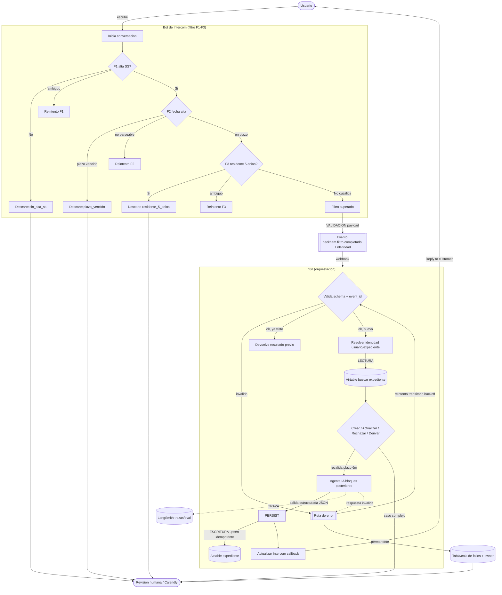

# Sesión de planificación — 2026-07-21

> **Naturaleza de esta sesión:** análisis y planificación en modo lectura.
> No se ha ejecutado, conectado, activado ni modificado ningún componente del sistema.
> El único archivo escrito es este documento.
>
> **Convención de etiquetas** usada en todo el documento:
> `[HECHO]` comprobado directamente en una fuente leída · `[INFERENCIA]` deducción razonada a partir de hechos ·
> `[PROPUESTA]` diseño sugerido, no existente todavía · `[DESCONOCIDO]` no verificable con los recursos accesibles.

---

## 1. Resumen ejecutivo

El proyecto automatiza el tramo inicial de captación del régimen Beckham (art. 93 LIRPF). Hoy el filtrado eliminatorio (F1 alta en SS, F2 plazo de 6 meses, F3 residencia fiscal previa) vive **dentro de n8n** como lógica determinista (Code + Switch + Set), y n8n devuelve el texto a Intercom por un *callback* asíncrono. `[HECHO]`

Tras la reunión con el manager, el cambio de rumbo es: **las preguntas de filtro deben realizarse dentro del propio bot de Intercom**, no en n8n. `[HECHO — instrucción del usuario]` Esto reasigna responsabilidades: Intercom pasa a ser el *front conversacional* (pregunta, recoge, ramifica el filtro básico y decide continuar/derivar), y n8n deja de recalcular las preguntas para convertirse en **capa de orquestación, persistencia e inteligencia** (identidad, expediente, agente de IA, escritura en Airtable, actualización de Intercom).

Consecuencias principales del rediseño `[INFERENCIA/PROPUESTA]`:
- El Switch `Filtro_Eliminatorio1` y las tres ramas F1/F2/F3 de n8n (Code de interpretación + Ruta_Fx + Set_*) **dejan de ser necesarios** si Intercom ya resuelve el filtro; parte de esa lógica se traslada a Intercom y parte simplemente desaparece.
- Aparece un **contrato de datos Intercom→n8n** nuevo y explícito (payload con resultados de filtro + identidad), que hay que versionar.
- El **agente de IA** entra *después* del filtro, para los bloques ricos (datos, perfil, documentación, 030/149), no para F1–F3.
- **LangSmith** es observabilidad + evaluación + iteración de prompts + datasets del agente de IA. **No entrena ni ajusta el modelo automáticamente.** `[HECHO — doc LangSmith]`
- **Airtable** ya tiene una tabla real muy rica (`Empleados`, 58 columnas) que **no coincide** con el modelo conceptual "Expediente de tabla única" descrito en la documentación del proyecto: es una discrepancia que hay que resolver antes de conectar nada. `[HECHO]`

Recomendación de arranque para la siguiente sesión: **congelar el contrato de datos Intercom→n8n y reconciliar el modelo Airtable real (`Empleados`) con el conceptual (`Expediente`) antes de tocar código.** Son las dos dependencias que bloquean todo lo demás.

---

## 2. Alcance de esta sesión

**Dentro de alcance:** leer los recursos accesibles, entender el sistema actual, traducir la decisión de la reunión a impacto arquitectónico, diseñar conceptualmente la arquitectura objetivo, y producir un plan de implementación futuro con riesgos y decisiones pendientes.

**Fuera de alcance (no realizado):** implementar, modificar o ejecutar cualquier componente; conectar sistemas; enviar webhooks; editar Airtable/Intercom/n8n/LangSmith; publicar el workflow; hacer commits.

**Restricción de datos:** no se reproduce ningún valor de registro (nombres, emails, teléfonos, NIF/DNI, documentos). Del CSV solo se usan **nombres de columna y estructura**.

---

## 3. Recursos revisados

| # | Recurso | ¿Abierto? | ¿Leído completo? | Qué aportó |
|---|---|---|---|---|
| 1 | `Empleados-Grid view.csv` (raíz del proyecto) | Sí `[HECHO]` | Solo cabecera / esquema (por PII) | 58 nombres de columna → estructura real de la tabla `Empleados`; identificadores técnicos y de negocio; estados; taxonomías Beckham |
| 2 | Workflow n8n `beckham_bot` (id `nhOwpiGxikeU5DLR`) vía MCP `n8n-mcp` (solo lectura) | Sí `[HECHO]` | Sí (51 nodos, analizado en subagente) | Trigger, grafo del Bloque ①, nodos Code, Switch, Set, Callback, nodos Airtable/IA desactivados, manejo de errores |
| 3 | Notion "LangSmith" (TaxDown AI Stack) + subpáginas "Introducción" y "Metodología para iterar prompts" | Sí `[HECHO]` | Índice + 2 subpáginas clave | Función real de LangSmith: depurar/evaluar/monitorizar LLMs, prompts, datasets, experimentos, auto-evaluadores; tenant EU SSO; workspaces |
| 4 | `Trabajo.md` (bitácora activa) | Sí `[HECHO]` | Sí | Estado del Bloque ①, contrato del Data Connector, contrato del callback, gap del "Reply" en Intercom |
| 5 | `ARQUITECTURA_bloque1.md` | Sí `[HECHO]` | Sí | Explicación de callback/fallback y topología del Bloque ① |
| 6 | `contexto_proyecto_beckham.md` | Sí `[HECHO]` | Sí | Reparto Hammad/Paula; historial; decisión Opción B; textos F1–F3; modelo Expediente conceptual |
| 7 | `.orchestron/log.md` + `state.json` (histórico read-only) | Sí `[HECHO]` | Sí | Trazabilidad de decisiones previas (coherente con Trabajo.md) |

---

## 4. Recursos no accesibles o incompletos

| Recurso | Estado | Detalle |
|---|---|---|
| Base de Airtable en vivo (`app5K8OnSObqwWweS`, tabla `tblTWCWu5nQXNOMR1`, vista `viwWOsgQWxZOJj2G8`) | **No inspeccionada en navegador esta sesión** `[DESCONOCIDO]` | No se abrió el navegador contra Airtable (requiere sesión autenticada y habría implicado abrir datos reales). Todo lo relativo a la estructura de Airtable procede del **CSV export** y de la documentación del proyecto, no de la base viva. No se ha confirmado: primary field real, tipos exactos de campo, relaciones entre tablas, otras tablas de la base, automatizaciones nativas, vistas ni permisos. |
| Configuración interna del bot de Intercom (workflows `reuse_mobility`, `n8n_BOT_mobility`, Data Connector `n8n_bot_mobility`) | **Parcial** `[HECHO parcial]` | Documentada en `Trabajo.md`/`.orchestron` a partir de una inspección previa por navegador (no de esta sesión). No re-verificada hoy. El "paso Reply" que muestra `mensajeUsuario` sigue marcado como gap pendiente. |
| LangSmith en vivo (tenant `eu.smith.langchain.com`) | **No accedido** `[DESCONOCIDO]` | Requiere SSO Microsoft. Solo se leyó la documentación en Notion, no la plataforma. No se conocen proyectos/datasets existentes del bot Beckham. |
| Correspondencia `Empleados` ↔ `Expediente` | **No resuelta** `[DESCONOCIDO]` | El CSV es de la tabla `Empleados`; la documentación describe una tabla `Expediente`. No se ha podido confirmar si son la misma tabla renombrada, dos tablas distintas de la base, o dos modelos en conflicto. |
| Contenido de vídeos/whiteboard enlazados en la doc de LangSmith | No consumido | Son adjuntos multimedia; no aportan datos estructurales adicionales al análisis. |

---

## 5. Estado actual del sistema

### 5.1 Flujo real Intercom ↔ n8n `[HECHO]`
```
Usuario escribe en Intercom
  → workflow Intercom reuse_mobility → "please wait" → n8n_BOT_mobility
  → Data Connector n8n_bot_mobility hace POST al Webhook de n8n
  → Webhook de n8n responde ACK inmediato ("Workflow got started.")
  → n8n ejecuta lógica de filtros F1/F2/F3 (determinista)
  → n8n hace POST callback a Intercom (trigger_step) con { data: { mensajeUsuario } }
  → Intercom (Wait for webhook) reanuda … y DEBERÍA mostrar el mensaje (gap)
```
- **Contrato de entrada (DC → n8n)** `[HECHO]`: body con `conversation_id`, `user_id`, `conversationPartId`, `message`, `nombre_apellidos`, `telefono`, `user_email`, `partner`, `conversation_part_id_debounce`, `First Message ID`.
- **Contrato de salida real** `[HECHO]`: el texto viaja por el **callback asíncrono**, no por la respuesta del DC. Intercom solo lee `data.mensajeUsuario`. El campo `message` del DC queda sin uso real.
- **Gap confirmado** `[HECHO]`: en `n8n_BOT_mobility` Path A, tras "Wait for webhook" **no hay paso "Reply to customer"** que renderice `mensajeUsuario`. Sin él, el callback no se ve.

### 5.2 Workflow n8n `beckham_bot` — Bloque ① `[HECHO, vía MCP]`
- Trigger: `Webhook1` (POST), **respuesta inmediata** (ack), sin nodo Respond.
- Cadena activa: `Webhook1 → If2 (debounce) → Wait2(3s)/directo → Traer_Conversacion_intercom1 (HTTP GET) → Formatear_conversacion1 (Code) → Search records2 [DESACTIVADO] → Existe_Expediente1 (If) → { true → Crear_Expediente1 [DESACTIVADO] → Enviar_F1_Inicial → Callback_Intercom · false → Determinar_Pregunta_Pendiente1 → Filtro_Eliminatorio1 }`.
- `Filtro_Eliminatorio1` (Switch, `fallbackOutput:"extra"`): `out0 F1→Interpretar_F1`, `out1 F2→Calcular_Plazo_F2`, `out2 F3→Interpretar_F3`, `out3 fallback→Set_Fallback_continuar`. Cada `Interpretar/Calcular → Ruta_Fx (Switch avanza/descarta/reintento) → Set_Fx_* → Converger_Bloque1 (NoOp) → Callback_Intercom`.
- Lógica determinista (sin IA): keywords sí/no normalizadas para F1/F3, parseo de fecha multi-formato + `fecha+6m ≥ hoy` para F2, `Determinar_Pregunta_Pendiente1` elige el primer campo vacío en orden F1→F2→F3 o `"completo"`.
- Errores: `retryOnFail:true` en `Traer_Conversacion_intercom1` y `Callback_Intercom` (sin maxTries/wait explícitos). `Formatear_conversacion1` con `onError:continueErrorOutput` pero **sin rama de error cableada**. No hay Error Trigger global.

### 5.3 Dos defectos latentes detectados hoy (no corregir en esta sesión) `[HECHO]`
1. **`Existe_Expediente1` mal configurado:** su `leftValue` es la cadena literal `"id"` (texto), no una expresión `{{ $json.id }}`, con `operation:empty`. Como `"id"` nunca está vacío, la condición es siempre falsa → **la rama de "expediente nuevo" (Crear_Expediente1 → Enviar_F1_Inicial) es inalcanzable**; todo cae siempre por `Determinar_Pregunta_Pendiente1`. `[INFERENCIA fuerte a partir del hecho de configuración]`
2. **Persistencia apagada:** `Search records2` y `Crear_Expediente1` están `disabled` y **con base/tabla vacías**; por eso `Determinar_Pregunta_Pendiente1` no recibe `alta_ss`/`fecha_alta_ss`/`residente_5_anios` y `pregunta_pendiente` resuelve siempre `"F1"`. Las rutas F2/F3 y el fallback solo se han probado con pinData. `[HECHO]`

### 5.4 Airtable real (según CSV `Empleados`) `[HECHO]`
La tabla exportada tiene **58 columnas** que cubren mucho más que el filtro: identidad y contacto, documentación (autorizaciones, contrato, pasaporte, apostilla, visado, certificado ENISA), estados de proceso y de modelos 030/149, datos de domicilio, situación fiscal por año, y enlaces prellenados a formularios Airtable. Esto es **más amplio** que el modelo conceptual "Expediente de tabla única" de la documentación. Detalle en §15.

### 5.5 Componentes de IA `[HECHO]`
Existen nodos `Agente_conversacional`, `Determinar_usuario` (langchain agent), modelos `OpenAI Chat Model`/`1`, y tools (`Validar_documentacion`, `Validador_API`, `Transferir_humano`, `Guardar_resumen_airtable`, `Reenvio_Checkout`) — **todos desactivados** y pertenecientes a la zona superior del workflow (otros bloques). El Bloque ① no usa IA hoy.

---

## 6. Cambios solicitados después de la reunión

`[HECHO — instrucciones del usuario tras la reunión con su manager]`

1. Las **preguntas iniciales de filtro deben vivir dentro del bot de Intercom** (no en n8n ni fuera).
2. Al mover las preguntas, hay que **rediseñar conceptualmente el flujo de n8n**.
3. Definir **qué es y cómo se relaciona el agente de IA** con Intercom, n8n, LangSmith y Airtable.
4. Estudiar **la función real de LangSmith** y cómo incorporarlo.
5. Analizar **cómo conectar Airtable** partiendo de una base parcialmente construida.
6. Revisar el CSV y, si hay acceso por navegador, inspeccionar Airtable **solo lectura**.
7. Revisar el workflow n8n **solo para comprenderlo**.
8. Producir un **plan de implementación futuro** sin ejecutar nada.

Intercom, en el estado objetivo, debe: iniciar la conversación, hacer las preguntas de filtro, recoger respuestas, aplicar la lógica conversacional inicial, decidir continuar/derivar, y enviar al resto del sistema **solo la información necesaria**.

---

## 7. Impacto de mover las preguntas de filtro a Intercom

### 7.1 Qué lógica **sale** de n8n `[INFERENCIA/PROPUESTA]`
- `Filtro_Eliminatorio1` (Switch por `pregunta_pendiente`) y `Determinar_Pregunta_Pendiente1`: la "pregunta pendiente" ahora la gestiona el estado conversacional de Intercom.
- `Interpretar_F1`, `Interpretar_F3` (keywords sí/no) y las `Ruta_Fx` (avanza/descarta/reintento): si Intercom usa **botones/quick replies** o su propio NLU, la interpretación textual determinista deja de ser necesaria.
- Los `Set_F*_*` que fijan el texto de cada pregunta/descarte/reintento: los textos pasan a ser **contenido del bot de Intercom**.
- Es discutible `Calcular_Plazo_F2` (ver 7.2): el **cálculo de fecha + 6 meses** puede quedarse en n8n como validación de negocio aunque la recogida de la fecha sea en Intercom.

### 7.2 Qué lógica **permanece** en n8n `[PROPUESTA]`
- Ingesta del evento de Intercom (webhook), validación y normalización del payload.
- **Identidad**: resolver usuario y expediente.
- **Persistencia** en Airtable (lectura + upsert).
- **Reglas de negocio no triviales o sensibles a fecha/servidor**: p. ej. recalcular/validar el plazo de 6 meses con la fecha del servidor (no confiar solo en el cálculo del cliente). `[PROPUESTA — defensa en profundidad]`
- **Agente de IA** para los bloques posteriores (datos, perfil, documentación).
- **Callback / actualización de Intercom** y trazas a LangSmith.
- Orquestación de errores, reintentos e idempotencia.

### 7.3 Qué asume Intercom / qué NO debe asumir
**Asume** `[PROPUESTA]`: conversación, preguntas de filtro, recogida de respuestas, ramificación básica (continuar/descartar/derivar), y emisión de un evento con resultados + identidad.
**No debe asumir** `[PROPUESTA]`: ser la fuente de verdad del expediente, ejecutar escrituras en Airtable, contener reglas fiscales complejas, ni almacenar histórico. Eso es de n8n/Airtable.

### 7.4 Preguntas de filtro
Las preguntas F1–F3, sus descartes y reintentos **sí aparecen** en los recursos (n8n `Set_*` y `contexto_proyecto_beckham.md`), con textos ya redactados en su mayoría. `[HECHO]`

| Filtro | Pregunta (texto real) | Tipo de respuesta | avanza | descarta | reintento |
|---|---|---|---|---|---|
| **F1** | "¿Estás dado de alta en la Seguridad Social española?" | Sí/No | Sí → F2 | No → `sin_alta_ss` | ambiguo |
| **F2** | "¿Qué día te diste de alta en la Seguridad Social?" | Fecha | `fecha+6m ≥ hoy` → F3 | `fecha+6m < hoy` → `plazo_vencido` | no parseable |
| **F3** (invertido) | "¿Has sido residente fiscal en España en los últimos 5 años?" | Sí/No | **No** → continuar | **Sí** → `residente_5_anios` | ambiguo |

Orden obligatorio: **F1 → F2 → F3**, todas obligatorias para cualificar. Mensajes de descarte y de "continuar" ya redactados (los `reintento_*` y `mensaje_continuar` son placeholders pendientes de redacción final). `[HECHO]`

**Ramas conversacionales** `[HECHO/PROPUESTA]`: por cada filtro, tres desenlaces (avanza / descarta con motivo / reintento). Descartes → fin de conversación con mensaje específico (posible derivación a "¿te ayudamos con tu declaración?"). Continuar tras F3 → entra el resto del sistema.

**Casos límite** `[PROPUESTA]`:
- *Falta respuesta / abandono:* Intercom debe tener timeout/estado "incompleto"; no se debe crear/actualizar expediente como cualificado. n8n solo procesa eventos "filtro completado" o "descartado".
- *Respuesta no contemplada:* rama reintento (máx. N reintentos → derivar a humano). `[PROPUESTA]`
- *Reapertura de conversación:* debe distinguirse (ver §18) para no reprocesar.

### 7.5 Qué debe enviar Intercom a n8n `[PROPUESTA — contrato nuevo]`
Payload mínimo:
- **Identidad:** `conversation_id`, `contact_id`/`user_id`, `user_email`, `nombre_apellidos`, `telefono`, `partner`.
- **Resultado del filtro:** `filtro_resultado` (`cualifica`/`descartado`/`incompleto`), `motivo_descarte` (enum) si aplica, `alta_ss` (bool), `fecha_alta_ss` (ISO), `residente_5_anios` (bool).
- **Metadatos (envoltura de evento):** `event_id`, `correlation_id`, `event_type` (p.ej. `beckham.filtro.completado`), `schema_version`, `occurred_at`, `source:"intercom"`, `metadata.attempt`.
- **Identificador único a conservar:** `conversation_id` como clave de correlación conversacional + `event_id` como clave de deduplicación del evento. `[PROPUESTA]`

---

## 8. Arquitectura actual

```
[Usuario] → [Intercom: reuse_mobility → n8n_BOT_mobility]
                 │  (Data Connector, síncrono, ack)
                 ▼
        [n8n beckham_bot]  ── TODA la lógica de filtro F1/F2/F3 (determinista) ──┐
                 │                                                                │
                 │  persistencia Airtable DESACTIVADA (base/tabla vacías)         │
                 ▼                                                                │
        [Callback_Intercom]  ── POST { data:{ mensajeUsuario } } ────────────────┘
                 ▼
        [Intercom Wait for webhook]  → (GAP: falta "Reply to customer")
```
Características actuales: filtro en n8n; sin persistencia; sin IA; sin observabilidad LangSmith; callback correcto pero no renderizado por falta del paso Reply. `[HECHO]`

---

## 9. Arquitectura objetivo

`[PROPUESTA]` Reasignación de responsabilidades:

| Componente | Responsabilidad objetivo |
|---|---|
| **Usuario** | Conversa dentro de Intercom. |
| **Bot de Intercom** | Inicia, pregunta F1–F3, recoge respuestas, ramifica (continuar/descartar/reintento), decide derivación humana, emite **evento de filtro** a n8n con identidad + resultados. Renderiza los mensajes de vuelta (Reply). |
| **n8n** | Ingesta + validación del evento; identidad usuario/expediente; lectura/upsert Airtable; (re)validación de reglas sensibles (plazo 6m); invoca al agente para bloques posteriores; actualiza Intercom; emite trazas a LangSmith; gestiona errores/reintentos/idempotencia. |
| **Agente de IA** | *Después* del filtro: conversación rica y estructurada (datos, perfil, documentación 030/149), devuelve **salida estructurada** (JSON) para que n8n persista; nunca escribe directamente en Airtable. |
| **LangSmith** | Observabilidad (trazas), evaluación con datasets y auto-evaluadores, iteración/versionado de prompts, comparación de experimentos, estimación de coste. **No entrena.** |
| **Airtable** | Fuente de verdad del expediente (tabla `Empleados`/`Expediente` reconciliada). Escrituras controladas vía n8n. |
| **Revisión humana** | Descartes dudosos, reintentos agotados, baja confianza del agente, y operaciones sensibles (envío de borradores 030/149). |

Flujo conceptual completo: **Intercom (filtro) → n8n (identidad+persistencia) → Agente IA (bloques ricos) → Airtable (upsert) → Intercom (respuesta)**, con **LangSmith** recibiendo trazas del agente y **cola/tabla de errores** recogiendo fallos.

---

## 10. Diagrama completo en Mermaid

> Documental. No debe usarse para generar, configurar ni desplegar nada.



Diferenciación pedida: **flujo normal** (aristas sólidas), **ruta de error** (`ERR`/`DLQ`), **derivación humana** (`HUM`), **lecturas** (`AT_R`), **escrituras futuras** (`AT_W`, `PERSIST`), **trazas LangSmith** (aristas punteadas a `LS`), **reintentos** (`ERR → VAL` con backoff), **puntos de validación** (`VAL`, "VALIDACION payload").

---

## 11. Diseño conceptual del bot de Intercom

`[PROPUESTA]` — no configurar; documentar cómo configurarlo después.

- **Estructura de cada pregunta:** enunciado + tipo de respuesta esperado + ramas. Preferir **respuestas cerradas** donde sea posible (F1, F3: botones Sí/No; F2: selector/entrada de fecha validada) para eliminar la interpretación por keywords y reducir reintentos. `[PROPUESTA]`
- **Finalidad por pregunta:** F1 = requisito de alta en SS; F2 = requisito de plazo improrrogable de 6 meses; F3 = requisito de no residencia fiscal previa (invertido).
- **Lógica de ramificación:** avanza / descarta (con `motivo_descarte`) / reintento (máx N → derivar a humano).
- **Estados conversacionales a mantener en Intercom:** `en_filtro_F1|F2|F3`, `descartado`, `cualificado`, `incompleto/abandonado`, `derivado_humano`.
- **Qué falta para redactar definitivamente:** textos finales de `reintento_F1/F2/F3` y `mensaje_continuar` (hoy placeholders); política de nº de reintentos; comportamiento de timeout/abandono; si F2 usa date-picker nativo de Intercom. `[DESCONOCIDO — pendiente de decisión]`
- **Salida:** al superar/descartar el filtro, Intercom emite el evento del §7.5 a n8n. En "incompleto/abandonado" **no** emite evento de cualificación.

---

## 12. Rediseño conceptual del workflow de n8n

`[PROPUESTA]` — no construir. Etapas del contrato `Trigger → Validate → Normalize → Enrich → Decide → Execute → Persist → Notify`:

1. **Trigger:** webhook nuevo dedicado (no reutilizar `path`/`webhookId` existentes — lección ya aprendida de la colisión con el bot cripto). Modo de respuesta a decidir (ack + callback vs. Respond node).
2. **Payload esperado:** el del §7.5 (identidad + resultado de filtro + metadatos de evento).
3. **Metadatos:** `event_id`, `correlation_id`, `schema_version`, `occurred_at`, `attempt`.
4. **Validaciones iniciales:** esquema del payload; presencia de identidad mínima; `motivo_descarte` ∈ enum; fecha ISO válida.
5. **Normalización:** email en minúsculas/trim; fecha a ISO; teléfono normalizado; mapeo de enums.
6. **Identidad de usuario:** clave de negocio (candidata: `user_email` / `UserId`), no el nombre.
7. **Identidad de expediente:** clave estable (candidata: `recordId` de Airtable para updates; clave de negocio para búsqueda). Ver §16.
8. **Consulta de registros existentes:** buscar expediente por clave de negocio antes de escribir.
9. **Decisión:** crear / actualizar / rechazar (descartado) / derivar (humano).
10. **Cuándo entra el agente:** **solo tras filtro superado**, para bloques posteriores (datos/perfil/documentación), no para F1–F3.
11. **Info al agente:** contexto de negocio (reglas Beckham), estado del expediente, historial conversacional relevante, esquema de salida.
12. **Info del agente:** JSON estructurado validado (campos + confianza + necesidad de revisión humana).
13. **Escritura en Airtable:** upsert idempotente (ver §17–18).
14. **Actualización de Intercom:** callback/Reply con el mensaje resultante.
15. **Ruta de error:** Error Trigger + tabla/cola de fallos con `correlation_id`, nodo, clase de error, payload seguro.
16. **Reintentos:** distinguir transitorios (429/timeout/5xx → backoff+jitter, límite) de permanentes (4xx semántico/credenciales → no reintentar).
17. **Idempotencia:** ledger por `event_id`/`idempotency_key` (ver §18).
18. **Logs / 19. Trazabilidad:** `correlation_id` propagado; trazas del agente a LangSmith.
20. **Eventos duplicados / 21. fuera de orden:** dedupe por `event_id`; usar `occurred_at` para descartar eventos atrasados que pisarían estado más nuevo.
22. **Fallo a mitad:** checkpoint/estado `processing` antes del efecto externo.
23. **Efecto ejecutado pero confirmación perdida:** reconciliación por clave de negocio + external ID guardado; upsert evita duplicar.
24. **Casos a revisión humana:** reintentos agotados, baja confianza del agente, operaciones sensibles (030/149).

**Efectos externos futuros:**

| Efecto | Sistema | Dato que lo identifica | Clave de idempotencia | Cómo comprobar que ya se ejecutó | Ante reintento | Si se pierde confirmación |
|---|---|---|---|---|---|---|
| Crear/actualizar expediente | Airtable | clave de negocio (email/UserId) + recordId | `idem = source+event_id` o clave de negocio | buscar registro por clave antes de crear | upsert (no duplica) | reconciliar por clave; external ID persistido |
| Responder a Intercom | Intercom | `conversation_id` + `event_id` | `conversation_id+step` | marcar en ledger "respondido" | evitar doble Reply consultando ledger | reintento acotado; Reply idempotente por paso |
| Traza a LangSmith | LangSmith | `run_id`/`correlation_id` | `correlation_id` | trazas son append-only, colisión tolerable | reenviar es seguro | pérdida no crítica (observabilidad) |

---

## 13. Diseño conceptual del agente de IA

`[PROPUESTA]` — no crear el agente.

1. **Responsabilidad:** conducir los **bloques posteriores al filtro** (datos básicos, perfil, guía de documentación 030/149) y devolver datos estructurados. No decide elegibilidad F1–F3 (eso es Intercom).
2. **Recibe:** mensaje del usuario, historial, estado del expediente, contexto de negocio.
3. **Contexto necesario:** reglas Beckham (art. 93), campos objetivo del expediente, taxonomías (estados, motivos), formato de salida.
4. **Herramientas:** lectura de expediente (Airtable, vía n8n), validaciones de documento, y —opcionalmente— acciones Intercom (transferir a humano). Toda escritura **mediada por n8n**.
5. **Puede consultar:** expediente actual, catálogos/enums, documentación.
6. **Puede proponer modificar:** campos derivados de la conversación (datos personales aportados por el usuario, perfil). Como **propuesta**, no escritura directa.
7. **Nunca debe modificar directamente:** Airtable, estados de proceso sensibles, ni datos legales/documentales validados manualmente. Ver §15 (campos no sobrescribibles).
8. **Formato de salida:** JSON estructurado con esquema fijo (campos + `confidence` + `needs_human_review` + `motivo`).
9. **Datos desconocidos:** debe marcar `unknown`/`null` explícito, nunca rellenar a ciegas.
10. **Evitar inventar:** instrucción de no alucinar; validación de salida contra esquema; rechazo si no cumple.
11. **Decisiones autónomas:** avanzar preguntas, normalizar datos claros, pedir aclaración.
12. **Requieren revisión humana:** baja confianza, contradicciones, documentación ambigua, envío de borradores 030/149.
13. **Registro de ejecuciones:** cada run a LangSmith con `correlation_id`.
14. **Trazas a LangSmith:** input, output, prompt/versión, tool calls, latencia, tokens/coste, resultado de evaluadores.
15. **Métricas:** correctness (vs. referencia), formato válido (structured output), llamada correcta a tool, tasa de `needs_human_review`, coste por conversación.
16. **Dataset de evaluación:** ejemplos representativos con output de referencia (incluyendo la conversión de conversaciones de Intercom a examples — la doc de LangSmith describe cómo). Datos **anonimizados**.
17. **Comparar versiones de prompt:** experimentos sobre el mismo dataset; vista *compare* de LangSmith.
18. **Criterio mejora/empeora:** media de métricas del experimento nuevo vs. baseline (correctness, formato, tool). Mejora = subir sin regresiones en casos críticos.
19. **Respuesta inválida:** rechazar → reintento con instrucción de formato → si persiste, derivar a humano y registrar.
20. **Versionado de prompts:** prompts versionados en LangSmith, publicación por entorno (`prod`), promoción tras superar evaluación.

**Separación de capas del agente:**
- *System prompt (permanente):* rol, límites, formato, prohibiciones.
- *Contexto de negocio:* reglas Beckham, catálogos, definiciones.
- *Datos de conversación:* historial + mensaje actual + estado del expediente.
- *Herramientas:* lecturas/validaciones (escrituras vía n8n).
- *Restricciones:* no inventar, no escribir directo, marcar desconocidos.
- *Formato de salida:* esquema JSON.
- *Evaluación:* datasets + auto-evaluadores.
- *Observabilidad:* trazas.
- *Revisión humana:* condiciones de escalado.

---

## 14. Función real de LangSmith

`[HECHO — documentación TaxDown/Notion]` LangSmith es "una plataforma para **depurar, evaluar y monitorizar** aplicaciones con LLMs; también permite **crear e iterar prompts**". Tenant TaxDown en `eu.smith.langchain.com` (SSO Microsoft), organizado en workspaces (p. ej. `Ops-Fiscal`, `Tech-Producto`). La metodología documentada usa: prompt + dataset (ejemplos con output de referencia) + al menos un auto-evaluador; se lanzan **experimentos** y se comparan para decidir si un prompt mejora antes de pasarlo a `prod`. Existe guía específica para **añadir conversaciones de Intercom a un dataset**.

| Concepto | ¿LangSmith lo soporta? | Nota |
|---|---|---|
| Trazas | **Directo** `[HECHO]` | Base de la observabilidad |
| Observabilidad / monitorización | **Directo** `[HECHO]` | Depurar y monitorizar en producción |
| Evaluación (experimentos) | **Directo** `[HECHO]` | Experimentos sobre datasets |
| Datasets | **Directo** `[HECHO]` | Key-Value, splits, examples; incl. desde Intercom |
| Pruebas de prompts (playground) | **Directo** `[HECHO]` | Test over dataset / repeticiones (máx 30) |
| Comparación de versiones | **Directo** `[HECHO]` | Vista *compare* entre experimentos |
| Depuración | **Directo** `[HECHO]` | Análisis de runs |
| Feedback / anotación | **Directo** `[HECHO]` | Correctness 0/1 + notas manuales |
| Evaluaciones automáticas | **Directo** `[HECHO]` | Auto-evaluadores asociados al dataset |
| Evaluaciones humanas | **Directo** `[HECHO]` | Anotación manual de ejemplos |
| Versionado de prompts por entorno | **Directo** `[HECHO]` | Publicar/probar por entorno, promover a `prod` |
| Estimación de costes | **Directo** `[HECHO]` | Guía "Cómo estimar costes desde LangSmith" |
| **Entrenamiento del modelo** | **No** `[HECHO — no figura como capacidad]` | LangSmith **no entrena** el bot |
| **Fine-tuning** | **No confirmado** `[DESCONOCIDO]` | La doc revisada no lo describe; no debe asumirse. La mejora se logra **iterando prompts y datasets**, no ajustando pesos |

> **Corrección expresa:** LangSmith **no "entrena" ni ajusta automáticamente** el bot. Mejora la calidad mediante iteración de prompts evaluada contra datasets con auto-evaluadores.

---

## 15. Auditoría de solo lectura de Airtable

`[HECHO — solo del CSV export `Empleados`; la base viva NO se inspeccionó esta sesión]`

**Qué representa la tabla `Empleados`:** una fila ≈ un **empleado/solicitante** con su expediente de tramitación Beckham (datos personales, documentación, estados de proceso y de modelos 030/149). Es **más rica** que el "Expediente de tabla única" conceptual del proyecto.

**Columnas (58) agrupadas por función** (solo nombres, sin valores):
- **Identidad / negocio:** `Nombre completo`, `Nombre empleado`, `Apellidos empleado`, `NIF`, `DNI`, `Pasaporte`, `email`, `emailcorrectosinespacios`, `NumeroTelefono`, `Sexo`, `FechaNacimiento`, `fechaNacimientocorrecta`, `PaisNacimiento`, `UltimoPaisResidencia`, `Idioma`.
- **Claves técnicas / integración:** `UserId`, `recordId`, `RecordID Formulario`. `[INFERENCIA]` `recordId` parece Airtable Record ID (empieza por `rec…`); `UserId` y `RecordID Formulario` parecen claves de negocio/origen. **No confirmado** cuál es el primary field ni los tipos exactos `[DESCONOCIDO]`.
- **Filtro Beckham (relevante para F1/F2/F3):** `AltaSeguridadSocial`, `FechaAlta`, `AplicaBeckham`, `TipoBeckham`, `AnioDesplazamiento`, `fechaDesplazamiento`, `fechaDesplazamientocorrecta`. `[INFERENCIA]` mapean a `alta_ss`/`fecha_alta_ss` del modelo conceptual. **No hay columna evidente para `residente_5_anios` (F3)** → posible gap.
- **Documentación:** `AutorizacionEmpleado`, `AutorizacionEmpresa`, `Contratotrabajo`, `CertificadoEnisa`, `Apostilla`, `Visado` (varios parecen adjuntos).
- **Empleador:** `Empresa`, `NombreEmpleador`, `CIFEmpleador`.
- **Estados / taxonomías:** `Status` (p. ej. valores tipo "N. Pendiente confirmación"), `Estado030`, `Estado149` (parecen checkbox/estado), `Modificacion M030`, `Modificacion M149`.
- **Domicilio / 030:** `Provincia de Nacimiento`, `Municipio de Nacimiento`, `Nombre de la calle`, `Número de tu domicilio`, `Planta`, `Puerta`, `Codigo Postal`, `Tipo de vía`, `estadoCivil`, `hijos`, `Propiedades`, `Inversiones`, `Situación fiscal Anio Desplazamiento`, `Situación fiscal AnioSiguiente`.
- **Formularios / envíos:** `LinkFormulario030149`, `Linkconfirmacion030`, `Linkconfirmacion149`, `Borrador030`, `EnviarBorrador030`, `MensajeConfirmacion149`.

**Fuente de verdad** `[INFERENCIA]`: `Empleados` parece la fuente de verdad del expediente. Los `Link…` y `Borrador…` son artefactos/derivados.

**Campos que podría escribir cada sistema** `[PROPUESTA]`:
- *Intercom (vía n8n):* `email`, `NumeroTelefono`, `Nombre/Apellidos`, `AltaSeguridadSocial`, `FechaAlta`, `UserId`, `conversation_id` (si existe).
- *Agente:* datos de perfil/domicilio, situación fiscal — **como propuesta a validar**.
- *n8n:* estados de proceso, `recordId`, campos de control/idempotencia.
- *Manuales:* documentación legal validada, `Status`, `Estado030/149`, envíos de borradores.
- *Histórico/snapshot:* `Status`, fechas, estados de modelos → conservar transiciones.

**Campos que NO deberían sobrescribirse automáticamente** `[PROPUESTA]`: documentación validada, `Status`, `Estado030/Estado149`, `EnviarBorrador030`, `MensajeConfirmacion149`, y cualquier dato ya confirmado por una persona.

**PII presente** `[HECHO]`: nombres, emails, teléfonos, NIF/DNI/pasaporte, fecha/lugar de nacimiento, domicilio, documentación. Requiere minimización y permisos estrictos (§20).

**Riesgos de integridad detectados** `[INFERENCIA]`: campos "correcto/duplicado" (`emailcorrectosinespacios`, `fechaNacimientocorrecta`, `fechaDesplazamientocorrecta`) sugieren **datos derivados/duplicados manuales** → normalizar quién los calcula. Sin restricción `UNIQUE` nativa en Airtable → riesgo de expedientes duplicados por email/UserId.

**No inspeccionado (base viva)** `[DESCONOCIDO]`: primary field real, tipos exactos, otras tablas, relaciones/linked records, lookups/rollups, vistas, automatizaciones nativas, permisos.

---

## 16. Fuentes de verdad

`[PROPUESTA/INFERENCIA]`

| Dato | Fuente de verdad | Notas |
|---|---|---|
| Identidad del solicitante | Airtable `Empleados` (clave de negocio email/`UserId`) | Intercom aporta, n8n reconcilia |
| Resultado de filtro F1–F3 | Intercom (lo produce) → persistido en Airtable | Airtable como registro; Intercom como origen del evento |
| Fecha de alta en SS / plazo | Airtable (`FechaAlta`), **revalidado por n8n** | No confiar solo en cliente |
| Estado del expediente / 030 / 149 | Airtable + gestión humana | n8n no debe pisar estados manuales |
| Documentación legal | Airtable + validación humana | Nunca sobrescritura automática |
| Prompts / versiones del agente | LangSmith | Fuente de verdad de prompts y evaluación |
| Trazas / métricas del agente | LangSmith | Observabilidad |
| Estado conversacional en curso | Intercom | Mientras la conversación está viva |

---

## 17. Mapeo conceptual de datos

`[PROPUESTA]` — nombres de destino tentativos; donde el nombre exacto no está confirmado se usa `DESCONOCIDO`. Operación ∈ {Lectura, Creación, Actualización, Upsert, Snapshot, Manual, Prohibida}.

| Sistema origen | Campo origen | Transformación | Sistema destino | Tabla destino | Campo destino | Operación | Oblig. | Validación | Clave idempotencia | ¿Sobrescribible? | Fuente de verdad | Observaciones |
|---|---|---|---|---|---|---|---|---|---|---|---|---|
| Intercom | conversation_id | ninguna | n8n | — | correlation_id | Lectura | Sí | no vacío | conversation_id | n/a | Intercom | correlación conversacional |
| Intercom | event_id | ninguna | n8n | — | idempotency_key | Lectura | Sí | UUID | event_id | n/a | Intercom | dedupe de evento |
| Intercom | user_email | lower+trim | Airtable | Empleados | `email` | Upsert | Sí | formato email | email | No (si validado) | Airtable | clave de negocio candidata |
| Intercom | user_id/UserId | ninguna | Airtable | Empleados | `UserId` | Upsert | Sí | no vacío | UserId | No | Airtable | clave técnica origen |
| Intercom | nombre_apellidos | split | Airtable | Empleados | `Nombre empleado`/`Apellidos empleado` | Actualización | No | — | — | Solo si vacío | Airtable | no pisar datos confirmados |
| Intercom | telefono | normaliza | Airtable | Empleados | `NumeroTelefono` | Actualización | No | E.164 | — | Solo si vacío | Airtable | PII |
| Intercom | alta_ss (F1) | bool | Airtable | Empleados | `AltaSeguridadSocial` | Upsert | Sí | bool | email | Con cuidado | Airtable | resultado F1 |
| Intercom | fecha_alta_ss (F2) | a ISO | Airtable | Empleados | `FechaAlta` | Upsert | Sí | fecha válida | email | Con cuidado | Airtable | n8n revalida +6m |
| Intercom | residente_5_anios (F3) | bool invert. | Airtable | Empleados | `DESCONOCIDO` | Upsert | Sí | bool | email | Con cuidado | Airtable | **no hay columna evidente** en el CSV |
| Intercom | motivo_descarte | enum | Airtable | Empleados | `DESCONOCIDO` (¿`Status`?) | Actualización | No | enum | email | Con cuidado | Airtable | no confirmado dónde se guarda |
| n8n | recordId | ninguna | Airtable | Empleados | `recordId` | Lectura/Actualización | Sí (update) | patrón `rec…` | recordId | No | Airtable | id técnico para updates |
| Agente | datos perfil/domicilio | estructura JSON | Airtable | Empleados | varios (`estadoCivil`,`hijos`,`Codigo Postal`,…) | Actualización | No | esquema | expediente+campo | Solo propuesta→humano si sensible | Airtable | agente propone, n8n persiste |
| n8n | estado de proceso | máquina estados | Airtable | Empleados | `Status`/`Estado030`/`Estado149` | Manual/Actualización controlada | No | transición válida | — | Prohibida sin regla | Airtable+humano | no pisar estados humanos |
| Agente | run/output | traza | LangSmith | — | run | Creación (append) | Sí | esquema salida | correlation_id | n/a | LangSmith | observabilidad |
| n8n | mensaje resultante | render | Intercom | — | data.mensajeUsuario | Actualización | Sí | no vacío | conversation_id+step | n/a | n8n | Reply al usuario |
| — | documentación legal | — | Airtable | Empleados | `Autorizacion*`,`Visado`,`Apostilla`,… | **Prohibida** (auto) | — | — | — | **No** | Airtable+humano | solo carga/validación manual |

**Justificación de cada `DESCONOCIDO`:**
- `residente_5_anios` destino: *relevante* porque es el resultado de F3; *falta* la columna en el CSV; *verificable* inspeccionando la base viva o preguntando a Paula; **no bloquea** el diseño conceptual pero **sí** la implementación de la escritura; *supuesto temporal:* crear/confirmar un campo booleano dedicado.
- `motivo_descarte` destino: *relevante* para trazar descartes; puede que se codifique dentro de `Status` u otro campo; verificable en la base; no bloquea el diseño; supuesto: enum propio (`sin_alta_ss|plazo_vencido|residente_5_anios|incompleto|otro`).
- Primary field y tipos exactos: relevantes para el mapeo físico; faltan por no abrir la base; verificables por lectura en Airtable; bloquean la fase de integración, no el diseño.

---

## 18. Idempotencia, duplicados y eventos fuera de orden

`[PROPUESTA]`
- **Clave de idempotencia:** `event_id` del evento de Intercom (dedupe de reentrega) + clave de negocio del expediente (`email`/`UserId`) para el upsert.
- **Ledger de ejecuciones:** tabla/vista de control (en Airtable a baja escala, o almacén externo si crece) con `event_id`, `estado` (`processing|succeeded|failed`), `external_id`, `occurred_at`, `attempt`.
- **Patrón:** normalizar `idempotency_key` → consultar ledger → si `succeeded`, devolver resultado previo (no repetir efecto) → si nuevo, marcar `processing` → ejecutar upsert → guardar `succeeded` + record id.
- **Duplicados:** webhooks/reintentos duplicados de Intercom se descartan por `event_id`. Expediente duplicado se evita buscando por clave de negocio antes de crear.
- **Fuera de orden:** comparar `occurred_at` del evento con el último aplicado; **no** sobrescribir con un evento más antiguo.
- **Fallo a mitad:** checkpoint `processing` antes del efecto; al reanudar, reconciliar por clave de negocio (idempotencia efectiva, no "exactly once").
- **Confirmación perdida tras efecto externo:** como el upsert es idempotente y el external ID se persiste, un reintento reconcilia sin duplicar.

---

## 19. Gestión de errores y reintentos

`[PROPUESTA]` (hoy el workflow **carece** de Error Trigger global y tiene una rama de error de `Formatear_conversacion1` sin cablear `[HECHO]`):
- **Error workflow común** con `Error Trigger`; captura `workflow`, `execution_id`, `node`, `error_class`, `correlation_id`, `attempt`, payload **con PII redactada**.
- **Clasificación:** transitorio (429/timeout/5xx → backoff+jitter, límite de intentos/tiempo); permanente (401/403/contrato inválido → no reintentar, escalar); de negocio (estado no permitido, descartado → ruta explícita); desconocido (detener + capturar + escalar).
- **Tabla/cola de fallos (DLQ)** con `estado`, `owner`, siguiente acción y enlace a la ejecución; **replay** manual seguro.
- **Compensación** para efectos ya realizados no reversibles automáticamente; **reconciliación** periódica Airtable↔sistemas.
- **Callback a Intercom:** ya tiene `retryOnFail` `[HECHO]`; añadir límite y control de doble-Reply vía ledger.
- **Aviso de n8n:** algunos mecanismos de error solo se disparan en ejecuciones automáticas, no en pruebas manuales — tenerlo en cuenta al testear.

---

## 20. Seguridad, privacidad y permisos

`[PROPUESTA/HECHO]`
- **PII abundante** en `Empleados` (identidad, contacto, documentos legales) `[HECHO]` → minimización: Intercom envía a n8n **solo lo necesario**; no exponer documentos a LLM salvo requerido y con base legal.
- **Credenciales** solo en el credential store de n8n / secret manager; nunca en Code, Set, URLs o sticky notes. `[PRINCIPIO]` El token del callback de Intercom ya viaja embebido en URL — tratarlo como secreto y no loguearlo. `[HECHO — token ofuscado en este análisis]`
- **Mínimo privilegio por integración futura:**
  - *n8n → Airtable:* acceso solo a la tabla/campos necesarios; sin permisos sobre campos legales validados (idealmente solo escritura de un subconjunto).
  - *Agente:* sin credenciales de escritura directa a Airtable (escribe vía n8n).
  - *LangSmith:* rol acorde (Editor para iterar prompts/datasets; Viewer si solo lectura); datasets **anonimizados**.
  - *Intercom → n8n:* verificar origen del webhook (firma/allowlist) cuando sea posible.
- **Operaciones que requieren aprobación humana:** envío de borradores 030/149, cambios de estado sensibles, descartes dudosos, escritura sobre documentación.
- **Retención:** redacción de PII en execution data/logs; política de pruning de ejecuciones.
- **Entornos:** separar test/prod; **datos de prueba anonimizados**, nunca PII real en datasets o tests.

---

## 21. Riesgos y mitigaciones

| # | Riesgo | Prob./Impacto | Mitigación |
|---|---|---|---|
| R1 | Discrepancia `Empleados` (58 cols, real) vs `Expediente` (conceptual) | Alta / Alto | Reconciliar modelos antes de conectar; congelar diccionario de datos con Paula |
| R2 | `Existe_Expediente1` con `leftValue` literal `"id"` → rama de creación inalcanzable | Alta / Medio | Corregir en fase de rediseño n8n (fuera de esta sesión) |
| R3 | Sin persistencia → multi-turno y F2/F3/fallback no probados en real | Alta / Alto | Conectar Airtable con clave de negocio + upsert idempotente |
| R4 | Duplicación de expedientes (sin UNIQUE nativo en Airtable) | Media / Alto | Clave canónica + vista de duplicados + búsqueda previa al create |
| R5 | Colisión de webhook (ya ocurrió con bot cripto) | Media / Alto | Crear webhook nuevo desde cero; nunca reutilizar `path`/`webhookId` |
| R6 | Gap "Reply to customer" en Intercom → usuario no ve respuesta | Alta / Alto | Añadir el paso Reply (cambio en producción → requiere OK) |
| R7 | F3 (`residente_5_anios`) sin columna evidente en Airtable | Media / Medio | Confirmar/crear campo con Paula |
| R8 | LLM inventa datos / escribe basura | Media / Alto | Salida estructurada validada, `needs_human_review`, evaluación LangSmith |
| R9 | Malentender LangSmith como "entrenamiento" | Media / Medio | Documentado: es observabilidad+evaluación+prompts, no training (§14) |
| R10 | Eventos duplicados/fuera de orden corrompen estado | Media / Alto | Dedupe por `event_id` + `occurred_at` + ledger (§18) |
| R11 | PII a LLM/logs/datasets | Media / Alto | Minimización, redacción, anonimización (§20) |
| R12 | Publicar el workflow por error | Baja / Alto | No publicar sin OK explícito; sigue en borrador |

---

## 22. Decisiones pendientes

1. **¿`Empleados` es el `Expediente`?** ¿Se reutiliza, se crea una tabla nueva, o se relacionan? (bloquea integración) `[DESCONOCIDO]`
2. **Formato de las preguntas en Intercom:** ¿botones/quick replies + date-picker (elimina interpretación por keywords) o texto libre? `[PENDIENTE]`
3. **Dónde revalidar el plazo de 6 meses:** solo Intercom, o Intercom + n8n (recomendado). `[PENDIENTE]`
4. **Clave de negocio del expediente:** `email` vs `UserId` vs compuesta. `[PENDIENTE]`
5. **Dónde se guarda `motivo_descarte` y `residente_5_anios`** en Airtable. `[DESCONOCIDO]`
6. **Modo de respuesta del webhook n8n:** mantener ack+callback o migrar a Respond node. `[PENDIENTE]`
7. **Alcance del agente:** qué bloques cubre primero (datos vs documentación). `[PENDIENTE]`
8. **Workspace y proyecto de LangSmith** para este bot. `[DESCONOCIDO]`
9. **Nº de reintentos y política de abandono/timeout** en Intercom. `[PENDIENTE]`
10. **Textos finales** de `reintento_F1/F2/F3` y `mensaje_continuar`. `[PENDIENTE]`

---

## 23. Dudas y bloqueos reales

- **Bloqueo de integración Airtable:** sin resolver la discrepancia de modelo (§22.1) y los campos destino de F3/motivo_descarte (§22.5), no se puede especificar el upsert. *Recurso que falta:* inspección de la base viva + confirmación de Paula. *Verificable:* abriendo Airtable en lectura o preguntando. *Bloquea:* fase de integración Airtable, no el diseño conceptual.
- **Bloqueo de renderizado Intercom:** el gap del paso "Reply" impide ver cualquier respuesta; es cambio en producción y **requiere OK explícito**. *Bloquea:* test end-to-end.
- **LangSmith en vivo:** no se conocen proyectos/datasets existentes del bot. *Recurso que falta:* acceso al tenant. *Bloquea:* fase de configuración LangSmith, no el diseño del agente.
- **Configuración interna del bot de Intercom:** la capacidad real del builder de Intercom (¿soporta fecha nativa? ¿estados? ¿condiciones?) no se ha verificado esta sesión. `[DESCONOCIDO]` No inventar capacidades de Intercom.

---

## 24. Plan de implementación futuro

`[PROPUESTA]` — ninguna tarea ejecutada ni marcada como completada.

| ID | Fase | Tarea | Objetivo | Dependencias | Sistemas | Riesgo | Criterio de verificación | ¿Aprobación? | Responsable |
|---|---|---|---|---|---|---|---|---|---|
| P1 | Validación arquitectura | Revisar este documento con manager/Paula | Alinear arquitectura objetivo | — | Todos | Bajo | Documento aprobado por escrito | Sí | Hammad |
| P2 | Preguntas de filtro | Confirmar textos finales + formato (botones/fecha) + reintentos/timeout | Cerrar F1–F3 definitivas | P1 | Intercom | Medio | Textos y ramas firmados; placeholders eliminados | Sí | Paula/Hammad |
| P3 | Contrato de datos | Definir y versionar el payload Intercom→n8n (§7.5) | Contrato estable v1 | P2 | Intercom, n8n | Alto | Payload valida contra esquema acordado | Sí | Hammad |
| P4 | Reconciliación Airtable | Resolver `Empleados`↔`Expediente`; mapear campos F1–F3, motivo_descarte, residente_5_anios; definir clave de negocio | Diccionario de datos cerrado | P1 | Airtable | Alto | Diccionario aprobado; toda columna destino identificada (0 `DESCONOCIDO` en el mapeo crítico) | Sí | Paula/Hammad |
| P5 | Config bot Intercom | Configurar el bot con F1–F3 y emisión del evento | Filtro dentro de Intercom | P2,P3 | Intercom | Alto | En test, F1–F3 ramifican bien y emiten evento válido | Sí | Paula/Hammad |
| P6 | Rediseño n8n | Rediseñar workflow: retirar Switch/rutas F1–F3; añadir Validate/Identity/Upsert/Error/idempotencia; corregir `Existe_Expediente1` | n8n como orquestador | P3,P4 | n8n | Alto | Workflow valida payload; evento duplicado no crea 2º registro; fallo Airtable cae en ruta de error | Sí (publicación) | Hammad |
| P7 | Diseño agente | Especificar system prompt, contexto, tools, esquema de salida | Agente definido | P4 | n8n, IA | Medio | Esquema de salida validable; prohibiciones explícitas | Sí | Paula/Hammad |
| P8 | Config LangSmith | Crear proyecto/dataset del bot; auto-evaluadores; versionado de prompts | Observabilidad + evaluación | P7 | LangSmith | Medio | Una ejecución de prueba queda registrada en LangSmith; dataset sin PII real | Sí | Paula |
| P9 | Integración Airtable | Implementar lectura + upsert idempotente con clave de negocio y ledger | Persistencia real | P4,P6 | n8n, Airtable | Alto | Upsert no duplica; ledger registra `succeeded`; PII minimizada | Sí | Hammad |
| P10 | Datos de prueba | Preparar fixtures **anonimizados** (happy path + bordes + duplicados) | Test seguro | P3,P4 | — | Bajo | Ninguna prueba usa PII real | No | Hammad |
| P11 | Pruebas en test | Ejecutar casos en entorno de test (borrador) | Validar flujo | P5,P6,P9,P10 | Todos | Medio | Casos borde pasan; reintentos/errores se comportan | No | Hammad |
| P12 | Test end-to-end | Conversación real Intercom→n8n→Airtable→Intercom (requiere Reply + publish) | Validación integral | P11, gap Reply | Todos | Alto | Usuario ve la respuesta; expediente correcto en Airtable; traza en LangSmith | Sí | Hammad/Paula |
| P13 | Seguridad y permisos | Revisar mínimo privilegio, redacción PII, verificación webhook | Cumplimiento | P6,P9 | Todos | Medio | Permisos por integración documentados; PII redactada en logs | Sí | Hammad |
| P14 | Paso a producción | Publicar workflow + activar Reply con go/no-go | Producción | P12,P13 | Todos | Alto | Criterios go/no-go cumplidos; rollback listo | **Sí (OK explícito)** | Hammad |
| P15 | Monitorización | Métricas, alertas, dashboard, runbook | Operar | P14 | n8n, LangSmith | Medio | Alertas con owner y umbral; runbook publicado | No | Hammad |
| P16 | Rollback | Plan de reversión a versión activa anterior | Seguridad | P14 | n8n, Intercom | Medio | Rollback probado en test; versión previa preservada | Sí | Hammad |

---

## 25. Criterios de verificación futuros

`[PROPUESTA]`
- El payload Intercom→n8n valida contra el esquema v1 acordado (P3).
- Un evento duplicado (mismo `event_id`) **no** genera un segundo registro (P6/P9).
- Un evento con `occurred_at` anterior al último aplicado **no** sobrescribe estado más nuevo (P9).
- Un fallo de Airtable termina en la **ruta de error** con entrada en la DLQ (P6).
- Una respuesta de filtro incompleta/abandonada **no** crea expediente cualificado y se deriva/marca (P5).
- Una respuesta inválida del agente se rechaza y, si persiste, escala a humano (P7).
- Una ejecución del agente queda **registrada en LangSmith** (P8/P12).
- Ninguna prueba ni dataset usa **datos personales reales** (P10).
- El usuario **ve** el mensaje del bot en Intercom (gap Reply resuelto) (P12).
- El upsert reconcilia sin duplicar cuando se pierde la confirmación tras el efecto (P9).
- n8n **no** repite ninguna pregunta de filtro ya resuelta por Intercom (P6).

---

## 26. Acciones expresamente no realizadas

Durante esta sesión:
- **No** se modificó Airtable (ni estructura, campos, registros, vistas, filtros, permisos ni automatizaciones). La base viva **no** se abrió en navegador; solo se leyó el CSV export (esquema).
- **No** se modificó Intercom (ni bots, mensajes, atributos, webhooks ni reglas).
- **No** se modificó n8n. El workflow solo se **leyó** vía MCP (`get_workflow_details`); no se editó, activó, desactivó, publicó ni ejecutó, y no se ejecutó ningún nodo.
- **No** se configuró LangSmith (ni proyectos, datasets, trazas, evaluaciones ni prompts); solo se leyó su documentación en Notion.
- **No** se ejecutaron workflows.
- **No** se ejecutaron nodos.
- **No** se enviaron webhooks (ni de test ni de producción).
- **No** se modificó código.
- **No** se instalaron dependencias.
- **No** se hicieron commits ni se crearon ramas.
- **No** se desplegó nada.
- **No** se conectó ningún sistema ni se autorizaron nuevas conexiones entre aplicaciones.
- **No** se incluyeron datos personales reales en este documento (del CSV solo se usaron nombres de columna / estructura).
- **Solo** se creó el documento de planificación `sesion_2026-07-21.md`.
